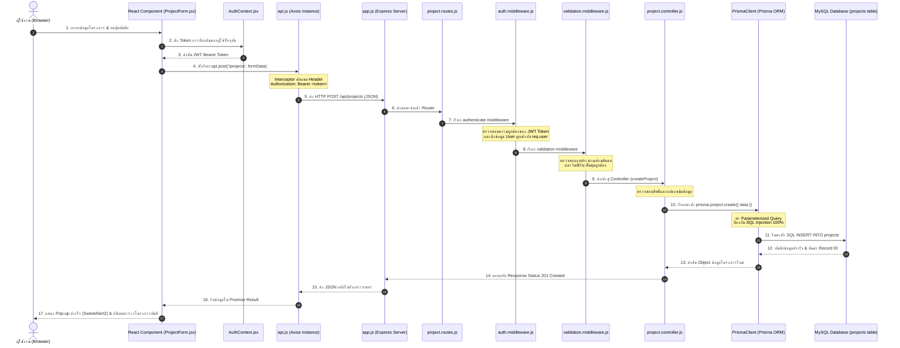

# คู่มืออธิบายโค้ดและการทำงานทั้งระบบฉบับสมบูรณ์ (Code & System Architecture Guide)
## ระบบติดตามและประเมินผลโครงการตามยุทธศาสตร์ มหาวิทยาลัยราชภัฏบุรีรัมย์ (BRU Strategic Tracking System)

---

## สารบัญเนื้อหา

1. [ภาพรวมระบบและสถาปัตยกรรมการทำงาน (Big Picture Architecture)](#1-ภาพรวมระบบและสถาปัตยกรรมการทำงาน)
2. [ฐานข้อมูลและโมเดลข้อมูล (Database & Prisma Layer)](#2-ฐานข้อมูลและโมเดลข้อมูล)
3. [ไฟล์ฝั่งหลังบ้าน (Backend Server & API Architecture)](#3-ไฟล์ฝั่งหลังบ้าน-backend-server)
4. [ไฟล์ฝั่งหน้าบ้านและโครงสร้างหน้าเว็บ (Frontend Architecture & UI Layout)](#4-ไฟล์ฝั่งหน้าบ้านและโครงสร้างหน้าเว็บ-frontend)
5. [ที่อยู่ของสี ธีม ภาพ และไฟล์มัลติมีเดีย (Colors, Themes & Assets Location)](#5-ที่อยู่ของสี-ธีม-ภาพ-และไฟล์มัลติมีเดีย)
6. [การทำงานร่วมกันตั้งแต่หน้าบ้านจนถึงฐานข้อมูล (End-to-End Collaboration Pipeline)](#6-การทำงานร่วมกันตั้งแต่หน้าบ้านจนถึงฐานข้อมูล)
7. [สารบัญสรุปหน้าที่ของทุกไฟล์ในระบบ (Complete File Inventory)](#7-สารบัญสรุปหน้าที่ของทุกไฟล์ในระบบ)

---

## 1. ภาพรวมระบบและสถาปัตยกรรมการทำงาน

ระบบนี้ถูกออกแบบตามสถาปัตยกรรม **3-Tier Architecture (Client - Server - Database)** ที่แยกส่วนหน้าบ้าน หลังบ้าน และฐานข้อมูลออกจากกันอย่างอิสระ (Decoupled System) เพื่อความยืดหยุ่น ความปลอดภัย และรองรับการขยายตัวในอนาคต

```
┌─────────────────────────────────────────────────────────────────────────────────────────────────┐
│                                   ภาพรวมการเชื่อมต่อทั้งระบบ                                    │
└─────────────────────────────────────────────────────────────────────────────────────────────────┘

   [ 1. FRONTEND: ไคลเอนต์หน้าบ้าน ]
   • เทคโนโลยี : React 19 + Vite + Tailwind CSS (ทำงานแบบ SPA: Single Page Application)
   • ที่อยู่โฟลเดอร์: c:\St_bru\frontend\
   • การทำงาน   : ผู้ใช้กรอกข้อมูล / กดปุ่ม ➔ Axios ดักแนบ JWT Bearer Token ➔ ยิง HTTP Request (JSON)
                                 │
                                 ▼ (ส่งข้อมูลผ่าน RESTful API ด้วยรูปแบบ JSON)
   [ 2. BACKEND: เซิร์ฟเวอร์หลังบ้าน ]
   • เทคโนโลยี : Node.js + Express.js
   • ที่อยู่โฟลเดอร์: c:\St_bru\backend\
   • การทำงาน   : app.js รับ Request ➔ Middleware ตรวจ Token (Auth) และสิทธิ์ (RBAC) ➔ Controller คำนวณ
                                 │
                                 ▼ (เรียกใช้งานผ่าน Prisma ORM แบบ Parameterized Queries)
   [ 3. DATABASE: คลังข้อมูลกลาง ]
   • เทคโนโลยี : MySQL 8.0 (14 ตารางสัมพันธ์ Relational Schema)
   • ที่อยู่โฟลเดอร์: c:\St_bru\backend\prisma\schema.prisma และ c:\St_bru\database\
   • การทำงาน   : จัดเก็บข้อมูลยุทธศาสตร์, บัญชีผู้ใช้, โครงการ, กิจกรรม, และประวัติการสั่งการของผู้บริหาร
```

---

## 2. ฐานข้อมูลและโมเดลข้อมูล (Database & Prisma Layer)

### 2.1 ที่อยู่ของไฟล์ฐานข้อมูลในระบบ
1. **`c:\St_bru\backend\prisma\schema.prisma`** — **ไฟล์หัวใจหลักของฐานข้อมูล** กำหนดโครงสร้าง 14 ตาราง, ความสัมพันธ์ (Relations), Enums สิทธิ์, และกฎ Foreign Keys ทั้งหมด
2. **`c:\St_bru\backend\prisma\seed.js`** — สคริปต์ใส่ข้อมูลเริ่มต้น (Seed Data) บัญชีผู้ใช้ 4 Role, 9 คณะ, 61 สาขา และยุทธศาสตร์
3. **`c:\St_bru\database\schema.sql`** — คำสั่ง SQL ดั้งเดิม (DDL) สำหรับรันบน MySQL CLI โดยตรง
4. **`c:\St_bru\database\DataDictionary.md`** — พจนานุกรมข้อมูล อธิบายความหมายของทุกคอลัมน์ใน 14 ตาราง

---

### 2.2 ตารางฐานข้อมูล 14 ตาราง แบ่งตาม 5 กลุ่มงาน

| กลุ่มงาน (Domain) | ตารางฐานข้อมูล (Table Name) | คำอธิบายสิ่งที่จัดเก็บ |
| :--- | :--- | :--- |
| **1. บัญชีผู้ใช้และองค์กร** | `users` | ข้อมูลผู้ใช้งานระบบ, Username, Password (แฮชด้วย Bcrypt), Role (ADMIN, PRESIDENT, DEAN, TEACHER) |
| | `faculties` | รายชื่อ 9 คณะในมหาวิทยาลัย เช่น คณะวิทยาศาสตร์, คณะครุศาสตร์ |
| | `departments` | รายชื่อ 61 ภาควิชา/สาขาวิชา ที่ผูกอยู่ภายใต้คณะ |
| **2. ยุทธศาสตร์ 4 ระดับ** | `local_issues` | **ระดับ 1:** ประเด็นการพัฒนาท้องถิ่น (Local Development Issues - LDI) |
| | `strategies` | **ระดับ 2:** แผนงานหลักของมหาวิทยาลัย (Strategy Pillars 6 ด้าน) |
| | `sub_strategies` | **ระดับ 3:** แผนงานย่อยที่สังกัดภายใต้แผนงานหลัก |
| | `indicators` | **ระดับ 4:** โครงการหลัก (Main Projects - MP 10 โครงการ) |
| **3. โครงการและการบริหาร** | `projects` | ข้อมูลโครงการ, รหัสยุทธศาสตร์ที่ผูก, งบประมาณรวม, เป้าหมาย, วันที่, สถานะล็อกแผนงาน (`isLocked`) |
| | `project_users` | **ตาราง Many-to-Many:** เชื่อมโยงโครงการกับอาจารย์ผู้ร่วมรับผิดชอบหลายคน |
| | `fiscal_years` | ปีงบประมาณ (เช่น 2569) |
| | `budget_sources` | แหล่งเงินงบประมาณ (งบแผ่นดิน, งบรายได้, กองทุนวิจัย) |
| **4. กิจกรรมและหลักฐาน** | `activities` | กิจกรรมย่อยใต้โครงการ, วันที่ลงพื้นที่, งบประมาณที่ใช้จริง, ผลผลิตสะสม |
| | `activity_images` | URL รูปภาพหลักฐานกิจกรรมที่อัปโหลด (เก็บเป็น Path สัมพัทธ์ชี้ไปยังโฟลเดอร์ `/uploads`) |
| **5. การสั่งการและปัญหา** | `issues` | รายการแจ้งปัญหาระบบของผู้ใช้งานส่งถึง Admin |

> **ความปลอดภัยของฐานข้อมูล:**
> - ทุกงบประมาณจัดเก็บเป็นชนิด `Decimal(12, 2)` ป้องกันปัญหาปัดเศษทศนิยมคลาดเคลื่อน
> - ตาราง `project_users` ใช้ `@@id([projectId, userId])` ป้องกันการมอบหมายอาจารย์ซ้ำซ้อนในโครงการเดียวกัน
> - มีการตั้งค่า `onDelete: Cascade` ให้กับตารางกิจกรรมและรูปภาพ เมื่อโครงการถูกลบ ข้อมูลกิจกรรมและรูปภาพจะถูกลบตามอัตโนมัติ ไม่เกิดขยะตกค้าง (Orphan Records)

---

## 3. ไฟล์ฝั่งหลังบ้าน (Backend Server & API Architecture)

โฟลเดอร์หลังบ้านอยู่ที่: **`c:\St_bru\backend\`**  
ใช้ **Node.js (Runtime) + Express.js (Web Framework) + Prisma ORM**

### 3.1 จุดเริ่มต้นเซิร์ฟเวอร์: `backend/app.js`
ทำหน้าที่เป็น **Gateway กลาง** ที่เปิดพอร์ต 5000:
1. **โหลด Middleware ความปลอดภัย:**
   * `helmet()`: ป้องกันช่องโหว่ HTTP Header
   * `cors()`: อนุญาตให้หน้าบ้าน (Frontend พอร์ต 5173/3000) ส่งคำขอข้ามโดเมนเข้ามาได้
   * `express-rate-limit`: ป้องกันการยิงคำขอถล่มเซิร์ฟเวอร์ (DDoS / Brute Force)
2. **ให้บริการไฟล์รูปภาพสถิต (Static File Serving):**
   * บรรทัด `app.use('/uploads', express.static(path.join(__dirname, 'uploads')));` ทำให้หน้าเว็บเปิดดูรูปภาพหลักฐานที่อัปโหลดได้ผ่าน URL เช่น `http://localhost:5000/uploads/image.jpg`
3. **แมปเส้นทาง API (Route Mounting):**
   * `/api/auth` ➔ เชื่อมต่อไปยัง `routes/auth.routes.js`
   * `/api/projects` ➔ เชื่อมต่อไปยัง `routes/project.routes.js`
   * `/api/activities` ➔ เชื่อมต่อไปยัง `routes/activity.routes.js`
   * `/api/dashboard` ➔ เชื่อมต่อไปยัง `routes/dashboard.routes.js`
   * `/api/directives` ➔ เชื่อมต่อไปยัง `routes/directive.routes.js`
   * `/api/master` ➔ เชื่อมต่อไปยัง `routes/master.routes.js`
   * `/api/issues` ➔ เชื่อมต่อไปยัง `routes/issue.routes.js`
   * `/api/reports` ➔ เชื่อมต่อไปยัง `routes/report.routes.js`

---

### 3.2 มิดเดิลแวร์ความปลอดภัย: `backend/middleware/`
* **`auth.middleware.js`:**
  * ฟังก์ชัน `authenticate`: ดักอ่าน Header `Authorization: Bearer <token>`, ถอดรหัสด้วย `jwt.verify()`, หาก Token ถูกต้องจะแนบข้อมูลผู้ใช้ลงใน `req.user`
  * ฟังก์ชัน `authorize([...roles])`: ตรวจสอบว่าบทบาทของ `req.user.role` ตรงกับสิทธิ์ที่อนุญาตหรือไม่ เช่น หน้าจัดการยุทธศาสตร์อนุญาตเฉพาะ `ADMIN`
* **`validation.middleware.js`:**
  * ใช้ `express-validator` ตรวจสอบความถูกต้องของ Input เช่น งบประมาณต้องไม่ติดลบ, วันที่ต้องเป็น ISO8601, รหัสผ่านต้องยาวเกิน 6 ตัวอักษร
* **`upload.middleware.js`:**
  * ใช้ **Multer** ดักจับไฟล์อัปโหลด ตรวจสอบ MIME Type อนุญาตเฉพาะไฟล์ภาพ (`jpg`, `jpeg`, `png`, `webp`) และจำกัดขนาดไม่เกิน 5 MB ต่อรูป

---

### 3.3 ตรรกะทางธุรกิจ: `backend/controllers/`
* **`project.controller.js`:**
  1. **Plan Locking Logic:** ตรวจสอบว่าโครงการมีกิจกรรมย่อยบันทึกแล้วหรือไม่ หากมีแล้วและผู้ใช้ไม่ใช่ ADMIN ระบบจะล็อกไม่อนุญาตให้แก้ไขงบประมาณรวมและเป้าหมาย
  2. **IDOR Protection:** ในฟังก์ชัน `updateExecutiveDirective` ระบบจะตรวจว่าคณบดีที่ส่งคำสั่งสั่งการ มีรหัส `facultyId` ตรงกับคณะเจ้าของโครงการหรือไม่ หากไม่ตรงจะปฏิเสธด้วย `HTTP 403 Forbidden`
  3. **Progress Calculation:** รวมผลผลิตสะสมจากกิจกรรมที่สถานะเสร็จสิ้น (`COMPLETED`) แล้วคำนวณเป็นอัตราร้อยละ (สูงสุดไม่เกิน 100%)
* **`dashboard.controller.js`:**
  * **Management by Exception (MBE):** ตรวจจับโครงการที่เข้าข่าย **ติดธงแดง (Red Flags)**:
    1. วันที่ปัจจุบันเลยกำหนดสิ้นสุดโครงการแล้วแต่ความก้าวหน้ายังไม่ครบ 100%
    2. ระยะเวลาดำเนินงานผ่านไปแล้วเกิน 50% แต่ผลงานทำได้จริงต่ำกว่า 25%
* **`activity.controller.js`:**
  * บันทึกกิจกรรมย่อย นำรูปภาพที่ Multer อัปโหลดเข้าสู่ตาราง `activity_images` และคำนวณยอดเงินเบิกจ่ายสะสม

---

## 4. ไฟล์ฝั่งหน้าบ้านและโครงสร้างหน้าเว็บ (Frontend Architecture & UI Layout)

โฟลเดอร์หน้าบ้านอยู่ที่: **`c:\St_bru\frontend\`**  
ใช้ **React 19 (Component-based UI) + Vite (Build Tool) + Tailwind CSS (Styling)**

### 4.1 สถาปัตยกรรมโครงสร้างหน้าเว็บ (Master Layout Pattern)
เมื่อผู้ใช้งานล็อกอินสำเร็จ ทุกหน้าจอจะถูกห่อหุ้มด้วย **`AppLayout.jsx`** เสมอ:

```
┌──────────────────────────────────────────────────────────────────────────────────────────────────┐
│                                   AppLayout.jsx (Master Container)                               │
├──────────────────────┬───────────────────────────────────────────────────────────────────────────┤
│     Sidebar.jsx      │  Topbar.jsx (แถบหัวเว็บด้านบน)                                             │
│  (แถบเมนูนำทางด้านซ้าย)│  [☰ ย่อ/ขยาย]  [ชื่อหน้า Dynamic]        [🔔 แจ้งเตือน (Red Flags)]  [👤 โปรไฟล์]│
│                      ├───────────────────────────────────────────────────────────────────────────┤
│  • โลโก้ BRU + ระบบ  │                                                                           │
│  • เมนูตาม Role:     │  <main className="bg-content-canvas page-enter">                          │
│    - อาจารย์         │     <Outlet />                                                            │
│    - คณบดี           │     (พื้นที่แสดงหน้าจอตาม URL เช่น Dashboard, Projects, Forms, Gallery)    │
│    - อธิการบดี       │                                                                           │
│    - แอดมิน          │  ┌─────────────────────────────────────────────────────────────────────┐  │
│  • ข้อมูลผู้ใช้ย่อ   │  │  Components ที่ถูกสลับมาแสดงผล (ตาม react-router-dom):               │  │
│  • ปุ่ม Logout       │  │  • pages/teacher/Dashboard.jsx หรือ ProjectForm.jsx                  │  │
│                      │  │  • pages/dean/Dashboard.jsx หรือ Reports.jsx                         │  │
│  [พับเก็บ: 80px]     │  │  • pages/president/Dashboard.jsx                                     │  │
│  [กางเต็ม: 270px]    │  │  • pages/admin/MasterData.jsx หรือ Issues.jsx                        │  │
│                      │  └─────────────────────────────────────────────────────────────────────┘  │
└──────────────────────┴───────────────────────────────────────────────────────────────────────────┘
```

#### หน้าที่ของแต่ละส่วนของหน้าจอ:
1. **`frontend/src/layouts/AppLayout.jsx` (โครงสร้างแม่แบบรวม):**
   * ควบคุม State การย่อ/ขยายเมนูซ้าย (`sidebarCollapsed: 80px / 270px`)
   * ควบคุม State การเปิด/ปิดเมนูบนหน้าจอมือถือ (`sidebarOpen`)
   * รองรับโหมดสั่งพิมพ์รายงาน (`Ctrl + P`) โดยซ่อนเมนูอัตโนมัติ
2. **`frontend/src/components/Sidebar.jsx` (แถบเมนูซ้าย):**
   * แสดงโลโก้มหาวิทยาลัย และคัดกรองเมนูนำทางอัตโนมัติตาม `user.role`
   * มีปุ่มลูกศรยุบเมนูเหลือ 80px เพิ่มพื้นที่ทำงาน
3. **`frontend/src/components/Topbar.jsx` (แถบหัวเว็บด้านบน):**
   * **Dynamic Title:** ฟังก์ชัน `getPageTitle()` เปลี่ยนชื่อหัวข้อตาม URL และ Role โดยอัตโนมัติ
   * **Notification Center (กระดิ่ง `FiBell`):** ดึงโครงการติดธงแดงมาเตือน พร้อมเลข Badge สีแดง
   * **User Dropdown:** ดูโปรไฟล์, เปลี่ยนรหัสผ่าน, แจ้งปัญหาระบบ, และออกจากระบบ
4. **`<Outlet />` ใน `AppLayout.jsx` (พื้นที่เนื้อหาหลัก):**
   * แสดงหน้าจอตามเส้นทาง URL ที่ถูกกำหนดไว้ใน `frontend/src/App.jsx`
   * มีสีพื้นหลังสบายตา `bg-content-canvas` (`#F8FAFC`) และแอนิเมชัน Fade-in เมื่อเปลี่ยนหน้า

---

### 4.2 หน้าจอแยกตาม 4 บทบาท (`frontend/src/pages/`)
* **`pages/auth/Login.jsx`:** หน้าจอเข้าสู่ระบบ กรอก Username / Password มีปุ่มกรอกบัญชีเดโมด่วน
* **`pages/teacher/` (สำหรับอาจารย์):**
  * `Dashboard.jsx`: สรุปโครงการที่ตนเองรับผิดชอบ
  * `Projects.jsx`: หน้ารายการโครงการทั้งหมด
  * `ProjectForm.jsx`: **ฟอร์มสร้าง/แก้ไขโครงการ พร้อม Cascading Dropdown ยุทธศาสตร์ 4 ระดับ**
  * `ProjectDetails.jsx`: หน้ารายละเอียดโครงการ บันทึกกิจกรรม และแสดงสถานะล็อกแผนงาน
  * `Gallery.jsx`: แกลเลอรีรูปภาพหลักฐานการลงพื้นที่จริง
* **`pages/dean/` (สำหรับคณบดี):**
  * `Dashboard.jsx`: สรุปผลงานระดับคณะ ตารางเปรียบเทียบสาขาวิชา และปุ่มออกข้อสั่งการ
* **`pages/president/` (สำหรับอธิการบดี):**
  * `Dashboard.jsx`: แดชบอร์ดมหาวิทยาลัย กราฟ 6 เสายุทธศาสตร์ Strategic Heatmap และรายการธงแดง
* **`pages/admin/` (สำหรับผู้ดูแลระบบ):**
  * `MasterData.jsx`: หน้าจัดการข้อมูลระบบ 9 หมวด (เพิ่ม/ลบ/แก้ไข ยุทธศาสตร์, คณะ, สาขา, แหล่งเงิน)
  * `Issues.jsx`: หน้าระบบจัดการเรื่องร้องเรียน/แจ้งปัญหาการใช้งาน

---

## 5. ที่อยู่ของสี ธีม ภาพ และไฟล์มัลติมีเดีย

หากต้องการแก้ไขสี ธีม หรือรูปภาพในระบบ สามารถมาแก้ไขได้ที่ไฟล์ตามจุดเหล่านี้:

### 5.1 ที่อยู่ของการตั้งค่าสีและธีม (Color Palette & Styles)

| สิ่งที่ต้องการเปลี่ยน | ไฟล์ที่จัดเก็บ | วิธีการแก้ไข |
| :--- | :--- | :--- |
| **สีหลักทั้งระบบ (Primary Theme)** | [`frontend/tailwind.config.js`](file:///c:/St_bru/frontend/tailwind.config.js) | แก้ไขที่ `theme.extend.colors.primary.DEFAULT` (ค่าเริ่มต้นคือ `#6C3BFF` สีม่วงสถาบัน) |
| **สีพื้นหลังเนื้อหาหน้าเว็บ** | [`frontend/tailwind.config.js`](file:///c:/St_bru/frontend/tailwind.config.js) | แก้ไขที่ `theme.extend.colors['content-canvas']` (ค่าเริ่มต้นคือ `#F8FAFC`) |
| **สีพื้นหลังแถบเมนู Sidebar** | [`frontend/src/components/Sidebar.jsx`](file:///c:/St_bru/frontend/src/components/Sidebar.jsx) | แก้ไขที่คำสั่งไล่เฉดสี: `linear-gradient(180deg, #2F1481 0%, #1E0A4A 100%)` |
| **สีป้ายสถานะโครงการ (Badges)** | [`frontend/src/utils/statusHelper.js`](file:///c:/St_bru/frontend/src/utils/statusHelper.js) | ฟังก์ชัน `getStatusColor()` กำหนดสีเขียว (`COMPLETED`), สีเหลือง (`IN_PROGRESS`), สีแดง (`DELAYED`) |
| **สไตล์สากลและ Font** | [`frontend/src/index.css`](file:///c:/St_bru/frontend/src/index.css) | กำหนดฟอนต์ Prompt / Sarabun และตกแต่ง Scrollbar |

---

### 5.2 ที่อยู่ของรูปภาพและไฟล์มีเดีย (Images & Assets)

```
c:\St_bru\
├── 📁 frontend/public/        ➔ [รูปภาพประจำระบบ / โลโก้ / พื้นหลัง]
│   ├── logob.png              — ตราสัญลักษณ์มหาวิทยาลัยราชภัฏบุรีรัมย์
│   ├── icon.png / favicon.svg — ไอคอนแสดงบนแท็บเบราว์เซอร์
│   ├── login1.jpg             — ภาพสไลด์พื้นหลังหน้า Login รูปที่ 1
│   ├── login2.jpg             — ภาพสไลด์พื้นหลังหน้า Login รูปที่ 2
│   └── login3.jpg             — ภาพสไลด์พื้นหลังหน้า Login รูปที่ 3
│
├── 📁 backend/uploads/         ➔ [ไฟล์ภาพจริงที่ผู้ใช้อัปโหลดขึ้นระบบ]
│   └── (ไฟล์ภาพกิจกรรม .jpg, .png ที่ถูกตั้งชื่อใหม่ตาม Timestamp เช่น 1787810803631.jpg)
│
└── 📁 frontend/src/utils/imageUrl.js ➔ [ฟังก์ชันเชื่อมต่อและบีบอัดภาพ]
    ├── getImageUrl()          — เติม Base URL (http://localhost:5000) ให้กับรูปภาพจาก backend
    └── compressImage()        — บีบอัดขนาดไฟล์ภาพบนหน้าเบราว์เซอร์ก่อนส่งขึ้นเซิร์ฟเวอร์
```

---

## 6. การทำงานร่วมกันตั้งแต่หน้าบ้านจนถึงฐานข้อมูล (End-to-End Collaboration Pipeline)



---

## 7. สารบัญสรุปหน้าที่ของทุกไฟล์ในระบบ (Complete File Inventory)

```
c:\St_bru\
├── 📁 database/
│   ├── DataDictionary.md               — เอกสารพจนานุกรมข้อมูล 14 ตาราง
│   ├── ERD.md                          — แผนภาพความสัมพันธ์เอนทิตี (ER Diagram)
│   ├── schema.sql                      — สคริปต์ DDL ภาษา SQL สำหรับสร้างตารางบน MySQL
│   └── seed.sql                        — สคริปต์ INSERT INTO ภาษา SQL ใส่ข้อมูลเริ่มต้น
│
├── 📁 postman/
│   ├── BRU_Strategic_Tracking_API_Test_Collection.postman_collection.json — รวมชุดทดสอบ API ทั้งหมด 8 หมวดหมู่ (25+ Requests)
│   ├── BRU_Strategic_Tracking_Environment.postman_environment.json        — ตัวแปร Environment ทดสอบระบบ (base_url, token, บัญชี 4 Role)
│   └── README.md                                                          — คู่มือการ Import และทดสอบ API ผ่าน Postman ใน 2 คลิก
│
├── 📁 backend/
│   ├── app.js                          — จุดเริ่มต้นเซิร์ฟเวอร์ Express, รวม Middleware และเชื่อมต่อ Route หลัก
│   ├── package.json / package-lock.json — กำหนด Dependencies และคำสั่งสคริปต์รันของ Backend
│   ├── seed-projects.js                — สคริปต์สร้างข้อมูลโครงการและกิจกรรมจำลองสำหรับทดสอบ
│   ├── verify-endpoints.js             — สคริปต์ทดสอบยิง API ตรวจสอบสถานะการทำงานของ Endpoint ต่างๆ
│   ├── 📁 config/
│   │   ├── prisma.js                   — Singleton Instance ของ PrismaClient ป้องกัน Connection ซ้ำซ้อน
│   │   └── cloudinary.js               — ตั้งค่าเชื่อมต่อบริการจัดเก็บรูปภาพ Cloudinary (ตัวเลือกเสริม)
│   ├── 📁 middleware/
│   │   ├── auth.middleware.js          — ตรวจสอบ JWT Token (authenticate) และตรวจสิทธิ์ตาม Role (authorize)
│   │   ├── validation.middleware.js    — ตรวจสอบความถูกต้องของข้อมูล Input ป้องกันข้อมูลผิดรูปแบบ
│   │   └── upload.middleware.js        — ตัวจัดการ Multer ตรวจนามสกุลไฟล์ภาพและจำกัดขนาดไม่เกิน 5MB
│   ├── 📁 routes/
│   │   ├── auth.routes.js              — เส้นทาง API ล็อกอิน, ตรวจสอบผู้ใช้ปัจจุบัน, และเปลี่ยนรหัสผ่าน
│   │   ├── project.routes.js           — เส้นทาง API เพิ่ม ลบ แก้ไข ล็อกแผนงาน และค้นหาโครงการ
│   │   ├── activity.routes.js          — เส้นทาง API เพิ่มกิจกรรมย่อย อัปโหลดรูปภาพ และคำนวณผลผลิต
│   │   ├── dashboard.routes.js         — เส้นทาง API ดึงข้อมูลสรุปแดชบอร์ดตามบทบาทผู้ใช้งาน (Role)
│   │   ├── directive.routes.js         — เส้นทาง API ส่งข้อสั่งการเร่งรัดงานของผู้บริหาร (Dean / President)
│   │   ├── master.routes.js            — เส้นทาง API จัดการข้อมูลพื้นฐานระบบ 9 หมวด (ยุทธศาสตร์, คณะ, สาขา)
│   │   ├── issue.routes.js             — เส้นทาง API ส่งเรื่องแจ้งปัญหาการใช้งานและอัปเดตสถานะปัญหา
│   │   └── report.routes.js            — เส้นทาง API รวบรวมข้อมูลสรุปโครงการเพื่อจัดทำรายงาน
│   ├── 📁 controllers/
│   │   ├── auth.controller.js          — ตรวจสอบรหัสผ่าน (Bcrypt), สร้าง JWT Token และจัดการสิทธิ์ผู้ใช้
│   │   ├── project.controller.js       — คำนวณความก้าวหน้าโครงการ ระบบล็อกแผนงาน และตรวจสิทธิ์ IDOR
│   │   ├── activity.controller.js      — บันทึกผลการดำเนินกิจกรรม คำนวณยอดเงินสะสม และจัดการรูปภาพหลักฐาน
│   │   ├── dashboard.controller.js     — ประมวลผลสถิติ กรองโครงการติดธงแดง (Red Flags) ตามข้อยกเว้น MBE
│   │   ├── master.controller.js        — ตรรกะจัดการเพิ่ม/ลบ/แก้ไขข้อมูลยุทธศาสตร์ 4 ระดับ และหน่วยงาน
│   │   ├── issue.controller.js         — รับเรื่องแจ้งปัญหา บันทึกรายละเอียด และเปลี่ยนสถานะโดยผู้ดูแลระบบ
│   │   └── report.controller.js        — คำนวณยอดรวมงบประมาณและผลผลิตตามยุทธศาสตร์เพื่อออกรายงาน
│   ├── 📁 prisma/
│   │   ├── schema.prisma               — แบบจำลองฐานข้อมูล 14 ตาราง Enums ความสัมพันธ์ และกฎความปลอดภัย
│   │   ├── seed.js                     — สคริปต์หลักสำหรับสร้าง Master Data และบัญชีทดสอบครบทุก Role
│   │   └── 📁 migrations/              — โฟลเดอร์เก็บประวัติและไฟล์สคริปต์การอัปเดตโครงสร้างฐานข้อมูล
│   └── 📁 uploads/                     — โฟลเดอร์จัดเก็บไฟล์รูปภาพหลักฐานกิจกรรมที่อัปโหลดขึ้นเซิร์ฟเวอร์
│
└── 📁 frontend/
    ├── index.html                      — โครงสร้าง HTML หลัก จุดติดตั้ง Root Element ของ React
    ├── vite.config.js                  — กำหนดค่า Vite, ตั้งค่า Proxy เชื่อมต่อไปยัง Backend และพอร์ต
    ├── tailwind.config.js              — กำหนดสีหลัก (primary: #6C3BFF) ฟอนต์ และ Utility คลาสของระบบ
    ├── postcss.config.js               — ตั้งค่า PostCSS สำหรับคอมไพล์สไตล์ร่วมกับ Tailwind และ Autoprefixer
    ├── vercel.json                     — กฎ Rewrite ส่งทุก URL ไปที่ index.html ป้องกันหน้า 404 บน Vercel
    ├── package.json / package-lock.json — กำหนด Dependencies และคำสั่งสคริปต์รันของ Frontend
    └── 📁 src/
        ├── main.jsx                    — จุดเริ่มต้น React นำ App ไปเรนเดอร์ใน DOM และห่อหุ้มด้วย Router
        ├── App.jsx                     — จัดการเส้นทาง URL (Routing) และระบบป้องกันสิทธิ์ (Role Guard)
        ├── index.css                   — ไฟล์สไตล์ CSS หลัก และการตั้งค่าพื้นฐานของ Tailwind CSS
        ├── 📁 layouts/
        │   └── AppLayout.jsx           — Master Layout รวม Sidebar + Topbar + Outlet (พื้นที่แสดงเนื้อหา)
        ├── 📁 components/
        │   ├── Topbar.jsx              — แถบเมนูด้านบน แสดงข้อมูลระบบ แจ้งเตือน และโปรไฟล์ผู้ใช้
        │   ├── Sidebar.jsx             — เมนูแถบข้างด้านซ้าย ปรับเปลี่ยนรายการตาม Role ของผู้ใช้โดยอัตโนมัติ
        │   ├── CustomSelect.jsx        — Dropdown พิเศษที่รองรับการค้นหาตัวเลือก (Searchable Dropdown)
        │   ├── ExecutiveProjectModal.jsx — หน้าต่าง Pop-up สรุปข้อมูลโครงการสำหรับผู้บริหาร
        │   ├── ProfileModal.jsx        — หน้าต่าง Pop-up แสดงข้อมูลผู้ใช้และฟอร์มเปลี่ยนรหัสผ่าน
        │   ├── ReportIssueModal.jsx    — หน้าต่าง Pop-up สำหรับกรอกและส่งเรื่องแจ้งปัญหาไปยังแอดมิน
        │   └── ErrorBoundary.jsx       — ตัวดักจับข้อผิดพลาดของ UI เพื่อป้องกันไม่ให้หน้าเว็บล่มทั้งระบบ
        ├── 📁 contexts/
        │   └── AuthContext.jsx         — จัดการ State การล็อกอิน ข้อมูลผู้ใช้ สิทธิ์ และฟังก์ชัน Login/Logout
        ├── 📁 services/
        │   └── api.js                  — กำหนดค่า Axios Client และดักแนบ JWT Token ในทุกคำขออัตโนมัติ
        ├── 📁 utils/
        │   ├── imageUrl.js             — แปลง Path สัมพัทธ์ของรูปภาพให้เป็น Full URL สำหรับแสดงผลบนหน้าเว็บ
        │   └── statusHelper.js         — ฟังก์ชันแปลงรหัสสถานะโครงการ/กิจกรรมเป็นสี Badge และข้อความภาษาไทย
        └── 📁 pages/
            ├── 📁 auth/Login.jsx       — หน้าจอกรอกชื่อผู้ใช้และรหัสผ่านเพื่อเข้าสู่ระบบ
            ├── 📁 teacher/             — แดชบอร์ดอาจารย์, จัดการโครงการ, ฟอร์ม 4 ระดับ, บันทึกกิจกรรม, แกลเลอรี
            ├── 📁 dean/                — แดชบอร์ดคณะ, โครงการคณะ, ตารางเปรียบเทียบสาขาวิชา, สั่งการคณบดี
            ├── 📁 president/           — แดชบอร์ดสถาบัน, ตรวจจับโครงการติดธงแดง, Strategic Heatmap
            ├── 📁 admin/               — แดชบอร์ดระบบ, จัดการ Master Data 9 หมวด, ปลดล็อกโครงการ, จัดการปัญหา
            └── 📁 executive/           — หน้ารายละเอียดโครงการแบบสรุปสำหรับผู้บริหาร
```

