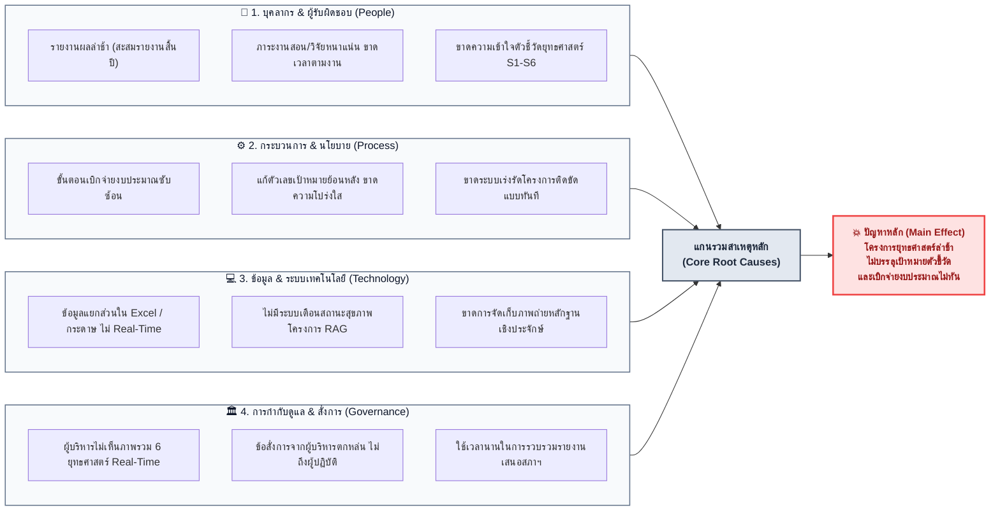

# การวิเคราะห์สาเหตุและผลกระทบ (Cause and Effect Analysis)
## ระบบติดตามและประเมินผลโครงการเชิงยุทธศาสตร์ — มหาวิทยาลัยราชภัฏบุรีรัมย์ (BRU)

การวิเคราะห์ **Cause and Effect Analysis (Ishikawa / Fishbone Diagram)** เพื่อค้นหารากเหง้าของปัญหา (Root Causes) ในการบริหารโครงการยุทธศาสตร์มหาวิทยาลัย และแสดงแนวทางการแก้ปัญหาด้วยระบบเทคโนโลยีดิจิทัล

---

### 🐟 1. ผังผังก้างปลา (Cause and Effect / Fishbone Diagram)



---

### 📊 2. ตารางวิเคราะห์สาเหตุ ผลกระทบ และแนวทางแก้ไขของระบบ (Cause, Effect & System Solution Matrix)

| หมวดหมู่สาเหตุ | สาเหตุที่แท้จริง (Root Cause) | ผลกระทบที่เกิดขึ้น (Effect) | นวัตกรรมที่ระบบนำมาแก้ไข (System Solution) |
| :--- | :--- | :--- | :--- |
| **👥 ด้านบุคลากร (People)** | • ผู้รับผิดชอบโครงการรวบรวมข้อมูลรายงานตอนสิ้นปีงบประมาณ<br/>• ขาดความคุ้นเคยกับตัวชี้วัดยุทธศาสตร์ | • ผู้บริหารไม่ทราบความก้าวหน้าที่แท้จริง<br/>• ผลงานไม่ตรงกับเป้าหมายยุทธศาสตร์ | **• แบบฟอร์มออนไลน์พร้อม Auto-Redirect:** บันทึกงบจริงและผลสำเร็จได้ทันทีหลังเสร็จแต่ละกิจกรรม<br/>**• ผูกตัวชี้วัดอัตโนมัติ:** Dropdown แสดงยุทธศาสตร์ S1-S6 และ 10 โครงการหลักอย่างชัดเจน |
| **⚙️ ด้านกระบวนการ (Process)** | • มีการปรับเปลี่ยนเป้าหมายตัวเลขย้อนหลังเมื่อทำไม่ได้ตามแผน<br/>• ขาดเกณฑ์วัดความเสี่ยงที่เป็นมาตรฐาน | • ข้อมูลขาดความน่าเชื่อถือ (Data Tampering)<br/>• ไม่สามารถตรวจจับโครงการวิกฤตได้ล่วงหน้า | **• ระบบล็อกแผนงาน (Plan Integrity):** ล็อกแผนงานอัตโนมัติ (`IsLocked`) ทันทีที่มีการบันทึกผลงาน<br/>**• Automated RAG Engine:** ตัดเกรด 🟢 ปกติ 🟡 เฝ้าระวัง 🔴 วิกฤต อัตโนมัติ |
| **💻 ด้านเทคโนโลยี (Technology)** | • ใช้ไฟล์ Excel และเอกสารกระดาษที่กระจัดกระจาย<br/>• ไม่มีศูนย์จัดเก็บภาพถ่ายกิจกรรม | • ข้อมูลสูญหาย ไม่สามารถประมวลผลภาพรวมมหาวิทยาลัยได้<br/>• ขาดหลักฐานเชิงประจักษ์เมื่อถูกตรวจสอบ | **• ฐานข้อมูลกลางระบบคลาวด์ (Single Source of Truth):** รวมข้อมูล 9 คณะไว้ที่เดียว<br/>**• Evidence Gallery:** คลังภาพถ่ายกิจกรรมจำกัดขนาด 5MB พร้อมแสดงผลแบบ Drill-Down |
| **🏛️ ด้านการกำกับดูแล (Governance)** | • ผู้บริหารทราบปัญหาเมื่อสิ้นสุดปีงบประมาณ ทำให้แก้ไขไม่ทัน<br/>• ขาดช่องทางสื่อสารคำสั่งเร่งรัดตรงถึงอาจารย์ | • งบประมาณถูกพับหรือส่งคืนคลัง<br/>• โครงการสำคัญไม่บรรลุตามแผนยุทธศาสตร์ | **• Management by Exception:** แดชบอร์ดคัดกรองเฉพาะโครงการติดธงแดง (Red Flags)<br/>**• Executive Directives Loop:** อธิการบดี/คณบดีส่งข้อสั่งการตรงถึงผู้รับผิดชอบทันที |

---

### 📋 3. โค้ดดิบสำหรับคัดลอก (Raw Mermaid Code)

```text
flowchart LR
    %% Category Roots
    subgraph P1 ["👥 1. บุคลากร & ผู้รับผิดชอบ (People)"]
        direction TB
        C1_1["รายงานผลล่าช้า (สะสมรายงานสิ้นปี)"]
        C1_2["ภาระงานสอน/วิจัยหนาแน่น ขาดเวลาตามงาน"]
        C1_3["ขาดความเข้าใจตัวชี้วัดยุทธศาสตร์ S1-S6"]
    end

    subgraph P2 ["⚙️ 2. กระบวนการ & นโยบาย (Process)"]
        direction TB
        C2_1["ขั้นตอนเบิกจ่ายงบประมาณซับซ้อน"]
        C2_2["แก้ตัวเลขเป้าหมายย้อนหลัง ขาดความโปร่งใส"]
        C2_3["ขาดระบบเร่งรัดโครงการติดขัดแบบทันที"]
    end

    subgraph P3 ["💻 3. ข้อมูล & ระบบเทคโนโลยี (Technology)"]
        direction TB
        C3_1["ข้อมูลแยกส่วนใน Excel / กระดาษ ไม่ Real-Time"]
        C3_2["ไม่มีระบบเตือนสถานะสุขภาพโครงการ RAG"]
        C3_3["ขาดการจัดเก็บภาพถ่ายหลักฐานเชิงประจักษ์"]
    end

    subgraph P4 ["🏛️ 4. การกำกับดูแล & สั่งการ (Governance)"]
        direction TB
        C4_1["ผู้บริหารไม่เห็นภาพรวม 6 ยุทธศาสตร์ Real-Time"]
        C4_2["ข้อสั่งการจากผู้บริหารตกหล่น ไม่ถึงผู้ปฏิบัติ"]
        C4_3["ใช้เวลานานในการรวบรวมรายงานเสนอสภาฯ"]
    end

    %% Central Spine & Main Effect
    P1 --> Spine["แกนรวมสาเหตุหลัก<br/>(Core Root Causes)"]
    P2 --> Spine
    P3 --> Spine
    P4 --> Spine

    Spine --> Effect["💥 ปัญหาหลัก (Main Effect)<br/><b>โครงการยุทธศาสตร์ล่าช้า<br/>ไม่บรรลุเป้าหมายตัวชี้วัด<br/>และเบิกจ่ายงบประมาณไม่ทัน</b>"]

    %% Styling
    classDef category fill:#f8fafc,stroke:#64748b,stroke-width:1.5px,color:#0f172a;
    classDef spineNode fill:#e2e8f0,stroke:#475569,stroke-width:2px,color:#1e293b,font-weight:bold;
    classDef effectNode fill:#fee2e2,stroke:#ef4444,stroke-width:2.5px,color:#991b1b,font-weight:bold,font-size:15px;

    class P1,P2,P3,P4 category;
    class Spine spineNode;
    class Effect effectNode;
```
