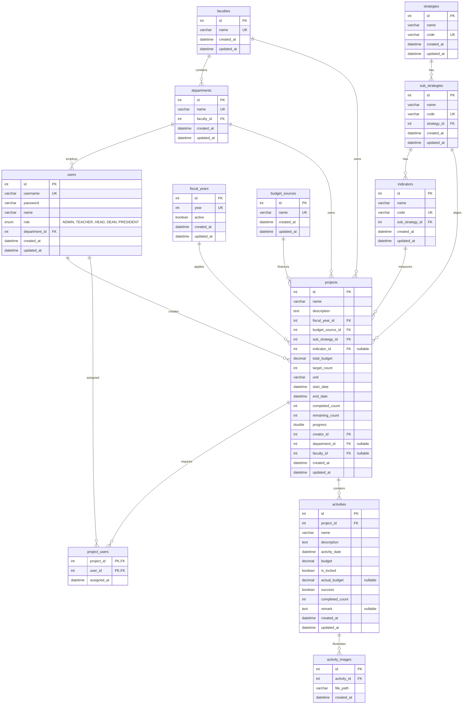

# Entity Relationship Diagram (ERD) - Strategic Performance Tracking System

This document visualizes the database schemas and relationships for the performance tracking system of Buriram Rajabhat University.

## Relationships Details

1. **One-to-Many (`1` to `N`):**
   - `faculties` -> `departments`: A faculty has many departments (e.g. Science -> Computer Science, Physics).
   - `departments` -> `users`: A department has many staff/teachers.
   - `strategies` -> `sub_strategies`: A main strategy consists of multiple sub-strategies.
   - `sub_strategies` -> `indicators`: A sub-strategy has multiple KPIs.
   - `projects` -> `activities`: A strategic project has multiple execution activities.
   - `activities` -> `activity_images`: An activity can document progress using multiple uploaded pictures.

2. **Many-to-Many (`N` to `M`):**
   - `projects` <-> `users` via `project_users`: A project can have multiple responsible coordinators (ผู้รับผิดชอบร่วม), and a user can coordinate multiple projects.

3. **Optional and Roll-up Keys:**
   - `projects.department_id` and `projects.faculty_id` are stored directly on the project to facilitate role-based dashboard aggregations for Heads and Deans. These keys automatically inherit the creator's affiliation during project creation.
