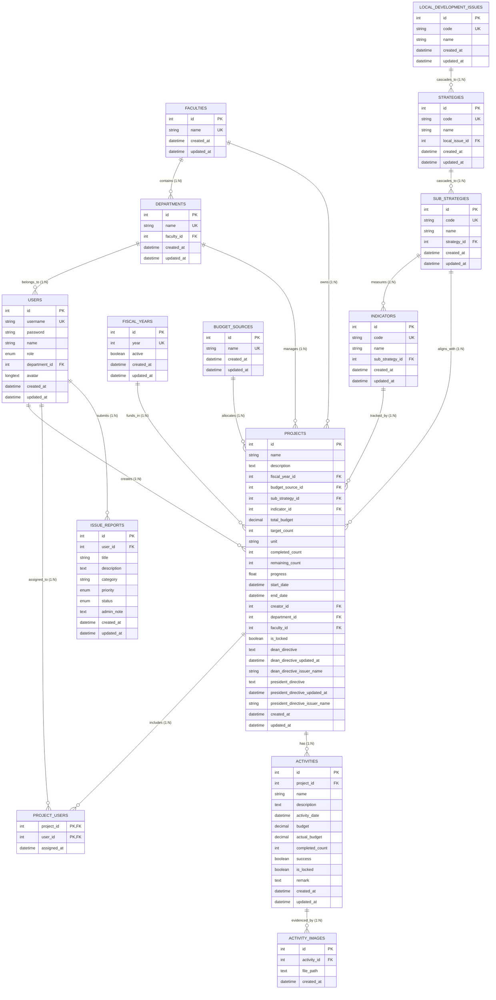

# คลัง Prompt และโค้ดสำหรับสร้าง Data ER Diagram (Entity-Relationship Diagram)
## ระบบติดตามและประเมินผลโครงการตามยุทธศาสตร์ มหาวิทยาลัยราชภัฏบุรีรัมย์ (BRU Strategic Tracking System)

เอกสารนี้รวบรวม Prompt และโค้ดสำเร็จรูปสำหรับการนำไปสร้าง **ER Diagram** ครบทั้ง 14 ตาราง ครอบคลุมทั้งเครื่องมือ AI (ChatGPT, Claude, Gemini), เว็บวาด ERD อัตโนมัติ (**dbdiagram.io**), และไดอะแกรมแบบโค้ด (**Mermaid / PlantUML**)

---

## 📌 สารบัญ
1. [ส่วนที่ 1: Master Prompt สำหรับสั่ง AI (ChatGPT / Claude / Gemini)](#ส่วนที่-1-master-prompt-สำหรับสั่ง-ai-chatgpt--claude--gemini)
2. [ส่วนที่ 2: โค้ด Mermaid ER Diagram (แสดงผลทันทีใน Markdown / Notion / draw.io)](#ส่วนที่-2-โค้ด-mermaid-er-diagram)
3. [ส่วนที่ 3: โค้ด DBML สำหรับ dbdiagram.io (แนะนำ - สวยงามและเป็นระเบียบที่สุด)](#ส่วนที่-3-โค้ด-dbml-สำหรับ-dbdiagramio)
4. [ส่วนที่ 4: ตารางสรุปความสัมพันธ์ (Cardinality & Relationship Matrix)](#ส่วนที่-4-ตารางสรุปความสัมพันธ์-cardinality--relationship-matrix)

---

## ส่วนที่ 1: Master Prompt สำหรับสั่ง AI (ChatGPT / Claude / Gemini)

> **วิธีใช้งาน:** คัดลอกข้อความในกรอบด้านล่างนี้ไปวางใน AI ตัวใดก็ได้ เพื่อให้ AI วาด ER Diagram, สร้างคำอธิบายสถาปัตยกรรมฐานข้อมูล, หรือแปลงเป็นภาษาอื่น ๆ

```text
คุณคือ Senior Database Architect และ System Analyst ผู้เชี่ยวชาญ
จงสร้าง Entity-Relationship Diagram (ER Diagram) และอธิบายความสัมพันธ์ของฐานข้อมูลแบบ Relational Database (MySQL) สำหรับ "ระบบติดตามและประเมินผลโครงการตามยุทธศาสตร์ มหาวิทยาลัยราชภัฏบุรีรัมย์ (BRU Strategic Tracking System)"

โครงสร้างฐานข้อมูลประกอบด้วย 14 ตารางหลัก แบ่งออกเป็น 4 กลุ่มฟังก์ชัน ดังนี้:

[กลุ่มที่ 1: โครงสร้างองค์กรและผู้ใช้งาน (Organization & Users)]
1. faculties (คณะ):
   - id (INT, PK, Auto Increment)
   - name (VARCHAR, Unique) - ชื่อคณะ
   - created_at, updated_at
2. departments (สาขาวิชา/ภาควิชา):
   - id (INT, PK, Auto Increment)
   - name (VARCHAR, Unique) - ชื่อสาขาวิชา
   - faculty_id (INT, FK -> faculties.id, Nullable)
   - created_at, updated_at
3. users (ผู้ใช้งานในระบบ):
   - id (INT, PK, Auto Increment)
   - username (VARCHAR, Unique) - ชื่อผู้ใช้สำหรับล็อกอิน
   - password (VARCHAR) - รหัสผ่านแฮช Bcrypt
   - name (VARCHAR) - ชื่อ-นามสกุลจริง
   - role (ENUM: 'ADMIN', 'TEACHER', 'DEAN', 'PRESIDENT')
   - department_id (INT, FK -> departments.id, Nullable)
   - avatar (LONGTEXT, Nullable) - ภาพโปรไฟล์แบบ Base64
   - created_at, updated_at

[กลุ่มที่ 2: แผนยุทธศาสตร์และข้อมูลพื้นฐาน (Master Data & Cascading Strategy)]
4. fiscal_years (ปีงบประมาณ):
   - id (INT, PK, Auto Increment)
   - year (INT, Unique) - เช่น 2569
   - active (BOOLEAN) - สถานะปีปัจจุบัน
5. budget_sources (แหล่งเงินงบประมาณ):
   - id (INT, PK, Auto Increment)
   - name (VARCHAR, Unique) - เช่น งบประมาณแผ่นดิน, งบรายได้
6. local_development_issues (ประเด็นการพัฒนาท้องถิ่น - ยุทธศาสตร์ระดับ 1):
   - id (INT, PK, Auto Increment)
   - code (VARCHAR, Unique)
   - name (VARCHAR)
7. strategies (ประเด็นยุทธศาสตร์มหาวิทยาลัย - ยุทธศาสตร์ระดับ 2):
   - id (INT, PK, Auto Increment)
   - code (VARCHAR, Unique)
   - name (VARCHAR)
   - local_issue_id (INT, FK -> local_development_issues.id)
8. sub_strategies (แผนงานย่อย/กลยุทธ์ - ยุทธศาสตร์ระดับ 3):
   - id (INT, PK, Auto Increment)
   - code (VARCHAR, Unique)
   - name (VARCHAR)
   - strategy_id (INT, FK -> strategies.id)
9. indicators (ตัวชี้วัดความสำเร็จ - ยุทธศาสตร์ระดับ 4):
   - id (INT, PK, Auto Increment)
   - code (VARCHAR, Unique)
   - name (VARCHAR)
   - sub_strategy_id (INT, FK -> sub_strategies.id)

[กลุ่มที่ 3: โครงการ กิจกรรม และหลักฐาน (Projects, Activities & Evidence)]
10. projects (โครงการหลัก):
    - id (INT, PK, Auto Increment)
    - name (VARCHAR) - ชื่อโครงการ
    - description (TEXT) - รายละเอียด
    - fiscal_year_id (INT, FK -> fiscal_years.id)
    - budget_source_id (INT, FK -> budget_sources.id)
    - sub_strategy_id (INT, FK -> sub_strategies.id)
    - indicator_id (INT, FK -> indicators.id, Nullable)
    - faculty_id (INT, FK -> faculties.id, Nullable)
    - department_id (INT, FK -> departments.id, Nullable)
    - creator_id (INT, FK -> users.id) - อาจารย์ผู้สร้างโครงการ
    - total_budget (DECIMAL 12,2) - งบประมาณรวมที่ตั้งไว้
    - target_count (INT) - เป้าหมายผลผลิตรวม
    - unit (VARCHAR) - หน่วยนับ
    - completed_count (INT) - ผลผลิตที่ทำได้จริงสะสม
    - remaining_count (INT) - ผลผลิตที่คงเหลือ
    - progress (FLOAT) - ร้อยละความก้าวหน้าสะสม (0 - 100%)
    - start_date (DATETIME)
    - end_date (DATETIME)
    - is_locked (BOOLEAN) - สถานะล็อกแผนงาน (Plan Locking)
    - dean_directive (TEXT) - ข้อสั่งการจากคณบดี
    - dean_directive_updated_at (DATETIME)
    - dean_directive_issuer_name (VARCHAR)
    - president_directive (TEXT) - ข้อสั่งการจากอธิการบดี
    - president_directive_updated_at (DATETIME)
    - president_directive_issuer_name (VARCHAR)
11. project_users (ตารางเชื่อมโยงทีมงานโครงการ Many-to-Many):
    - project_id (INT, Composite PK, FK -> projects.id)
    - user_id (INT, Composite PK, FK -> users.id)
    - assigned_at (DATETIME)
12. activities (กิจกรรมย่อยในโครงการ):
    - id (INT, PK, Auto Increment)
    - project_id (INT, FK -> projects.id, ON DELETE CASCADE)
    - name (VARCHAR) - ชื่อกิจกรรม
    - description (TEXT)
    - activity_date (DATETIME) - วันที่จัดกิจกรรม
    - budget (DECIMAL 12,2) - งบประมาณที่ได้รับจัดสรร
    - actual_budget (DECIMAL 12,2, Nullable) - งบที่ใช้จ่ายจริง
    - completed_count (INT) - ผลผลิตที่ทำได้ในกิจกรรมนี้
    - success (BOOLEAN) - บรรลุตามเป้าหมายหรือไม่
    - is_locked (BOOLEAN) - สถานะล็อกกิจกรรม
    - remark (TEXT, Nullable)
13. activity_images (รูปภาพหลักฐานกิจกรรมเชิงประจักษ์):
    - id (INT, PK, Auto Increment)
    - activity_id (INT, FK -> activities.id, ON DELETE CASCADE)
    - file_path (TEXT) - พาธไฟล์รูปภาพ
    - created_at (DATETIME)

[กลุ่มที่ 4: การดูแลระบบและแจ้งปัญหา (System & Support)]
14. issue_reports (รายงานปัญหาการใช้งานระบบ):
    - id (INT, PK, Auto Increment)
    - user_id (INT, FK -> users.id)
    - title (VARCHAR) - หัวข้อปัญหา
    - description (TEXT) - รายละเอียด
    - category (VARCHAR, Nullable)
    - priority (ENUM: 'LOW', 'MEDIUM', 'HIGH', 'URGENT')
    - status (ENUM: 'PENDING', 'IN_PROGRESS', 'RESOLVED', 'REJECTED')
    - admin_note (TEXT, Nullable) - บันทึกผลการแก้ไขจาก Admin

สิ่งที่ต้องการให้สร้าง:
1. แผนภาพ ER Diagram แบบละเอียด ระบุ Primary Key (PK), Foreign Key (FK) และ Cardinality (1:1, 1:N, N:M) ให้ถูกต้องชัดเจน
2. ตารางอธิบายความสัมพันธ์ (Relationship Matrix) ว่าตารางไหนเชื่อมโยงกับตารางไหน พร้อมประเภทความสัมพันธ์
3. วิเคราะห์จุดเด่นของ Schema เช่น Cascading Strategy 4 ระดับ, Plan Locking Mechanism, และ Multi-tenant Isolation
```

---

## ส่วนที่ 2: โค้ด Mermaid ER Diagram

> **วิธีใช้งาน:** สามารถคัดลอกโค้ดด้านล่างนี้ไปวางใน:
> - **Mermaid Live Editor** ([https://mermaid.live](https://mermaid.live)) เพื่อ Export เป็นไฟล์ PNG/SVG
> - **Notion** หรือโปรแกรมที่รองรับ Markdown Mermaid
> - **draw.io** (เลือก Arrange ➔ Insert ➔ Advanced ➔ Mermaid)



---

## ส่วนที่ 3: โค้ด DBML สำหรับ dbdiagram.io (แนะนำมากที่สุด)

> **วิธีใช้งาน:**
> 1. เข้าไปที่เว็บไซต์ **[https://dbdiagram.io](https://dbdiagram.io)**
> 2. ลบโค้ดเริ่มต้นออก แล้ว **คัดลอกโค้ด DBML ด้านล่างนี้ไปวาง**
> 3. หน้าเว็บจะวาด ER Diagram ให้ทันทีแบบ Interactive จัดตำแหน่งได้ ลากย้ายได้ และ Export เป็น PDF / PNG / SVG ได้ฟรี

```dbml
// ========================================================
// BRU Strategic Tracking System - Database Schema (DBML)
// Buriram Rajabhat University
// ========================================================

// --------------------------------------------------------
// กลุ่มที่ 1: โครงสร้างองค์กรและผู้ใช้งาน (Organization & Users)
// --------------------------------------------------------

Table faculties {
  id int [pk, increment, note: 'รหัสคณะ']
  name varchar [unique, not null, note: 'ชื่อคณะ']
  created_at datetime [default: `now()`]
  updated_at datetime
  Note: 'ตารางข้อมูลคณะ'
}

Table departments {
  id int [pk, increment, note: 'รหัสสาขาวิชา']
  name varchar [unique, not null, note: 'ชื่อสาขาวิชา/ภาควิชา']
  faculty_id int [ref: > faculties.id, note: 'สังกัดคณะ']
  created_at datetime [default: `now()`]
  updated_at datetime
  Note: 'ตารางข้อมูลสาขาวิชา'
}

Enum role_enum {
  ADMIN
  TEACHER
  DEAN
  PRESIDENT
}

Table users {
  id int [pk, increment, note: 'รหัสผู้ใช้']
  username varchar [unique, not null, note: 'ชื่อผู้ใช้']
  password varchar [not null, note: 'รหัสผ่าน Bcrypt']
  name varchar [not null, note: 'ชื่อ-นามสกุล']
  role role_enum [not null, note: 'บทบาทและสิทธิ์']
  department_id int [ref: > departments.id, note: 'สังกัดสาขาวิชา']
  avatar longtext [note: 'รูปภาพโปรไฟล์ Base64']
  created_at datetime [default: `now()`]
  updated_at datetime
  Note: 'ตารางบัญชีผู้ใช้งานระบบ'
}

// --------------------------------------------------------
// กลุ่มที่ 2: แผนยุทธศาสตร์และข้อมูลหลัก (Master Data & Cascading)
// --------------------------------------------------------

Table fiscal_years {
  id int [pk, increment, note: 'รหัสปีงบประมาณ']
  year int [unique, not null, note: 'ปี พ.ศ. เช่น 2569']
  active boolean [default: false, note: 'สถานะปีงบประมาณปัจจุบัน']
  created_at datetime [default: `now()`]
  updated_at datetime
  Note: 'ตารางปีงบประมาณ'
}

Table budget_sources {
  id int [pk, increment, note: 'รหัสแหล่งงบประมาณ']
  name varchar [unique, not null, note: 'ชื่อแหล่งเงิน เช่น งบแผ่นดิน']
  created_at datetime [default: `now()`]
  updated_at datetime
  Note: 'ตารางแหล่งงบประมาณ'
}

Table local_development_issues {
  id int [pk, increment, note: 'รหัสประเด็นการพัฒนาท้องถิ่น']
  code varchar [unique, not null, note: 'รหัสประเด็น เช่น LP-01']
  name varchar [not null, note: 'ชื่อประเด็นการพัฒนาท้องถิ่น']
  created_at datetime [default: `now()`]
  updated_at datetime
  Note: 'ยุทธศาสตร์ระดับ 1: ประเด็นการพัฒนาท้องถิ่น'
}

Table strategies {
  id int [pk, increment, note: 'รหัสประเด็นยุทธศาสตร์']
  code varchar [unique, not null, note: 'รหัสยุทธศาสตร์ เช่น ST-01']
  name varchar [not null, note: 'ชื่อประเด็นยุทธศาสตร์มหาวิทยาลัย']
  local_issue_id int [ref: > local_development_issues.id, note: 'เชื่อมโยงประเด็นท้องถิ่น']
  created_at datetime [default: `now()`]
  updated_at datetime
  Note: 'ยุทธศาสตร์ระดับ 2: ประเด็นยุทธศาสตร์'
}

Table sub_strategies {
  id int [pk, increment, note: 'รหัสแผนงานย่อย/กลยุทธ์']
  code varchar [unique, not null, note: 'รหัสแผนงานย่อย เช่น SS-01']
  name varchar [not null, note: 'ชื่อแผนงานย่อย']
  strategy_id int [ref: > strategies.id, note: 'เชื่อมโยงยุทธศาสตร์หลัก']
  created_at datetime [default: `now()`]
  updated_at datetime
  Note: 'ยุทธศาสตร์ระดับ 3: กลยุทธ์/แผนงานย่อย'
}

Table indicators {
  id int [pk, increment, note: 'รหัสตัวชี้วัด']
  code varchar [unique, not null, note: 'รหัสตัวชี้วัด เช่น IND-01']
  name varchar [not null, note: 'ชื่อตัวชี้วัดความสำเร็จ']
  sub_strategy_id int [ref: > sub_strategies.id, note: 'เชื่อมโยงกลยุทธ์']
  created_at datetime [default: `now()`]
  updated_at datetime
  Note: 'ยุทธศาสตร์ระดับ 4: ตัวชี้วัด'
}

// --------------------------------------------------------
// กลุ่มที่ 3: โครงการ กิจกรรม และหลักฐาน (Projects & Activities)
// --------------------------------------------------------

Table projects {
  id int [pk, increment, note: 'รหัสโครงการ']
  name varchar [not null, note: 'ชื่อโครงการ']
  description text [note: 'วัตถุประสงค์และรายละเอียด']
  fiscal_year_id int [ref: > fiscal_years.id, not null, note: 'ปีงบประมาณ']
  budget_source_id int [ref: > budget_sources.id, not null, note: 'แหล่งงบประมาณ']
  sub_strategy_id int [ref: > sub_strategies.id, not null, note: 'แผนงานย่อยที่ตอบสนอง']
  indicator_id int [ref: > indicators.id, note: 'ตัวชี้วัดที่ตอบสนอง']
  faculty_id int [ref: > faculties.id, note: 'สังกัดคณะ']
  department_id int [ref: > departments.id, note: 'สังกัดสาขาวิชา']
  creator_id int [ref: > users.id, not null, note: 'อาจารย์ผู้สร้างโครงการ']
  total_budget decimal(12,2) [not null, note: 'งบประมาณรวมที่ตั้งไว้']
  target_count int [not null, note: 'เป้าหมายผลผลิต']
  unit varchar [not null, note: 'หน่วยนับ เช่น คน, ชุมชน']
  completed_count int [default: 0, note: 'ผลผลิตที่ทำได้สะสม']
  remaining_count int [default: 0, note: 'ผลผลิตคงเหลือ']
  progress float [default: 0.0, note: 'ร้อยละความก้าวหน้า (0-100%)']
  start_date datetime [not null, note: 'วันเริ่มโครงการ']
  end_date datetime [not null, note: 'วันสิ้นสุดโครงการ']
  is_locked boolean [default: true, note: 'สถานะล็อกแผนงาน']
  dean_directive text [note: 'ข้อสั่งการคณบดี']
  dean_directive_updated_at datetime
  dean_directive_issuer_name varchar
  president_directive text [note: 'ข้อสั่งการอธิการบดี']
  president_directive_updated_at datetime
  president_directive_issuer_name varchar
  created_at datetime [default: `now()`]
  updated_at datetime
  Note: 'ตารางข้อมูลโครงการหลัก'
}

Table project_users {
  project_id int [ref: > projects.id, note: 'รหัสโครงการ']
  user_id int [ref: > users.id, note: 'รหัสสมาชิกทีมงาน']
  assigned_at datetime [default: `now()`]
  indexes {
    (project_id, user_id) [pk]
  }
  Note: 'ตารางทีมงานผู้รับผิดชอบโครงการ (Many-to-Many)'
}

Table activities {
  id int [pk, increment, note: 'รหัสกิจกรรมย่อย']
  project_id int [ref: > projects.id, not null, note: 'โครงการแม่']
  name varchar [not null, note: 'ชื่อกิจกรรม']
  description text [note: 'รายละเอียดกิจกรรม']
  activity_date datetime [not null, note: 'วันที่จัดกิจกรรม']
  budget decimal(12,2) [not null, note: 'งบประมาณที่จัดสรร']
  actual_budget decimal(12,2) [note: 'งบประมาณที่ใช้จ่ายจริง']
  completed_count int [default: 0, note: 'ผลผลิตที่ทำได้จริง']
  success boolean [default: false, note: 'สถานะสำเร็จ']
  is_locked boolean [default: true, note: 'สถานะล็อกกิจกรรม']
  remark text [note: 'หมายเหตุ/ปัญหาอุปสรรค']
  created_at datetime [default: `now()`]
  updated_at datetime
  Note: 'ตารางกิจกรรมย่อยและการเบิกจ่าย'
}

Table activity_images {
  id int [pk, increment, note: 'รหัสรูปภาพ']
  activity_id int [ref: > activities.id, not null, note: 'กิจกรรมที่เกี่ยวข้อง']
  file_path text [not null, note: 'พาธที่อยู่รูปภาพ']
  created_at datetime [default: `now()`]
  Note: 'ตารางรูปภาพหลักฐานเชิงประจักษ์'
}

// --------------------------------------------------------
// กลุ่มที่ 4: การแจ้งปัญหาและการสนับสนุน (System & Support)
// --------------------------------------------------------

Enum issue_priority_enum {
  LOW
  MEDIUM
  HIGH
  URGENT
}

Enum issue_status_enum {
  PENDING
  IN_PROGRESS
  RESOLVED
  REJECTED
}

Table issue_reports {
  id int [pk, increment, note: 'รหัสรายการแจ้งปัญหา']
  user_id int [ref: > users.id, not null, note: 'ผู้แจ้งปัญหา']
  title varchar [not null, note: 'หัวข้อปัญหา']
  description text [not null, note: 'รายละเอียด']
  category varchar [note: 'หมวดหมู่ปัญหา']
  priority issue_priority_enum [default: 'MEDIUM', note: 'ระดับความเร่งด่วน']
  status issue_status_enum [default: 'PENDING', note: 'สถานะการดำเนินงาน']
  admin_note text [note: 'บันทึกของ Admin ผู้แก้ไข']
  created_at datetime [default: `now()`]
  updated_at datetime
  Note: 'ตารางการแจ้งปัญหาและการซัพพอร์ตระบบ'
}
```

---

## ส่วนที่ 4: ตารางสรุปความสัมพันธ์ (Cardinality & Relationship Matrix)

| # | ตารางต้นทาง (Parent) | ความสัมพันธ์ | ตารางปลายทาง (Child) | คำอธิบายความสัมพันธ์ทางธุรกิจ |
| :---: | :--- | :---: | :--- | :--- |
| **1** | `faculties` | **1 : N** | `departments` | หนึ่งคณะมีได้หลายสาขาวิชา (One Faculty has many Departments) |
| **2** | `faculties` | **1 : N** | `projects` | คณะกำกับดูแลโครงการที่สังกัดภายในคณะตนเอง |
| **3** | `departments` | **1 : N** | `users` | หนึ่งสาขาวิชามีผู้ใช้งานได้หลายคน (อาจารย์ประจำสาขา) |
| **4** | `departments` | **1 : N** | `projects` | สาขาวิชาเป็นเจ้าของและดำเนินโครงการ |
| **5** | `fiscal_years` | **1 : N** | `projects` | หนึ่งปีงบประมาณมีหลายโครงการที่ได้รับการจัดสรร |
| **6** | `budget_sources` | **1 : N** | `projects` | แหล่งเงินงบประมาณหนึ่งแหล่งถูกจัดสรรให้หลายโครงการ |
| **7** | `local_development_issues` | **1 : N** | `strategies` | ยุทธศาสตร์ขั้นที่ 1 แตกแขนงออกเป็นยุทธศาสตร์มหาวิทยาลัยขั้นที่ 2 |
| **8** | `strategies` | **1 : N** | `sub_strategies` | ยุทธศาสตร์ขั้นที่ 2 แตกออกเป็นแผนงานย่อย/กลยุทธ์ขั้นที่ 3 |
| **9** | `sub_strategies` | **1 : N** | `indicators` | กลยุทธ์ขั้นที่ 3 กำหนดตัวชี้วัดความสำเร็จขั้นที่ 4 |
| **10** | `sub_strategies` | **1 : N** | `projects` | โครงการต้องผูกโยงตอบสนองต่อแผนงานย่อย (Strategic Alignment) |
| **11** | `indicators` | **1 : N** | `projects` | โครงการระบุตัวชี้วัดความสำเร็จที่เกี่ยวข้อง |
| **12** | `users` | **1 : N** | `projects` | อาจารย์ 1 ท่านสามารถเป็นผู้สร้าง/เสนอโครงการได้หลายโครงการ |
| **13** | `projects` | **N : M** | `users` | หนึ่งโครงการมีคณะทำงานได้หลายคน (ผ่านตารางกลาง `project_users`) |
| **14** | `projects` | **1 : N** | `activities` | หนึ่งโครงการแบ่งการดำเนินงานออกเป็นหลายกิจกรรมย่อย (Cascade Delete) |
| **15** | `activities` | **1 : N** | `activity_images` | หนึ่งกิจกรรมมีรูปภาพหลักฐานยืนยันได้หลายภาพ (Cascade Delete) |
| **16** | `users` | **1 : N** | `issue_reports` | ผู้ใช้งานหนึ่งคนสามารถส่งรายงานแจ้งปัญหาได้หลายครั้ง |
