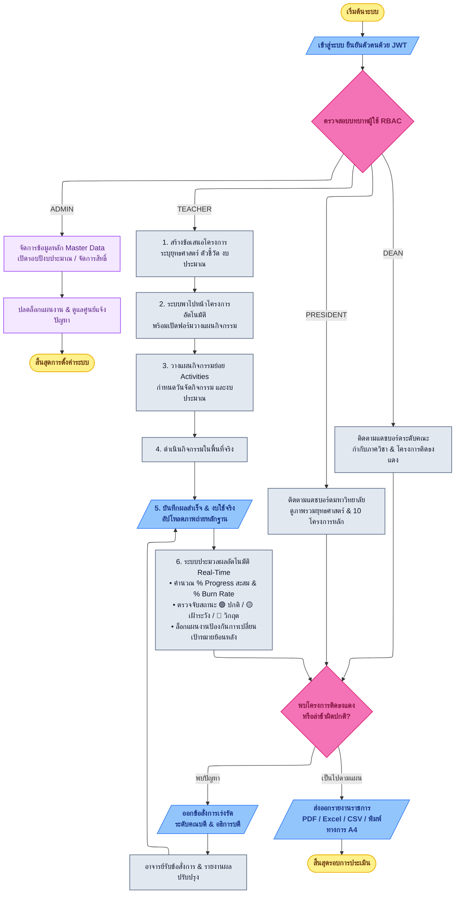

# ผังกระบวนการทำงานของระบบ (Standard Structured Flowchart)
## ระบบติดตามและประเมินผลโครงการเชิงยุทธศาสตร์ — มหาวิทยาลัยราชภัฏบุรีรัมย์ (BRU)

ผังงานนี้ออกแบบตามโครงสร้างและสไตล์ภาพตัวอย่าง (Standard Flowchart Structure) ใช้สัญลักษณ์มาตรฐานสากล จุดเชื่อมโยงตั้งฉากสวยงาม (Orthogonal Lines) และแบ่งสายงานชัดเจน

---

### 📊 แผนภาพผังกระบวนการทำงาน (Mermaid Flowchart)



---

### 📋 โค้ดดิบสำหรับคัดลอก (Raw Mermaid Code)

```text
---
config:
  layout: elk
---
flowchart TD
    %% 1. START & LOGIN
    Start([เริ่มต้นระบบ]) --> Login[/เข้าสู่ระบบ ยืนยันตัวตนด้วย JWT/]
    
    Login --> RoleCheck{ตรวจสอบบทบาทผู้ใช้ RBAC}
    
    %% 2. ADMIN BRANCH
    RoleCheck -->|ADMIN| AdminMaster[จัดการข้อมูลหลัก Master Data<br/>เปิดรอบปีงบประมาณ / จัดการสิทธิ์]
    AdminMaster --> AdminUnlock[ปลดล็อกแผนงาน & ดูแลศูนย์แจ้งปัญหา]
    AdminUnlock --> EndAdmin([สิ้นสุดการตั้งค่าระบบ])
    
    %% 3. TEACHER MAIN PIPELINE
    RoleCheck -->|TEACHER| TeacherProj[1. สร้างข้อเสนอโครงการ<br/>ระบุยุทธศาสตร์ ตัวชี้วัด งบประมาณ]
    TeacherProj --> AutoRedirect[2. ระบบพาไปหน้าโครงการอัตโนมัติ<br/>พร้อมเปิดฟอร์มวางแผนกิจกรรม]
    AutoRedirect --> PlanAct[3. วางแผนกิจกรรมย่อย Activities<br/>กำหนดวันจัดกิจกรรม และงบประมาณ]
    PlanAct --> DoAct[4. ดำเนินกิจกรรมในพื้นที่จริง]
    DoAct --> ReportAct[/5. บันทึกผลสำเร็จ & งบใช้จริง<br/>อัปโหลดภาพถ่ายหลักฐาน/]
    
    ReportAct --> EngineCalc["6. ระบบประมวลผลอัตโนมัติ Real-Time<br/>• คำนวณ % Progress สะสม & % Burn Rate<br/>• ตรวจจับสถานะ 🟢 ปกติ / 🟡 เฝ้าระวัง / 🔴 วิกฤต<br/>• ล็อกแผนงานป้องกันการเปลี่ยนเป้าหมายย้อนหลัง"]
    
    %% 4. EXECUTIVE OVERSIGHT & DECISION
    RoleCheck -->|DEAN| DeanDashboard[ติดตามแดชบอร์ดระดับคณะ<br/>กำกับภาควิชา & โครงการติดธงแดง]
    RoleCheck -->|PRESIDENT| PresDashboard[ติดตามแดชบอร์ดมหาวิทยาลัย<br/>ดูภาพรวมยุทธศาสตร์ & 10 โครงการหลัก]
    
    EngineCalc --> DeanPresOversight{พบโครงการติดธงแดง<br/>หรือล่าช้าผิดปกติ?}
    DeanDashboard --> DeanPresOversight
    PresDashboard --> DeanPresOversight
    
    %% Decision Branches
    DeanPresOversight -->|พบปัญหา| SendDirective[/ออกข้อสั่งการเร่งรัด<br/>ระดับคณบดี & อธิการบดี/]
    SendDirective --> TeacherReceive[อาจารย์รับข้อสั่งการ & รายงานผลปรับปรุง]
    TeacherReceive --> ReportAct
    
    DeanPresOversight -->|เป็นไปตามแผน| ExportReport[/ส่งออกรายงานราชการ<br/>PDF / Excel / CSV / พิมพ์ทางการ A4/]
    ExportReport --> End([สิ้นสุดรอบการประเมิน])

    %% STYLING (MATCHING REFERENCE IMAGE)
    classDef startEnd fill:#fef08a,stroke:#eab308,stroke-width:1.5px,color:#713f12,font-weight:bold;
    classDef io fill:#93c5fd,stroke:#3b82f6,stroke-width:1.5px,color:#1e3a8a,font-weight:bold;
    classDef process fill:#e2e8f0,stroke:#64748b,stroke-width:1.5px,color:#0f172a;
    classDef decision fill:#f472b6,stroke:#db2777,stroke-width:1.5px,color:#831843,font-weight:bold;
    classDef adminNode fill:#f3e8ff,stroke:#a855f7,stroke-width:1.5px,color:#581c87;

    class Start,End,EndAdmin startEnd;
    class Login,ReportAct,SendDirective,ExportReport io;
    class RoleCheck,DeanPresOversight decision;
    class TeacherProj,AutoRedirect,PlanAct,DoAct,EngineCalc,DeanDashboard,PresDashboard,TeacherReceive process;
    class AdminMaster,AdminUnlock adminNode;
```
