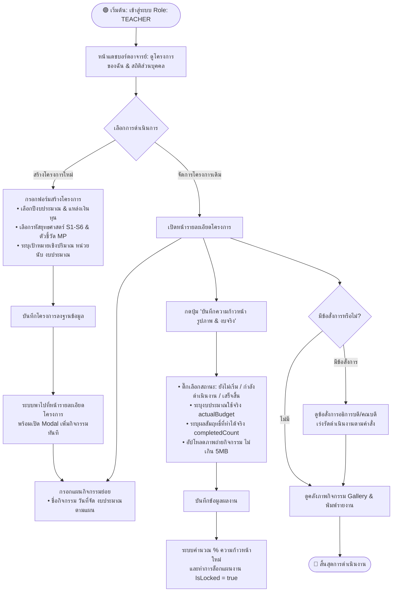
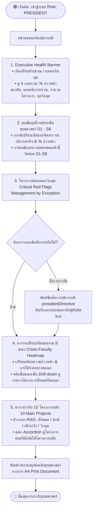
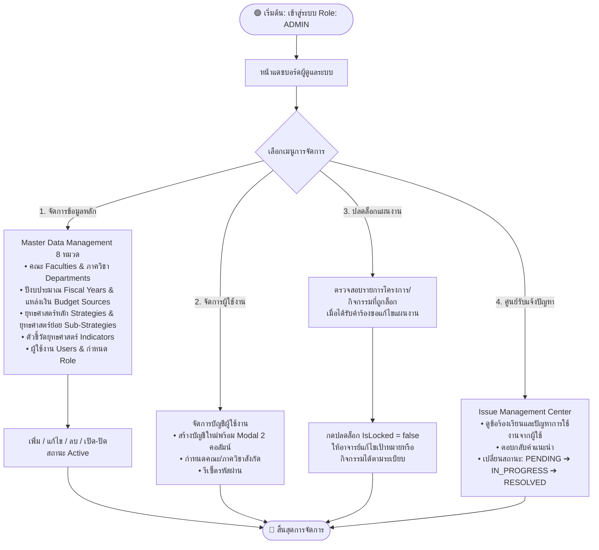
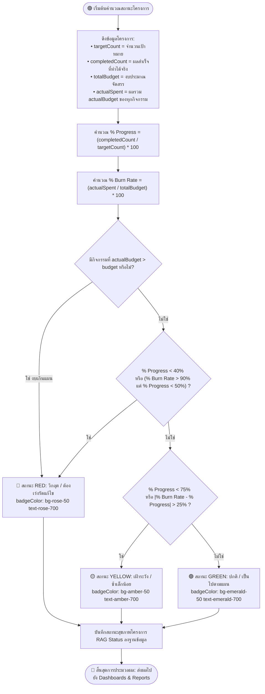
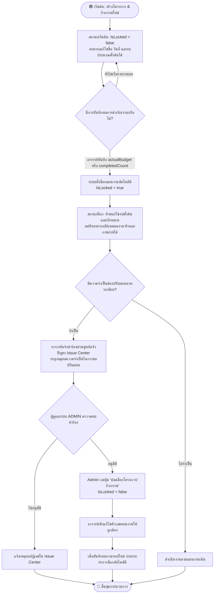

# ผังกระบวนการทำงานของระบบ (System Flowchart Manual) — SA Edition
## Strategic Performance Tracking System — มหาวิทยาลัยราชภัฏบุรีรัมย์ (BRU)
**วิเคราะห์และออกแบบโดย:** Senior System Analyst (SA Agent)  
**มาตรฐานสถาปัตยกรรม:** Role-Based Multi-Tier Workflow & Activity Diagram (Mermaid Standard)

---

## 📌 สารบัญผังกระบวนการทำงาน (Table of Flowcharts)

1. [Flowchart 1: ผังกระบวนการทำงานหลักทั้งระบบ (Master End-to-End System Flowchart)](#1-ผังกระบวนการทำงานหลักทั้งระบบ-master-end-to-end-system-flowchart)
2. [Flowchart 2: ผังการทำงานของอาจารย์/ผู้รับผิดชอบโครงการ (Teacher Workflow)](#2-ผังการทำงานของอาจารย์ผู้รับผิดชอบโครงการ-teacher-workflow)
3. [Flowchart 3: ผังการทำงานของผู้บริหารระดับคณะ (Dean Workflow)](#3-ผังการทำงานของผู้บริหารระดับคณะ-dean-flowchart)
4. [Flowchart 4: ผังการทำงานของอธิการบดีและผู้บริหารระดับสถาบัน (President Flowchart)](#4-ผังการทำงานของอธิการบดีและผู้บริหารระดับสถาบัน-president-flowchart)
5. [Flowchart 5: ผังการทำงานของผู้ดูแลระบบ (Admin Flowchart)](#5-ผังการทำงานของผู้ดูแลระบบ-admin-flowchart)
6. [Flowchart 6: ผังตรรกะการประมวลผลสถานะโครงการ (Project RAG Calculation Engine)](#6-ผังตรรกะการประมวลผลสถานะโครงการ-project-rag-calculation-engine)
7. [Flowchart 7: ผังกระบวนการล็อกและปลดล็อกแผนงาน (Plan Locking & Unlock Workflow)](#7-ผังกระบวนการล็อกและปลดล็อกแผนงาน-plan-locking--unlock-workflow)

---

## 1. ผังกระบวนการทำงานหลักทั้งระบบ (Master End-to-End System Flowchart)

ผังงานนี้ออกแบบตามหลักวิศวกรรมระบบ (System Analysis & Design) โดยแบ่งสัดส่วนการทำงานเป็น Swimlane / Stage ชัดเจน จัดการจุดเชื่อมโยง (Connectors) และเงื่อนไขการตัดสินใจ (Decision Gateways) ให้ไหลลื่นในทิศทางเดียว (Top-to-Bottom Flow)

```mermaid
flowchart TD
    %% ==========================================
    %% GLOBAL STYLES
    %% ==========================================
    classDef startEnd fill:#10b981,stroke:#059669,stroke-width:2px,color:#ffffff,font-weight:bold;
    classDef authNode fill:#6366f1,stroke:#4f46e5,stroke-width:1.5px,color:#ffffff,font-weight:bold;
    classDef adminNode fill:#f0f9ff,stroke:#0284c7,stroke-width:1.5px,color:#0369a1;
    classDef teacherNode fill:#f0fdf4,stroke:#16a34a,stroke-width:1.5px,color:#15803d;
    classDef engineNode fill:#fefce8,stroke:#ca8a04,stroke-width:1.5px,color:#a16207;
    classDef execNode fill:#faf5ff,stroke:#9333ea,stroke-width:1.5px,color:#7e22ce;
    classDef dbNode fill:#f1f5f9,stroke:#475569,stroke-width:1.5px,color:#334155;
    classDef reportNode fill:#ecfeff,stroke:#0891b2,stroke-width:1.5px,color:#0e7490;

    %% ==========================================
    %% START POINT
    %% ==========================================
    StartNode([🟢 เริ่มต้น: ผู้ใช้งานเข้าสู่ระบบ Authentication]) :::startEnd

    %% ==========================================
    %% AUTHENTICATION & RBAC GATEWAY
    %% ==========================================
    StartNode --> AuthStep[1. เข้าสู่ระบบ & ตรวจสอบสิทธิ์ JWT Token] :::authNode
    AuthStep --> RoleRouter{2. ตรวจสอบ Role} :::authNode

    RoleRouter -->|ADMIN| Stage1
    RoleRouter -->|TEACHER| Stage2
    RoleRouter -->|DEAN / PRESIDENT| Stage5

    %% ==========================================
    %% STAGE 1: MASTER DATA SETUP (ADMIN)
    %% ==========================================
    subgraph Stage1 ["Stage 1 : ⚙️ การเตรียมข้อมูลระบบ (Master Data & System Setup) — ADMIN"]
        direction TB
        Admin1["1.1 กำหนด 9 คณะ, ภาควิชา, แหล่งเงิน & เปิดรอบปีงบประมาณ"] :::adminNode
        Admin2["1.2 กำหนดยุทธศาสตร์ S1-S6, ตัวชี้วัด & 10 โครงการหลัก"] :::adminNode
        Admin3["1.3 จัดการสิทธิ์ผู้ใช้งาน (RBAC) & ดูแลศูนย์คำร้องขอปลดล็อกแผน"] :::adminNode
        Admin1 --> Admin2 --> Admin3
    end
    style Stage1 fill:#f8fafc,stroke:#94a3b8,stroke-width:2px

    Stage1 --> MasterDB[(🗄️ Master Data Tables)] :::dbNode
    MasterDB --> Stage2

    %% ==========================================
    %% STAGE 2: PROPOSAL & PLANNING (TEACHER)
    %% ==========================================
    subgraph Stage2 ["Stage 2 : 📝 การสร้างข้อเสนอและแผนงาน (Project Proposal & Planning) — TEACHER"]
        direction TB
        T_Create["2.1 กรอกข้อเสนอโครงการ: รหัสยุทธศาสตร์ S1-S6, ตัวชี้วัด, งบประมาณตั้งต้น"] :::teacherNode
        T_Redirect["2.2 บันทึกข้อมูล & ระบบนำทางอัตโนมัติ (Auto-Redirect) ไปหน้ารายละเอียด"] :::teacherNode
        T_Activities["2.3 เพิ่มแผนกิจกรรมย่อย (Activities): กำหนดวันจัดกิจกรรม และวงเงินตามแผน"] :::teacherNode
        T_Create --> T_Redirect --> T_Activities
    end
    style Stage2 fill:#f0fdf4,stroke:#86efac,stroke-width:2px

    Stage2 --> ProjDB[(🗄️ Projects & Activities DB)] :::dbNode
    ProjDB --> Stage3

    %% ==========================================
    %% STAGE 3: EXECUTION & ACTUALS (TEACHER)
    %% ==========================================
    subgraph Stage3 ["Stage 3 : 🚀 การดำเนินงานและรายงานผลจริง (Execution & Actuals) — TEACHER"]
        direction TB
        T_DoAct["3.1 จัดกิจกรรมเชิงยุทธศาสตร์ในพื้นที่จริง"] :::teacherNode
        T_Record["3.2 บันทึกงบใช้จริง (actualBudget) & ผลสำเร็จจริง (completedCount)"] :::teacherNode
        T_Upload["3.3 อัปโหลดภาพถ่ายกิจกรรมเพื่อเป็นหลักฐานเชิงประจักษ์ (Evidence Gallery)"] :::teacherNode
        T_DoAct --> T_Record --> T_Upload
    end
    style Stage3 fill:#f0fdf4,stroke:#4ade80,stroke-width:2px

    Stage3 --> Stage4

    %% ==========================================
    %% STAGE 4: AUTOMATED ENGINE & INTEGRITY (SYSTEM)
    %% ==========================================
    subgraph Stage4 ["Stage 4 : 🧠 ระบบประมวลผลอัตโนมัติ (Automated RAG & Integrity Engine) — CORE SYSTEM"]
        direction TB
        E_Calc["4.1 คำนวณอัตราความก้าวหน้า (% Progress) & การใช้จ่าย (% Burn Rate)"] :::engineNode
        E_RAG["4.2 ประเมินสถานะสุขภาพโครงการ: 🟢 ปกติ | 🟡 เฝ้าระวัง | 🔴 วิกฤต (Red Flag)"] :::engineNode
        E_Lock["4.3 ล็อกแผนงานอัตโนมัติ (IsLocked = true) ป้องกันการแก้ไขเป้าหมายย้อนหลัง"] :::engineNode
        E_Calc --> E_RAG --> E_Lock
    end
    style Stage4 fill:#fefce8,stroke:#fde047,stroke-width:2px

    Stage4 --> SummaryDB[(🗄️ Aggregated KPI & Health DB)] :::dbNode
    SummaryDB --> Stage5

    %% ==========================================
    %% STAGE 5: GOVERNANCE & DIRECTIVES (EXEC)
    %% ==========================================
    subgraph Stage5 ["Stage 5 : 🏛️ การกำกับติดตามและข้อสั่งการ (Governance & Directives) — PRESIDENT & DEAN"]
        direction TB
        Exec_View["5.1 ผู้บริหารติดตามผลผ่าน Executive Dashboard & Faculty Heatmap"] :::execNode
        Exec_RedFlag["5.2 ตรวจสอบโครงการติดธงแดงวิกฤต (Management by Exception)"] :::execNode
        Exec_Directive["5.3 บันทึกข้อสั่งการกำชับเร่งรัด (Directive) ส่งตรงถึงผู้รับผิดชอบโครงการ"] :::execNode
        Exec_View --> Exec_RedFlag --> Exec_Directive
    end
    style Stage5 fill:#faf5ff,stroke:#d8b4fe,stroke-width:2px

    %% Feedback Loop: Directives to Teacher
    Exec_Directive -.->|แจ้งเตือนข้อสั่งการเร่งรัด| T_Record

    Stage5 --> Stage6

    %% ==========================================
    %% STAGE 6: REPORTING & EVALUATION (ALL)
    %% ==========================================
    subgraph Stage6 ["Stage 6 : 📄 การสรุปผลและส่งออกรายงาน (Reporting & Outputs) — ทุกระดับ"]
        direction TB
        R_Strategic["6.1 รายงานสรุปผลสัมฤทธิ์ราย 6 ประเด็นยุทธศาสตร์ & 10 โครงการหลัก"] :::reportNode
        R_Export["6.2 ส่งออกเอกสารทางการ: PDF มาตรฐานราชการ / Excel / CSV Data"] :::reportNode
        R_Print["6.3 สั่งพิมพ์แบบฟอร์มทางการ A4 Print Layout เพื่อเสนอสภามหาวิทยาลัย"] :::reportNode
        R_Strategic --> R_Export --> R_Print
    end
    style Stage6 fill:#ecfeff,stroke:#a5f3fc,stroke-width:2px

    %% ==========================================
    %% END POINT
    %% ==========================================
    Stage6 --> EndNode([🏁 สิ้นสุด: ครบวงจรการติดตามและประเมินผลเชิงยุทธศาสตร์]) :::startEnd
```

---

## 2. ผังการทำงานของอาจารย์/ผู้รับผิดชอบโครงการ (Teacher Workflow)



---

## 3. ผังการทำงานของผู้บริหารระดับคณะ (Dean Workflow)


---

## 4. ผังการทำงานของอธิการบดีและผู้บริหารระดับสถาบัน (President Flowchart)



---

## 5. ผังการทำงานของผู้ดูแลระบบ (Admin Flowchart)



---

## 6. ผังตรรกะการประมวลผลสถานะโครงการ (Project RAG Calculation Engine)



---

## 7. ผังกระบวนการล็อกและปลดล็อกแผนงาน (Plan Locking & Unlock Workflow)


