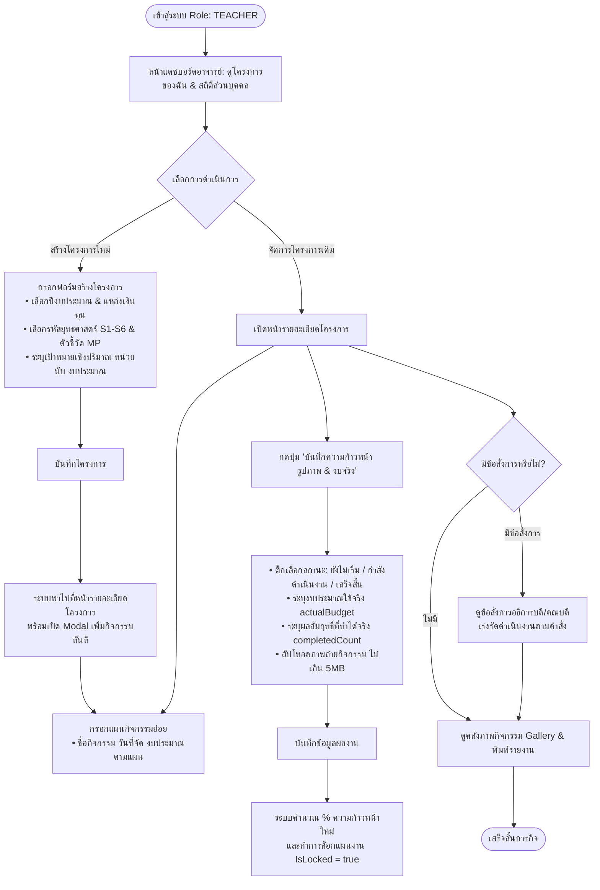
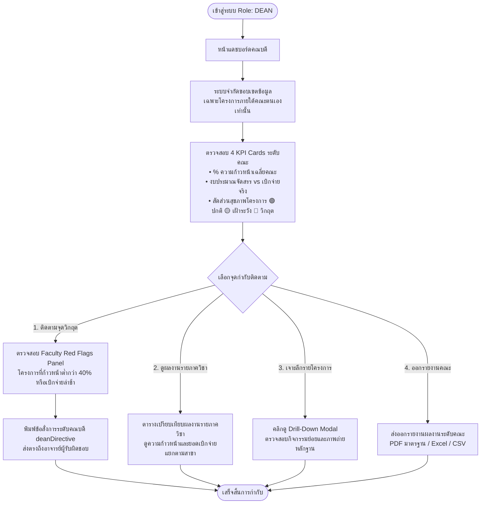
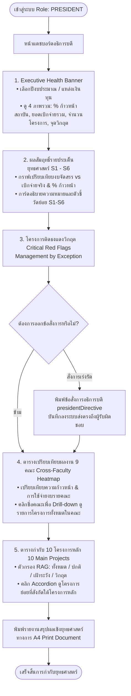
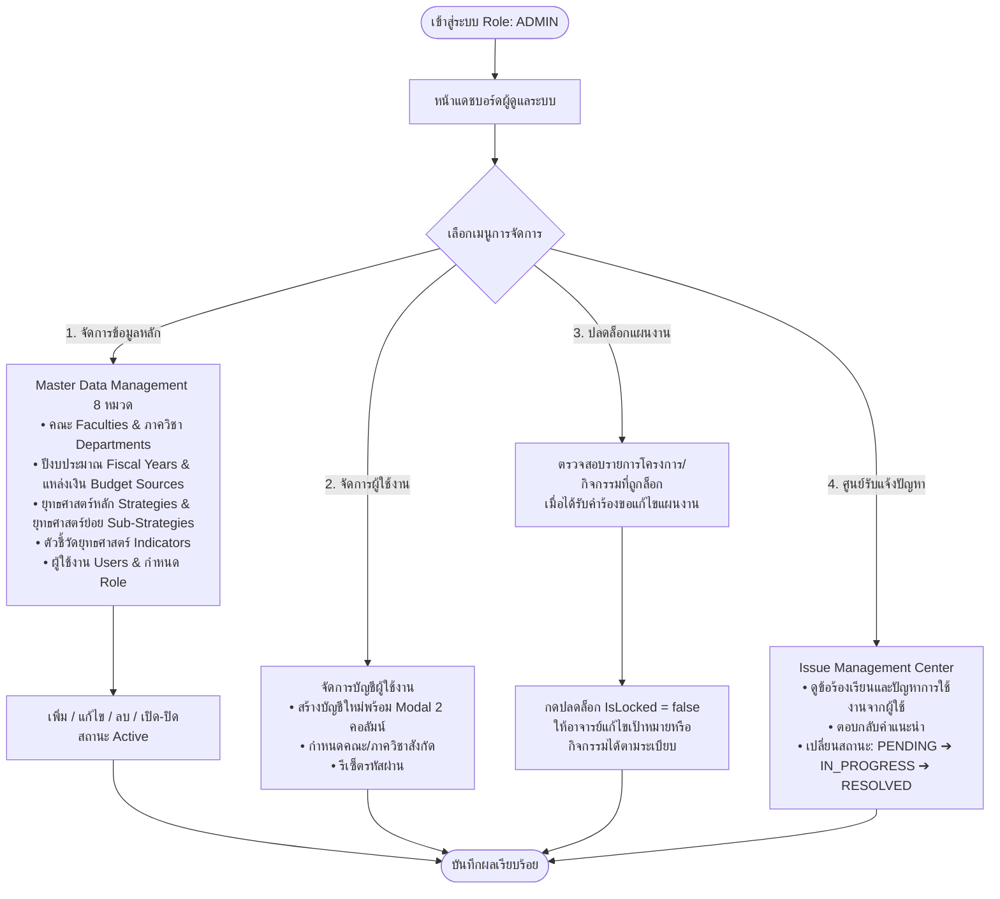
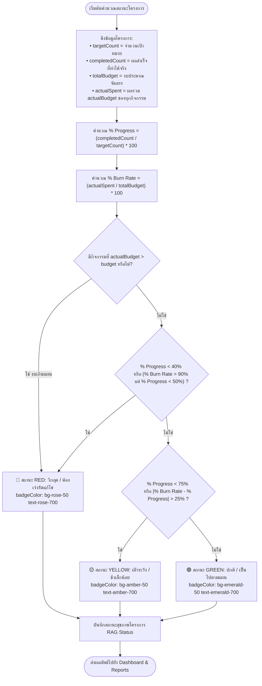
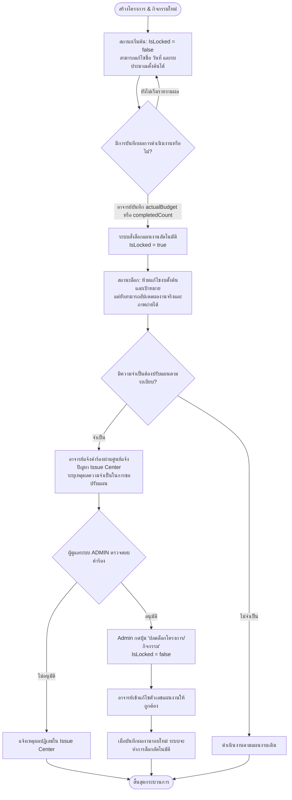

# ผังกระบวนการทำงานของระบบ (System Flowchart Manual)
## Strategic Performance Tracking System — มหาวิทยาลัยราชภัฏบุรีรัมย์ (BRU)

เอกสารนี้รวบรวม **ผังกระบวนการทำงาน (Flowcharts)** ของระบบติดตามและประเมินผลโครงการเชิงยุทธศาสตร์ มหาวิทยาลัยราชภัฏบุรีรัมย์ ครอบคลุมวงจรการทำงานแบบบูรณาการ 6 ขั้นตอน (Linear 6-Phase Architecture) ตั้งแต่การเตรียมข้อมูลพื้นฐาน จนถึงการออกข้อสั่งการและส่งออกรายงาน

---

## 📌 สารบัญผังกระบวนการทำงาน (Table of Flowcharts)

1. [Flowchart 1: ผังภาพรวมทั้งระบบแบบเส้นตรง 6 ขั้นตอน (Linear End-to-End Architecture)](#1-ผังภาพรวมทั้งระบบแบบเส้นตรง-6-ขั้นตอน-linear-end-to-end-architecture)
2. [Flowchart 2: ผังการทำงานของอาจารย์/ผู้รับผิดชอบโครงการ (Teacher Workflow)](#2-ผังการทำงานของอาจารย์ผู้รับผิดชอบโครงการ-teacher-workflow)
3. [Flowchart 3: ผังการทำงานของผู้บริหารระดับคณะ (Dean Workflow)](#3-ผังการทำงานของผู้บริหารระดับคณะ-dean-flowchart)
4. [Flowchart 4: ผังการทำงานของอธิการบดีและผู้บริหารระดับสถาบัน (President Flowchart)](#4-ผังการทำงานของอธิการบดีและผู้บริหารระดับสถาบัน-president-flowchart)
5. [Flowchart 5: ผังการทำงานของผู้ดูแลระบบ (Admin Flowchart)](#5-ผังการทำงานของผู้ดูแลระบบ-admin-flowchart)
6. [Flowchart 6: ผังตรรกะการประมวลผลสถานะโครงการ (Project RAG Calculation Engine)](#6-ผังตรรกะการประมวลผลสถานะโครงการ-project-rag-calculation-engine)
7. [Flowchart 7: ผังกระบวนการล็อกและปลดล็อกแผนงาน (Plan Locking & Unlock Workflow)](#7-ผังกระบวนการล็อกและปลดล็อกแผนงาน-plan-locking--unlock-workflow)

---

## 1. ผังภาพรวมทั้งระบบแบบเส้นตรง 6 ขั้นตอน (Linear End-to-End Architecture)

ผังแสดงวงจรการทำงานของระบบแบบจัดเรียงตามลำดับขั้น (Linear Sequential Flow) 6 ขั้นตอน เป็นระเบียบ เส้นตรง สบายตา และเห็นความเชื่อมโยงของทุกบทบาทในภาพเดียว

```mermaid
flowchart TD
    %% Global styling
    classDef phaseBox fill:#f8fafc,stroke:#cbd5e1,stroke-width:2px,color:#1e293b,font-weight:bold;
    classDef startNode fill:#0ea5e9,stroke:#0284c7,color:#ffffff,font-weight:bold;
    classDef adminNode fill:#f0f9ff,stroke:#0284c7,stroke-width:1.5px,color:#0369a1;
    classDef teacherNode fill:#f0fdf4,stroke:#16a34a,stroke-width:1.5px,color:#15803d;
    classDef engineNode fill:#fefce8,stroke:#ca8a04,stroke-width:1.5px,color:#a16207;
    classDef execNode fill:#faf5ff,stroke:#9333ea,stroke-width:1.5px,color:#7e22ce;
    classDef reportNode fill:#ecfeff,stroke:#0891b2,stroke-width:1.5px,color:#0e7490;
    classDef endNode fill:#10b981,stroke:#059669,color:#ffffff,font-weight:bold;

    Start([🟢 เริ่มต้น: ผู้ใช้งานเข้าสู่ระบบ Authentication]) :::startNode

    Start --> Stage1

    %% ========================================================
    %% STAGE 1: MASTER DATA & SETUP
    %% ========================================================
    subgraph Stage1 ["ขั้นตอนที่ 1 : ⚙️ การเตรียมข้อมูลหลัก (Master Data & Setup) — ผู้ดูแลระบบ ADMIN"]
        direction TB
        S1_1["1.1 กำหนดข้อมูลโครงสร้าง: 9 คณะ / ภาควิชา / บัญชีผู้ใช้งาน RBAC"] :::adminNode
        S1_2["1.2 กำหนดข้อมูลยุทธศาสตร์: S1-S6 / ตัวชี้วัด / 10 โครงการหลัก"] :::adminNode
        S1_3["1.3 เปิดรอบปีงบประมาณ และกำหนดแหล่งเงินทุน (Budget Sources)"] :::adminNode
        S1_1 --> S1_2 --> S1_3
    end
    style Stage1 fill:#f8fafc,stroke:#94a3b8,stroke-width:2px

    Stage1 --> Stage2

    %% ========================================================
    %% STAGE 2: PROJECT PROPOSAL & PLANNING
    %% ========================================================
    subgraph Stage2 ["ขั้นตอนที่ 2 : 📝 การสร้างข้อเสนอและแผนงาน (Project Proposal) — อาจารย์ TEACHER"]
        direction TB
        S2_1["2.1 สร้างข้อเสนอโครงการ: เลือกยุทธศาสตร์ S1-S6, ตัวชี้วัด, งบประมาณตั้งต้น"] :::teacherNode
        S2_2["2.2 ระบบนำทางอัตโนมัติ (Auto-Redirect) ไปยังหน้าโครงการทันที"] :::teacherNode
        S2_3["2.3 กำหนดแผนกิจกรรมย่อย (Activities): ระบุวันจัดกิจกรรม & งบตามแผน"] :::teacherNode
        S2_1 --> S2_2 --> S2_3
    end
    style Stage2 fill:#f0fdf4,stroke:#86efac,stroke-width:2px

    Stage2 --> Stage3

    %% ========================================================
    %% STAGE 3: EXECUTION & ACTUALS REPORTING
    %% ========================================================
    subgraph Stage3 ["ขั้นตอนที่ 3 : 🚀 การดำเนินงานและรายงานผลจริง (Execution & Actuals) — อาจารย์ TEACHER"]
        direction TB
        S3_1["3.1 ดำเนินกิจกรรมเชิงยุทธศาสตร์ในพื้นที่จริง"] :::teacherNode
        S3_2["3.2 บันทึกงบประมาณใช้จริง (actualBudget) & ผลผลิตที่ทำได้ (completedCount)"] :::teacherNode
        S3_3["3.3 อัปโหลดภาพถ่ายกิจกรรมเพื่อเป็นหลักฐานเชิงประจักษ์ (Evidence Gallery)"] :::teacherNode
        S3_1 --> S3_2 --> S3_3
    end
    style Stage3 fill:#f0fdf4,stroke:#4ade80,stroke-width:2px

    Stage3 --> Stage4

    %% ========================================================
    %% STAGE 4: AUTOMATED ENGINE & INTEGRITY LOCKING
    %% ========================================================
    subgraph Stage4 ["ขั้นตอนที่ 4 : 🧠 ระบบประมวลผลอัตโนมัติ (RAG & Integrity Engine) — CORE SYSTEM"]
        direction TB
        S4_1["4.1 คำนวณความก้าวหน้า (% Progress) & อัตราการเบิกจ่าย (% Burn Rate) แบบ Real-time"] :::engineNode
        S4_2["4.2 ประเมินสุขภาพโครงการอัตโนมัติ: 🟢 ปกติ | 🟡 เฝ้าระวัง | 🔴 วิกฤต (Red Flag)"] :::engineNode
        S4_3["4.3 มาตรการป้องกันข้อมูล: ล็อกแผนงาน (IsLocked = true) เมื่อเริ่มบันทึกผลงานจริง"] :::engineNode
        S4_1 --> S4_2 --> S4_3
    end
    style Stage4 fill:#fefce8,stroke:#fde047,stroke-width:2px

    Stage4 --> Stage5

    %% ========================================================
    %% STAGE 5: GOVERNANCE & EXECUTIVE DIRECTIVES
    %% ========================================================
    subgraph Stage5 ["ขั้นตอนที่ 5 : 🏛️ การกำกับติดตามและข้อสั่งการ (Governance & Directives) — PRESIDENT & DEAN"]
        direction TB
        S5_1["5.1 ผู้บริหารติดตามผลผ่าน Executive Dashboard & แดชบอร์ดระดับคณะ"] :::execNode
        S5_2["5.2 ตรวจสอบโครงการติดธงแดง (Management by Exception & Cross-Faculty Heatmap)"] :::execNode
        S5_3["5.3 ส่งข้อสั่งการกำชับเร่งรัด (President / Dean Directives) ตรงถึงผู้รับผิดชอบ"] :::execNode
        S5_1 --> S5_2 --> S5_3
    end
    style Stage5 fill:#faf5ff,stroke:#d8b4fe,stroke-width:2px

    Stage5 --> Stage6

    %% ========================================================
    %% STAGE 6: REPORTING & EVALUATION
    %% ========================================================
    subgraph Stage6 ["ขั้นตอนที่ 6 : 📄 การสรุปผลและส่งออกรายงาน (Reporting & Outputs) — ทุกระดับผู้ใช้"]
        direction TB
        S6_1["6.1 ออกรายงานสรุปผลสัมฤทธิ์รายยุทธศาสตร์ S1-S6 & 10 โครงการหลัก"] :::reportNode
        S6_2["6.2 ส่งออกไฟล์มาตรฐาน: PDF เอกสารทางการ / Excel ข้อมูลดิบ / CSV"] :::reportNode
        S6_3["6.3 พิมพ์รายงานแบบพิมพ์ทางการ A4 Print Layout เพื่อนำเสนอสภามหาวิทยาลัย"] :::reportNode
        S6_1 --> S6_2 --> S6_3
    end
    style Stage6 fill:#ecfeff,stroke:#a5f3fc,stroke-width:2px

    Stage6 --> End([🏁 สิ้นสุด: ครบวงจรการติดตามและประเมินผลเชิงยุทธศาสตร์]) :::endNode
```

---

## 2. ผังการทำงานของอาจารย์/ผู้รับผิดชอบโครงการ (Teacher Workflow)

แสดงขั้นตอนการสร้างโครงการ การวางแผนกิจกรรม การรายงานผลผลิตพร้อมแนบภาพถ่าย และการตอบสนองต่อข้อสั่งการ



---

## 3. ผังการทำงานของผู้บริหารระดับคณะ (Dean Workflow)

แสดงการกำกับติดตามโครงการภายในคณะ การชี้เป้าโครงการติดธงแดง (Faculty Red Flags) และการออกข้อสั่งการคณบดี



---

## 4. ผังการทำงานของอธิการบดีและผู้บริหารระดับสถาบัน (President Flowchart)

แสดงสถาปัตยกรรมแดชบอร์ด 5 ลำดับชั้นสำหรับอธิการบดี (Executive Information System - EIS)



---

## 5. ผังการทำงานของผู้ดูแลระบบ (Admin Flowchart)

แสดงกระบวนการบริหารจัดการข้อมูลหลัก (Master Data), การควบคุมสิทธิ์ผู้ใช้ (RBAC), การปลดล็อกแผนงาน และศูนย์รับแจ้งปัญหา



---

## 6. ผังตรรกะการประมวลผลสถานะโครงการ (Project RAG Calculation Engine)

แสดงขั้นตอนการคำนวณและประเมินเกณฑ์สี (Red / Yellow / Green) ของแต่ละโครงการแบบอัตโนมัติ



---

## 7. ผังกระบวนการล็อกและปลดล็อกแผนงาน (Plan Locking & Unlock Workflow)

แสดงมาตรการรักษาความน่าเชื่อถือของแผนงาน (Plan Integrity) เพื่อป้องกันการแก้ไขตัวเลขย้อนหลัง


