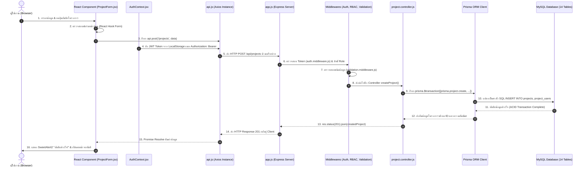

# คู่มือเตรียมสอบโครงการจบ: ระบบติดตามและประเมินผลโครงการตามยุทธศาสตร์มหาวิทยาลัย
## BRU Strategic Tracking System — Defense & Presentation Masterplan (ฉบับเข้าใจง่าย)

---

## สารบัญหัวข้อหลัก

1. [การเริ่มทดสอบการทำงานระบบ: ลำดับการทดสอบตาม Role พร้อมฉากการนำเสนอ (Testing Workflow & Presentation Script)](#1-การเริ่มทดสอบการทำงานระบบ-ลำดับการทดสอบตาม-role)
2. [วิธีรับมือเมื่อถูกสั่งให้แก้โค้ดสด (Live Coding & Customization Defense)](#2-วิธีรับมือเมื่อถูกสั่งให้แก้โค้ดสด)
   - 2.1 [การเปลี่ยนสีระบบ (Color Palette & Theme)](#21-การเปลี่ยนสีระบบ-color-palette--theme)
   - 2.2 [การแก้ไขข้อความ (Text, Labels & Alert Messages)](#22-การแก้ไขข้อความ-text-labels--alert-messages)
   - 2.3 [การแก้ไขโค้ดตรรกะระบบ (Business Logic & Validation)](#23-การแก้ไขโค้ดตรรกะระบบ-business-logic--validation)
3. [เครื่องมือที่ใช้ในการพัฒนาระบบ (Tech Stack & Development Tools)](#3-เครื่องมือที่ใช้ในการพัฒนาระบบ-tech-stack)
4. [โครงสร้างไฟล์ทั้งหมด หน้าที่ของแต่ละไฟล์ และการทำงานร่วมกัน (Full System Architecture & File Breakdown)](#4-โครงสร้างไฟล์ทั้งหมด-หน้าที่ของแต่ละไฟล์-และการทำงานร่วมกัน)
   - 4.1 [แผนผังโฟลเดอร์และไฟล์ทั้งหมดในระบบ (Inventory Tree: Database, Backend, Frontend)](#41-แผนผังโฟลเดอร์และไฟล์ทั้งหมดในระบบ)
   - 4.2 [คำอธิบายหน้าที่ของแต่ละไฟล์ในระบบอย่างละเอียด (File-by-File Detailed Explanation)](#42-คำอธิบายหน้าที่ของแต่ละไฟล์ในระบบอย่างละเอียด)
   - 4.3 [โครงสร้างหน้าจอหลักและองค์ประกอบ UI (Master Layout: Topbar, Sidebar, Main Canvas)](#43-โครงสร้างหน้าจอหลักและองค์ประกอบ-ui)
   - 4.4 [แผนผังและกลไกการทำงานร่วมกันตั้งแต่หน้าบ้านถึงฐานข้อมูล (End-to-End Collaboration & Sequence Diagram)](#44-แผนผังและกลไกการทำงานร่วมกันตั้งแต่หน้าบ้านถึงฐานข้อมูล)
5. [การ Deploy ระบบ: เครื่องมือ วิธีการทำงาน และการตั้งค่า (Deployment Architecture)](#5-การ-deploy-ระบบ-เครื่องมือและวิธีการทำงาน)
   - 5.1 [การ Deploy ฝั่ง Frontend ด้วย Vercel](#51-การ-deploy-ฝั่ง-frontend-ด้วย-vercel)
   - 5.2 [การ Deploy ฝั่ง Backend ด้วย Render / Railway หรือ VPS](#52-การ-deploy-ฝั่ง-backend-ด้วย-render--railway-หรือ-vps)
   - 5.3 [การเชื่อมต่อฐานข้อมูล (Database Deployment)](#53-การเชื่อมต่อฐานข้อมูล-database-deployment)
6. [ชื่อตารางฐานข้อมูล 14 ตารางและความหมาย (Database Architecture & Data Dictionary)](#6-ชื่อตารางฐานข้อมูล-14-ตารางและความหมาย)
7. [คำถามที่คาดว่าจะถามเกี่ยวกับระบบ พร้อมแนวทางการตอบ (Top 12 Defense Q&A)](#7-คำถามที่คาดว่าจะถามเกี่ยวกับระบบ-พร้อมแนวทางการตอบ)

---

## 1. การเริ่มทดสอบการทำงานระบบ: ลำดับการทดสอบตาม Role

> **หลักการจำง่ายๆ:** นำเสนอแบบ **"ต้นน้ำ ➔ กลางน้ำ ➔ ปลายน้ำ ➔ หลังบ้าน"**  
> เริ่มจาก **อาจารย์** (คนป้อนข้อมูล) ➔ **คณบดี** (คนกำกับคณะ) ➔ **อธิการบดี** (คนสั่งการมหาวิทยาลัย) ➔ **แอดมิน** (คนคุมระบบ)

```
┌─────────────────────────────────────────────────────────────────────────────┐
│                          ลำดับการเดินเรื่องนำเสนอระบบ                       │
├─────────────────────────────────────────────────────────────────────────────┤
│ 1. อาจารย์ (TEACHER)    : สร้างโครงการ ➔ ล็อกแผน ➔ บันทึกรูป ➔ คำนวณ % สะสม │
│ 2. คณบดี (DEAN)        : ตรวจแดชบอร์ดเฉพาะคณะ ➔ ดูผลงานสาขา ➔ สั่งการ Dean  │
│ 3. อธิการบดี (PRESIDENT): แดชบอร์ดรวม มรภ. ➔ ตรวจโครงการติดธงแดง ➔ สั่งการ Pres│
│ 4. แอดมิน (ADMIN)      : จัดการยุทธศาสตร์ ➔ ดูแลบัญชีผู้ใช้ ➔ จัดการปัญหา   │
└─────────────────────────────────────────────────────────────────────────────┘
```

### ตารางบัญชีผู้ใช้งานสำหรับทดสอบ (Demo Test Accounts)

| บทบาท (Role) | บัญชีผู้ใช้ (Username) | รหัสผ่าน (Password) | ใครเป็นผู้ใช้งาน? |
| :--- | :--- | :--- | :--- |
| **TEACHER** | `teacher` | `123456` | อ.สมชาย ใจดี (สาขาวิทยาการคอมพิวเตอร์ คณะวิทยาศาสตร์) |
| **DEAN** | `dean` | `123456` | ผศ.ดร.คณบดีคณะวิทยาศาสตร์ |
| **PRESIDENT** | `president` | `123456` | รศ.ดร.อธิการบดีมหาวิทยาลัยราชภัฏบุรีรัมย์ |
| **ADMIN** | `admin` | `admin1234` | ผู้ดูแลระบบสารสนเทศส่วนกลาง |

---

### รายละเอียดขั้นตอนการสาธิตและบทพูดทีละฉาก (Scene-by-Scene Screenplay)

#### จุดเริ่มต้น (1 นาทีแรก): เกริ่นเปิดตัวปัญหาและวัตถุประสงค์
* **บทพูดแนะนำตัว:**  
  > *"สวัสดีครับอาจารย์ทุกท่าน ระบบนี้คือ **'ระบบติดตามและประเมินผลโครงการตามยุทธศาสตร์ มหาวิทยาลัยราชภัฏบุรีรัมย์'** ครับ  
  > ปัญหาเดิมคือมหาวิทยาลัยติดตามโครงการผ่านเอกสารกระดาษและ Excel ทำให้ข้อมูลไม่เป็นปัจจุบัน ข้อมูลกระจัดกระจาย และผู้บริหารไม่รู้ว่าโครงการไหนกำลังติดขัด  
  > ระบบนี้จึงถูกสร้างขึ้นเพื่อแปลงยุทธศาสตร์ลงสู่การปฏิบัติจริงที่มีหลักฐานเชิงประจักษ์ (Evidence-based) และช่วยให้ผู้บริหารติดตามเฉพาะโครงการที่มีปัญหาได้ทันท่วงที (Management by Exception) ครับ"*

---

#### สเต็ปที่ 1: เข้าใช้งานในมุมมองอาจารย์ผู้รับผิดชอบโครงการ (Role: TEACHER)
* **ล็อกอิน:** `teacher` / `123456`
* **สิ่งที่ต้องกดโชว์:**
  1. เข้าหน้าแรกจะเห็น **"แดชบอร์ดงานของฉัน"** (สรุปเฉพาะโครงการที่ตนเองดูแล)
  2. กดเมนูด้านซ้าย **"เพิ่มโครงการใหม่"** (`/projects/new`)
  3. **โชว์จุดเด่น 1 (Cascading Dropdown ยุทธศาสตร์ 4 ระดับ):**
     * เลือก *ประเด็นการพัฒนาท้องถิ่น (LDI)* ➔ Dropdown *แผนงานหลัก (Strategy)* จะกรองเฉพาะตัวเลือกที่เกี่ยวข้องขึ้นมาอัตโนมัติ
     * เลือก *แผนงานย่อย (Sub-Strategy)* ➔ แล้วเลือก *โครงการหลัก (Main Project - MP)*
     * **ชี้ให้กรรมการดู:** แถบสีม่วงอ่อน **"Strategic Alignment Pipeline"** ด้านล่าง จะแสดงเส้นทางความเชื่อมโยงยุทธศาสตร์แบบ 4 ขั้นยืนยันความสอดคล้อง
  4. **โชว์จุดเด่น 2 (การผูกผู้ร่วมรับผิดชอบ):** ติ๊กเลือกอาจารย์ท่านอื่นในคณะเดียวกันมาร่วมดูแลโครงการ
  5. กรอกงบประมาณ เช่น `100,000` บาท, เป้าหมาย `50`, หน่วยนับ `คน`, กำหนดวันเริ่ม-สิ้นสุด ➔ กดปุ่ม **"บันทึกโครงการ"**
  6. ระบบพาเข้าหน้า **"รายละเอียดโครงการ"** (`/projects/:id`) ➔ กดปุ่ม **"เพิ่มกิจกรรม"**
     * ใส่งบใช้จริง `40,000` บาท, ผลผลิตที่ทำได้ `25` คน และแนบรูปภาพลงพื้นที่จริง ➔ กดบันทึก
     * **ชี้ให้กรรมการดู:** หลอด Progress Bar ขยับคำนวณใหม่เป็น **50.00%** ทันทีแบบ Real-time
  7. **โชว์จุดเด่น 3 (ระบบล็อกแผนงาน - Plan Locking):**
     * พอกิจกรรมถูกบันทึกแล้ว กดปุ่ม "แก้ไขโครงการ"
     * **ชี้ให้กรรมการดู:** ช่องงบประมาณและเป้าหมายจะขึ้นแม่กุญแจ 🔒 สีเทาพิมพ์แก้ไม่ได้แล้ว เพื่อป้องกันการลดเป้าหมายย้อนหลังตามหลักธรรมาภิบาล

---

#### สเต็ปที่ 2: เข้าใช้งานในมุมมองคณบดี (Role: DEAN)
* **ล็อกอิน:** `dean` / `123456`
* **สิ่งที่ต้องกดโชว์:**
  1. เข้าหน้าแรกจะเห็น **"แดชบอร์ดภาพรวมคณะวิทยาศาสตร์"**
  2. **ชี้ให้กรรมการดู Data Isolation (การจำกัดสิทธิ์ระดับคณะ):**
     * ตัวเลขงบประมาณ โครงการ และกราฟทั้งหมดจะแสดงเฉพาะคณะวิทยาศาสตร์เท่านั้น ไม่เห็นข้อมูลของคณะอื่น
  3. โชว์ตาราง **Cross-Department Matrix** เปรียบเทียบผลงาน อัตราเบิกจ่ายงบประมาณระหว่างสาขาวิชาในคณะ
  4. **โชว์การสั่งการระดับคณะ (Dean Directive):**
     * คลิกเปิดโครงการในคณะ ➔ พิมพ์ข้อสั่งการเร่งรัดงาน เช่น *"ขอให้สาขาเร่งเบิกจ่ายงวดแรกภายในสัปดาห์นี้"* ➔ กดบันทึก
     * อธิบายว่าระบบมี **IDOR Protection** คณบดีจะไม่สามารถส่งคำสั่งข้ามไปยังโครงการของคณะอื่นได้เด็ดขาด

---

#### สเต็ปที่ 3: เข้าใช้งานในมุมมองอธิการบดี/ผู้บริหารระดับสูง (Role: PRESIDENT)
* **ล็อกอิน:** `president` / `123456`
* **สิ่งที่ต้องกดโชว์:**
  1. เข้าหน้าแรกจะเห็น **"Strategic Dashboard ภาพรวมมหาวิทยาลัย"**
  2. โชว์ภาพรวมงบประมาณแผ่นดินรวม อัตราการเบิกจ่าย และสัดส่วนความก้าวหน้าทุกยุทธศาสตร์
  3. **โชว์จุดเด่น Management by Exception (โครงการติดธงแดง - Red Flags):**
     * ชี้ให้ดูกล่องสีแดง **"โครงการที่ต้องเร่งรัดติดตาม (Critical Bottlenecks)"**
     * อธิบายว่าระบบคัดกรองโครงการที่หมดเวลาแล้วแต่งานไม่เสร็จ หรือเวลาผ่านไปเกิน 50% แต่งานไม่ถึง 25% ขึ้นมาเตือนผู้บริหารอัตโนมัติ
  4. **โชว์การสั่งการอธิการบดี (President Directive):**
     * คลิกเปิดโครงการติดธงแดง ➔ พิมพ์ข้อสั่งการระดับนโยบาย ส่งตรงไปยังหน้าจอของอาจารย์ผู้รับผิดชอบทันที

---

#### สเต็ปที่ 4: เข้าใช้งานในมุมมองผู้ดูแลระบบ (Role: ADMIN)
* **ล็อกอิน:** `admin` / `admin1234`
* **สิ่งที่ต้องกดโชว์:**
  1. คลิกเมนู **"จัดการข้อมูลระบบ (Master Data)"** (`/master-data`)
  2. แสดงแท็บจัดการยุทธศาสตร์ 4 ระดับ, ปีงบประมาณ (เปิด/ปิด active), แหล่งงบประมาณ, คณะ/สาขา และจัดการบัญชีผู้ใช้งาน
  3. แสดงหน้า **"รายงานปัญหา (Issue Reports)"** ที่รับเรื่องแจ้งซ่อม/ข้อขัดข้องจากผู้ใช้ทุกระดับ เพื่อให้ Admin ตรวจสอบและอัปเดตสถานะ

---

## 2. วิธีรับมือเมื่อถูกสั่งให้แก้โค้ดสด (Live Coding Defense)

> **เทคนิคก่อนเริ่มพิมพ์:**  
> 1. ทวนโจทย์ให้ชัดเจน  
> 2. บอกชื่อไฟล์ที่จะเปิดก่อนแตะแป้นพิมพ์  
> 3. บอกจุดที่จะแก้สั้นๆ แล้วลงมือแก้ ➔ บันทึก ➔ แสดงผลทันที

---

### 2.1 การเปลี่ยนสีระบบ (Color Palette & Theme)

#### โจทย์ ก: "ลองเปลี่ยนสีหลัก (Primary Theme) ของทั้งระบบเป็นสีน้ำเงิน หรือสีเขียวให้ดูหน่อย"
* **ไฟล์ที่ต้องเปิด:** [`frontend/tailwind.config.js`](file:///c:/St_bru/frontend/tailwind.config.js) (บรรทัดที่ 10–14)
* **วิธีแก้:** เปลี่ยนรหัสสี HEX ของ `primary.DEFAULT` เพียงบรรทัดเดียว:
  ```javascript
  // เปลี่ยนจากสีม่วงเดิม (#6C3BFF) เป็น:
  primary: {
    DEFAULT: '#2563EB', // สีน้ำเงิน (หรือ #059669 สีเขียวมรกต)
    dark: '#1D4ED8',
    light: '#DBEAFE',
  }
  ```
* **คำอธิบายต่อกรรมการ:** *"ระบบเราใช้ Semantic Tokens ของ Tailwind CSS ครับ การกำหนดสีหลักไว้ที่ `primary.DEFAULT` เพียงจุดเดียว ทำให้ปุ่ม ไอคอน และแถบไฮไลต์ทั้งระบบเปลี่ยนธีมสีตามทันทีครับ"*

#### โจทย์ ข: "เปลี่ยนสีพื้นหลังหรือสีขอบของ Sidebar เมนูด้านซ้าย"
* **ไฟล์ที่ต้องเปิด:** [`frontend/src/components/Sidebar.jsx`](file:///c:/St_bru/frontend/src/components/Sidebar.jsx)
* **วิธีแก้:** ค้นหาแท็ก `<aside>` แล้วเปลี่ยนคลาสจาก `bg-white` เป็น `bg-slate-900 text-white` (เปลี่ยนเป็นโหมดมืด)

---

### 2.2 การแก้ไขข้อความ (Text, Labels & Alert Messages)

#### โจทย์ ก: "เปลี่ยนหัวข้อหน้าเว็บ หรือชื่อระบบตรง Topbar"
* **ไฟล์ที่ต้องเปิด:** [`frontend/src/components/Topbar.jsx`](file:///c:/St_bru/frontend/src/components/Topbar.jsx) (บรรทัด 24–60 ในฟังก์ชัน `getPageTitle`)
* **วิธีแก้:** แก้ไขข้อความในคำสั่ง `return '...'` เช่น จาก `'แดชบอร์ดงานของฉัน'` เป็น `'ระบบติดตามยุทธศาสตร์ มรภ.บุรีรัมย์'`

#### โจทย์ ข: "เปลี่ยนข้อความแจ้งเตือน Pop-up (SweetAlert2) เมื่อบันทึกสำเร็จ"
* **ไฟล์ที่ต้องเปิด:** [`frontend/src/pages/teacher/ProjectForm.jsx`](file:///c:/St_bru/frontend/src/pages/teacher/ProjectForm.jsx)
* **วิธีแก้:** ค้นหา `Swal.fire` แล้วเปลี่ยนข้อความใน `title:` หรือ `text:`
  ```javascript
  Swal.fire({
    icon: 'success',
    title: 'บันทึกข้อมูลเรียบร้อยแล้ว!',
    text: 'ข้อมูลโครงการถูกส่งเข้าสู่ระบบยุทธศาสตร์แล้ว'
  });
  ```

---

### 2.3 การแก้ไขโค้ดตรรกะระบบ (Business Logic & Validation)

#### โจทย์ ก: "ลองแก้ไม่ให้ผู้ใช้กรอกเป้าหมายน้อยกว่า 10"
* **หน้าบ้าน (Frontend):** เปิด [`frontend/src/pages/teacher/ProjectForm.jsx`](file:///c:/St_bru/frontend/src/pages/teacher/ProjectForm.jsx) ➔ ค้นหา `targetCount` แก้เป็น `min: { value: 10, message: 'เป้าหมายต้องไม่ต่ำกว่า 10' }`
* **หลังบ้าน (Backend):** เปิด [`backend/middleware/validation.middleware.js`](file:///c:/St_bru/backend/middleware/validation.middleware.js) ➔ แก้เป็น `.isInt({ min: 10 })`
* **โชว์กรรมการ:** ทดลองกรอกเลข 5 แล้วกดบันทึก ระบบจะแจ้งเตือนทั้งหน้าบ้านและถูกบล็อกที่หลังบ้าน

#### โจทย์ ข: "ซ่อนปุ่มลบโครงการ ไม่ให้อาจารย์เห็น ให้เห็นเฉพาะ ADMIN"
* **ไฟล์ที่ต้องเปิด:** [`frontend/src/pages/teacher/ProjectDetails.jsx`](file:///c:/St_bru/frontend/src/pages/teacher/ProjectDetails.jsx)
* **วิธีแก้:** นำตัวแปร `user` มาครอบเงื่อนไข:
  ```jsx
  {user?.role === 'ADMIN' && (
    <button onClick={handleDelete} className="btn-danger">ลบโครงการ</button>
  )}
  ```

#### โจทย์ ค: "ถ้ากรรมการสั่งให้แก้โครงสร้างตารางฐานข้อมูลสด"
* **คำตอบแบบมืออาชีพ:**  
  > *"ในระบบจริงเราใช้ Prisma ORM การแก้ตารางจะต้องเริ่มจากการแก้ไฟล์ `schema.prisma` ➔ รันคำสั่ง `npx prisma migrate dev` เพื่อให้ MySQL สร้างคอลัมน์ใหม่ แล้วจึงไปอัปเดต Controller  
  > แต่เนื่องจากการ Migrate สดตอนนี้อาจกระทบกับชุดข้อมูลทดสอบเดิม ผมขออนุญาต **เขียนโค้ดจำลองในไฟล์และอธิบายขั้นตอนการทำงานทีละสเต็ป** ให้อาจารย์เห็นภาพแทนได้ไหมครับ"*

---

## 3. เครื่องมือที่ใช้ในการพัฒนาระบบ (Tech Stack)

| ส่วนของระบบ | เครื่องมือที่ใช้ | บทบาทและหน้าที่ (ทำไมต้องเลือกตัวนี้?) |
| :--- | :--- | :--- |
| **Frontend UI** | **React 19 + Vite** | React จัดการหน้าจอด้วย Virtual DOM ทำงานแบบ SPA โหลดหน้าเร็ว ส่วน Vite ช่วยให้ Build และ Hot-Reload ได้ทันทีใน 3 วินาที |
| **Styling** | **Tailwind CSS** | Utility-first CSS กำหนดขนาด สเปซ และสีสันได้แม่นยำ รองรับ Responsive ทุกขนาดหน้าจอ |
| **Icons** | **React-Icons (Feather)** | ไอคอน Vector SVG คมชัด ไม่แตก ปรับสีและขนาดผ่านคลาส Tailwind ได้ง่าย |
| **Form Management** | **React Hook Form** | จัดการฟอร์มขนาดใหญ่ที่มี Dropdown ซับซ้อนได้ลื่นไหล ไม่เกิดการ Re-render ทั้งหน้าแบบพร่ำเพรื่อ |
| **Data Visualization**| **Chart.js + React-Chartjs-2** | สร้างกราฟสรุปสถิติงบประมาณและผลงาน เรนเดอร์บน HTML5 Canvas ลื่นไหลสวยงาม |
| **Alerts & Modals** | **SweetAlert2** | แจ้งเตือน Pop-up และ Dialog ยืนยันการลบข้อมูล สวยงาม มีมิติ แทนที่ `alert()` ธรรมดา |
| **Backend API** | **Node.js + Express.js** | Node.js ทำงานแบบ Non-blocking I/O รองรับ Request ได้พร้อมกันจำนวนมาก ส่วน Express มี Middleware ที่แข็งแกร่ง |
| **Database & ORM** | **MySQL 8.0 + Prisma ORM** | MySQL เก็บข้อมูลสัมพันธ์มั่นคงสูง ส่วน Prisma มี Type-safety และ Parameterized Queries ป้องกัน **SQL Injection ได้ 100%** |
| **Security & Auth** | **JWT + Bcrypt.js** | Bcrypt แฮชรหัสผ่าน 10 รอบ และใช้ JWT สำหรับ Stateless Authentication ควบคุมการเข้าถึงด้วย RBAC |
| **File Uploading** | **Multer** | จัดการรับไฟล์รูปภาพหลักฐานกิจกรรม ตรวจสอบนามสกุลไฟล์ และจัดเก็บลงโฟลเดอร์ `/uploads` อย่างเป็นระบบ |

---

## 4. โครงสร้างไฟล์ทั้งหมด หน้าที่ของแต่ละไฟล์ และการทำงานร่วมกัน

---

### 4.1 แผนผังโฟลเดอร์และไฟล์ทั้งหมดในระบบ (Inventory Tree)

```
c:\St_bru\
├── 📁 database/                        (สคริปต์ DDL, Data Dictionary และ ERD)
│   ├── DataDictionary.md
│   ├── ERD.md
│   ├── schema.sql
│   └── seed.sql
│
├── 📁 backend/                         (Node.js + Express + Prisma ORM)
│   ├── .env
│   ├── app.js
│   ├── package.json / package-lock.json
│   ├── seed-projects.js
│   ├── verify-endpoints.js
│   ├── 📁 config/
│   │   ├── prisma.js
│   │   └── cloudinary.js
│   ├── 📁 middleware/
│   │   ├── auth.middleware.js
│   │   ├── validation.middleware.js
│   │   └── upload.middleware.js
│   ├── 📁 routes/
│   │   ├── auth.routes.js
│   │   ├── project.routes.js
│   │   ├── activity.routes.js
│   │   ├── dashboard.routes.js
│   │   ├── directive.routes.js
│   │   ├── master.routes.js
│   │   ├── issue.routes.js
│   │   └── report.routes.js
│   ├── 📁 controllers/
│   │   ├── auth.controller.js
│   │   ├── project.controller.js
│   │   ├── activity.controller.js
│   │   ├── dashboard.controller.js
│   │   ├── master.controller.js
│   │   ├── issue.controller.js
│   │   └── report.controller.js
│   ├── 📁 prisma/
│   │   ├── schema.prisma
│   │   ├── seed.js
│   │   ├── seed-strategic-plan.js
│   │   ├── seed-admin-only.js
│   │   ├── seed-production-masterdata.js
│   │   ├── setup-4tiers.js
│   │   └── 📁 migrations/
│   └── 📁 uploads/                    (ที่จัดเก็บไฟล์รูปภาพหลักฐานกิจกรรม)
│
└── 📁 frontend/                        (React 19 + Vite + Tailwind CSS)
    ├── index.html
    ├── vite.config.js
    ├── tailwind.config.js
    ├── postcss.config.js
    ├── vercel.json
    ├── package.json / package-lock.json
    └── 📁 src/
        ├── main.jsx
        ├── App.jsx
        ├── index.css
        ├── 📁 layouts/
        │   └── AppLayout.jsx
        ├── 📁 components/
        │   ├── Topbar.jsx
        │   ├── Sidebar.jsx
        │   ├── CustomSelect.jsx
        │   ├── ExecutiveProjectModal.jsx
        │   ├── ProfileModal.jsx
        │   ├── ReportIssueModal.jsx
        │   └── ErrorBoundary.jsx
        ├── 📁 contexts/
        │   └── AuthContext.jsx
        ├── 📁 services/
        │   └── api.js
        ├── 📁 utils/
        │   ├── imageUrl.js
        │   └── statusHelper.js
        └── 📁 pages/
            ├── 📁 auth/
            │   └── Login.jsx
            ├── 📁 teacher/
            │   ├── Dashboard.jsx
            │   ├── Projects.jsx
            │   ├── ProjectForm.jsx
            │   ├── ProjectDetails.jsx
            │   ├── ActivitiesList.jsx
            │   └── Gallery.jsx
            ├── 📁 dean/
            │   ├── Dashboard.jsx
            │   ├── Projects.jsx
            │   └── Reports.jsx
            ├── 📁 president/
            │   ├── Dashboard.jsx
            │   ├── Projects.jsx
            │   └── Reports.jsx
            ├── 📁 admin/
            │   ├── Dashboard.jsx
            │   ├── MasterData.jsx
            │   ├── Projects.jsx
            │   ├── AdminActivities.jsx
            │   ├── Issues.jsx
            │   └── Reports.jsx
            └── 📁 executive/
                └── ProjectDetail.jsx
```

---

### 4.2 คำอธิบายหน้าที่ของแต่ละไฟล์ในระบบอย่างละเอียด

#### 1) หมวดฐานข้อมูล (`database/`)
* **`schema.sql`:** คำสั่ง SQL ดั้งเดิม (DDL) สำหรับสร้าง 14 ตาราง, กำหนด Primary Keys, Foreign Keys และ Constraints บน MySQL
* **`seed.sql`:** ชุดคำสั่ง `INSERT INTO` ข้อมูลจำลองและยุทธศาสตร์ตั้งต้น
* **`DataDictionary.md`:** พจนานุกรมข้อมูลฉบับสมบูรณ์ อธิบายชื่อฟิลด์ ชนิดข้อมูล และหน้าที่ของทุกคอลัมน์ใน 14 ตาราง
* **`ERD.md`:** แผนผังความสัมพันธ์เอนทิตี (Entity-Relationship Diagram) แสดงเส้นโยง 1:N และ Many-to-Many

---

#### 2) หมวดหลังบ้าน (`backend/`)
* **`app.js`:** **จุดเริ่มต้นของเซิร์ฟเวอร์ Express** รวม Middleware ทั้งหมด (CORS, Rate Limiter, Morgan, JSON Parser), แมป Route ปลายทาง และให้บริการโฟลเดอร์ภาพ `/uploads`
* **`config/prisma.js`:** ตัวสร้าง Singleton Instance ของ PrismaClient ป้องกันการเปิด Connection ซ้ำซ้อน
* **`.env`:** จัดเก็บตัวแปรระบบที่เป็นความลับ เช่น `DATABASE_URL`, `JWT_SECRET`, `PORT`
* **`prisma/schema.prisma`:** **แม่แบบฐานข้อมูลของระบบ** กำหนดโมเดล 14 ตาราง, Enums สิทธิ์, ความสัมพันธ์ Cascade และฟิลด์ข้อสั่งการผู้บริหาร
* **`prisma/seed.js`:** สคริปต์สร้างข้อมูลตั้งต้น (User แอดมิน, ผู้บริหาร, อาจารย์, ยุทธศาสตร์ 4 ระดับ, คณะ/สาขา)

##### มิดเดิลแวร์ความปลอดภัย (`middleware/`):
* **`auth.middleware.js`:** มี `authenticate` (ตรวจ JWT Bearer Token) และ `authorize` (ตรวจสิทธิ์ Role)
* **`validation.middleware.js`:** ตรวจสอบความถูกต้องของข้อมูลอินพุต เช่น รูปแบบวันที่, ตัวเลขงบประมาณไม่ติดลบ
* **`upload.middleware.js`:** ใช้ Multer จัดการไฟล์รูปภาพ ตรวจสอบนามสกุลและจำกัดขนาดไม่เกิน 5MB

##### เส้นทาง API (`routes/`):
* **`auth.routes.js`:** เส้นทางล็อกอิน, ดึงโปรไฟล์ และเปลี่ยนรหัสผ่าน
* **`project.routes.js`:** เส้นทางเพิ่ม/แก้ไข/ลบ/ล็อก โครงการ
* **`directive.routes.js`:** เส้นทางส่งข้อสั่งการระดับคณบดีและอธิการบดี (`/dean`, `/president`)
* **`activity.routes.js`:** เส้นทางบันทึกกิจกรรมย่อย และอัปโหลด/ลบรูปภาพหลักฐาน
* **`dashboard.routes.js`:** เส้นทางดึงข้อมูลสรุปแดชบอร์ดตาม Role
* **`master.routes.js`:** เส้นทางจัดการข้อมูลหลัก 9 หมวดหมู่
* **`issue.routes.js`:** เส้นทางรับแจ้งปัญหาและอัปเดตสถานะการแก้ไข
* **`report.routes.js`:** เส้นทางดึงข้อมูลออกรายงานทางการ

##### ตัวประมวลผลตรรกะระบบ (`controllers/`):
* **`auth.controller.js`:** จัดการ Login เปรียบเทียบรหัสผ่าน Bcrypt และสร้าง JWT Token
* **`project.controller.js`:** บันทึกโครงการ, คำนวณ % ก้าวหน้า (`updateProjectProgress`), ล็อกแผนงาน (Plan Locking) และบันทึกข้อสั่งการพร้อมตรวจ IDOR
* **`activity.controller.js`:** บันทึกกิจกรรมย่อย งบที่ใช้จริง และสั่งคำนวณ % โครงการแม่ใหม่ทันที
* **`dashboard.controller.js`:** คำนวณสรุปสถิติผู้บริหาร และตรวจจับ **โครงการติดธงแดง (Red Flags)**
* **`master.controller.js`:** เพิ่ม/ลบ/แก้ไข ข้อมูลระบบพื้นฐานทั้ง 9 หมวด
* **`issue.controller.js`:** รับเรื่องแจ้งปัญหา บันทึกข้อความตอบกลับของ Admin
* **`report.controller.js`:** ประมวลผลตัวเลขและสถิติสำหรับหน้าจอรายงาน

---

#### 3) หมวดหน้าบ้าน (`frontend/`)

##### ไฟล์โครงสร้างหลักและคอนฟิก:
* **`index.html`:** หน้าเว็บโครงร่างหลัก มี `<div id="root"></div>` สำหรับเรนเดอร์ React
* **`src/main.jsx`:** จุด Mount สคริปต์ React เข้ากับหน้า `index.html`
* **`src/App.jsx`:** จัดการระบบเส้นทางหน้าจอ (Routes) ทั้งหมด หุ้มด้วย `ProtectedRoute`
* **`src/index.css`:** สไตล์ Global, ฟอนต์ Prompt, สไตล์ Select และ Scrollbar
* **`tailwind.config.js`:** กำหนดธีมสีหลัก (`primary: #6C3BFF`), สีพื้นหลัง และขนาดฟอนต์
* **`vercel.json`:** คำสั่ง URL Rewrite ป้องกันหน้า 404 เมื่อ Refresh หน้าเว็บ SPA บน Vercel

##### เลย์เอาต์และคอมโพเนนต์ส่วนกลาง (`components/`, `layouts/`):
* **`layouts/AppLayout.jsx`:** โครงร่างหลัก รวม Topbar + Sidebar + `<Outlet />`
* **`components/Topbar.jsx`:** แถบหัวเว็บ แสดงชื่อหน้าภาษาไทยตาม Role, กระดิ่งแจ้งเตือน, กล่องโปรไฟล์ผู้ใช้
* **`components/Sidebar.jsx`:** แถบเมนูด้านซ้าย แสดงลิงก์นำทางตามสิทธิ์ของผู้ใช้งาน
* **`components/CustomSelect.jsx`:** Dropdown พิเศษ เรนเดอร์แบบ Portal รองรับตัวเลือกยาวและค้นหาได้
* **`components/ExecutiveProjectModal.jsx`:** Modal แสดงสรุปโครงการและช่องบันทึกข้อสั่งการของผู้บริหาร
* **`components/ProfileModal.jsx`:** Modal แก้ไขโปรไฟล์และเปลี่ยนรหัสผ่าน
* **`components/ReportIssueModal.jsx`:** Modal ส่งแจ้งปัญหาระบบไปยังผู้ดูแลระบบ
* **`components/ErrorBoundary.jsx`:** ดักจับข้อผิดพลาดของ React ไม่ให้หน้าจอดับ

##### สเตตและบริการเชื่อมต่อ (`contexts/`, `services/`, `utils/`):
* **`contexts/AuthContext.jsx`:** เก็บข้อมูล User และ Token ปัจจุบัน พร้อมฟังก์ชัน Login / Logout
* **`services/api.js`:** Axios Instance กลาง แนบ Header `Authorization: Bearer <token>` อัตโนมัติ
* **`utils/imageUrl.js`:** แปลง Path รูปภาพ และบีบอัดรูปภาพก่อนส่งขึ้นเซิร์ฟเวอร์
* **`utils/statusHelper.js`:** คำนวณสี Badge และข้อความสถานะโครงการ

##### หน้าจอผู้ใช้งานแยกตาม Role (`pages/`):
* **`auth/Login.jsx`:** หน้าจอล็อกอินเข้าสู่ระบบ
* **`teacher/` (อาจารย์):** จัดการแดชบอร์ดงานตนเอง, สร้าง/แก้ไขโครงการ, รายละเอียดโครงการ, บันทึกกิจกรรม, แกลเลอรีรูปภาพ
* **`dean/` (คณบดี):** แดชบอร์ดสรุปผลงานระดับคณะ, ตารางเปรียบเทียบสาขาวิชา, รายงานคณะ
* **`president/` (อธิการบดี):** Strategic Dashboard มหาวิทยาลัย, ตรวจจับโครงการติดธงแดง, รายงานระดับสถาบัน
* **`admin/` (ผู้ดูแลระบบ):** แดชบอร์ดระบบ, จัดการข้อมูล Master Data 9 หมวด, ปลดล็อกโครงการ, จัดการปัญหา
* **`executive/ProjectDetail.jsx`:** หน้ารายละเอียดโครงการแบบสรุปสำหรับผู้บริหาร

---

### 4.3 โครงสร้างหน้าจอหลักและองค์ประกอบ UI (Master Layout Pattern)

```
┌─────────────────────────────────────────────────────────────────────────────────┐
│                           AppLayout.jsx (Master Container)                      │
├─────────────────┬───────────────────────────────────────────────────────────────┤
│   Sidebar.jsx   │  Topbar.jsx (ปุ่มย่อเมนู, Dynamic Title, กระดิ่งแจ้งเตือน, User Profile) │
│  (เมนูนำทางซ้าย)  ├───────────────────────────────────────────────────────────────┤
│  - โลโก้ระบบ    │                                                               │
│  - ลิงก์ตาม Role│  <main className="bg-content-canvas">                         │
│  - ข้อมูลระบบ   │     <Outlet />                                                │
│  - กล่อง User   │     (พื้นที่แสดงหน้าจอตาม URL เช่น Dashboard, ProjectForm)      │
│  - ปุ่ม Logout  │                                                               │
└─────────────────┴───────────────────────────────────────────────────────────────┘
```

1. **Topbar:** หัวเว็บด้านบน มีปุ่มย่อเมนู, ชื่อหน้าเปลี่ยนตามสิทธิ์, กระดิ่งเตือนโครงการล่าช้า และเมนูโปรไฟล์
2. **Sidebar:** เมนูด้านซ้าย คัดกรองรายการเมนูให้เห็นเฉพาะหน้าที่ Role นั้นได้รับอนุญาต
3. **Main Canvas (`<Outlet />`):** พื้นที่ตรงกลางสำหรับแสดงผล Component หน้าจอตามเส้นทาง URL

---

### 4.4 แผนผังและกลไกการทำงานร่วมกันตั้งแต่หน้าบ้านถึงฐานข้อมูล



#### 4 กลไกการทำงานร่วมกันที่สำคัญ:
1. **ความปลอดภัยไร้สถานะ (Stateless JWT & RBAC):** หน้าบ้านไม่ต่อฐานข้อมูลตรง ทุกคำขอต้องผ่าน API พร้อมแนบ JWT Token ตรวจสอบสิทธิ์ที่หลังบ้านเสมอ
2. **ความสมบูรณ์ของข้อมูล (ACID Transactions):** บันทึกหลายตารางพร้อมกันผ่าน `prisma.$transaction` หากจุดใดล้มเหลวจะ Rollback ทันที ข้อมูลไม่ค้าง
3. **การคำนวณแบบ Real-time:** เมื่อบันทึกกิจกรรมย่อย หลังบ้านจะรวมผลผลิตสะสมและคำนวณ % โครงการแม่ใหม่ทันที ทำให้แดชบอร์ดเป็นปัจจุบันเสมอ
4. **การควบคุมธรรมาภิบาล (Plan Locking & IDOR):** หน้าบ้านล็อกช่องห้ามแก้ และหลังบ้านตรวจสอบซ้ำเพื่อป้องกันการลดเป้าหมายย้อนหลัง และป้องกันการสั่งการข้ามคณะ

---

## 5. การ Deploy ระบบ: เครื่องมือและวิธีการทำงาน

ระบบใช้สถาปัตยกรรม **Decoupled Architecture** (แยกหน้าบ้าน-หลังบ้านอิสระจากกัน):

```
┌─────────────────────────────────┐       ┌─────────────────────────────────┐
│       Frontend (Vercel)         │       │     Backend API (Render / VPS)  │
│  - React 19 + Tailwind CSS      │ HTTP  │  - Node.js + Express.js         │
│  - บิลด์เป็น Static HTML/JS/CSS │──────►│  - Prisma ORM + Multer Uploads  │
│  - ควบคุม SPA ด้วย vercel.json  │ Bearer│  - รันตลอด 24 ชม. ด้วย PM2      │
└─────────────────────────────────┘  JWT  └────────────────┬────────────────┘
                                                           │ TCP 3306 (SSL)
                                                           ▼
                                          ┌─────────────────────────────────┐
                                          │      Cloud Database (MySQL)     │
                                          │  - Aiven / Railway / On-Premise │
                                          │  - 14 ตาราง, ACID Transactions  │
                                          └─────────────────────────────────┘
```

### 5.1 การ Deploy ฝั่ง Frontend ด้วย Vercel
* **เครื่องมือ:** [Vercel](https://vercel.com)
* **การทำงาน:** เมื่อ Push โค้ดขึ้น GitHub ตัว Vercel จะรัน `npm run build` บิลด์โค้ดออกมาเป็นไฟล์ Static HTML/JS/CSS ในโฟลเดอร์ `frontend/dist/`
* **ทำไมต้องมี [`vercel.json`](file:///c:/St_bru/vercel.json):**  
  เพราะระบบเป็น Single Page Application (SPA) หากผู้ใช้กด Refresh ที่หน้าย่อยเช่น `/projects/5` ตัวเซิร์ฟเวอร์จะหาไฟล์ไม่เจอและขึ้น 404  
  ไฟล์ `vercel.json` จึงสั่ง **URL Rewrite** ให้ส่งทุก Request กลับมาที่ `/index.html` เพื่อให้ React Router ฝั่ง Client จัดการแสดงผลหน้าเดิมได้ถูกต้อง

### 5.2 การ Deploy ฝั่ง Backend ด้วย Render / Railway หรือ VPS
* **เครื่องมือ:** Render, Railway หรือเซิร์ฟเวอร์ Linux VPS ของมหาวิทยาลัย
* **การทำงาน:** รันด้วย Node.js ร่วมกับ **PM2 Process Manager** (`pm2 start backend/app.js --name "bru-backend"`) เพื่อให้เซิร์ฟเวอร์ทำงานตลอด 24 ชม. และรีสตาร์ตตัวเองอัตโนมัติหากมีปัญหา พร้อมตั้งค่า Nginx ทำ Reverse Proxy รองรับ HTTPS (SSL)

### 5.3 การเชื่อมต่อฐานข้อมูล (Database Deployment)
* **เครื่องมือ:** Cloud MySQL (Aiven, Railway) หรือเซิร์ฟเวอร์ MySQL ของมหาวิทยาลัย
* **การตั้งค่า Environment Variables (`.env`):**
  * `DATABASE_URL`: Connection string เชื่อมต่อ MySQL
  * `JWT_SECRET`: คีย์ลับสำหรับเข้ารหัส Token
  * `VITE_API_URL` (หน้าบ้าน): URL ชี้ไปยัง Backend API

---

## 6. ชื่อตารางฐานข้อมูล 14 ตารางและความหมาย

ฐานข้อมูลของระบบพัฒนาบน **MySQL 8.0** ผ่าน **Prisma ORM** ประกอบด้วย **14 ตาราง** แบ่งออกเป็น 5 กลุ่มโดเมน:

| ตารางที่ | ชื่อตารางใน MySQL | Prisma Model | กลุ่มข้อมูล | ความหมายและหน้าที่ในระบบ |
| :---: | :--- | :--- | :--- | :--- |
| **1** | `faculties` | `Faculty` | โครงสร้างองค์กร | เก็บข้อมูลคณะต่าง ๆ ในมหาวิทยาลัย (เป็นขอบเขตข้อมูล Data Isolation ของคณบดี) |
| **2** | `departments` | `Department` | โครงสร้างองค์กร | เก็บข้อมูลภาควิชา/สาขาวิชา ที่สังกัดภายใต้คณะ |
| **3** | `users` | `User` | โครงสร้างองค์กร | เก็บบัญชีผู้ใช้, รหัสผ่านแฮช Bcrypt, สิทธิ์ Role (`ADMIN`, `TEACHER`, `DEAN`, `PRESIDENT`) |
| **4** | `fiscal_years` | `FiscalYear` | งบประมาณ | เก็บปีงบประมาณ พ.ศ. (เช่น 2567, 2568) และสถานะปีปัจจุบัน (`active`) |
| **5** | `budget_sources` | `BudgetSource` | งบประมาณ | เก็บประเภทแหล่งเงินงบประมาณ เช่น งบประมาณแผ่นดิน, งบรายได้ (บ.กศ.), งบกองทุน |
| **6** | `local_development_issues` | `LocalIssue` | ยุทธศาสตร์ 4 ระดับ | **ยุทธศาสตร์ระดับ 1:** ประเด็นการพัฒนาท้องถิ่น (มี 4 ด้านหลักตามพันธกิจ มรภ.) |
| **7** | `strategies` | `Strategy` | ยุทธศาสตร์ 4 ระดับ | **ยุทธศาสตร์ระดับ 2:** ประเด็นยุทธศาสตร์หลักของมหาวิทยาลัย |
| **8** | `sub_strategies` | `SubStrategy` | ยุทธศาสตร์ 4 ระดับ | **ยุทธศาสตร์ระดับ 3:** แผนงานย่อยที่ระบุเป้าหมายเฉพาะเจาะจง |
| **9** | `indicators` | `Indicator` | ยุทธศาสตร์ 4 ระดับ | **ยุทธศาสตร์ระดับ 4:** โครงการหลักระดับสถาบัน (Main Project - MP) หรือตัวชี้วัด Macro |
| **10** | `projects` | `Project` | การดำเนินงานหลัก | **ตารางศูนย์กลาง (31 ฟิลด์):** เก็บชื่อโครงการ, งบประมาณ, เป้าหมาย, วันที่, % ความก้าวหน้า (`progress`), ผลผลิตสะสม (`completed_count`), สถานะล็อกแผน (`is_locked`), และข้อสั่งการ 3 ระดับ (`executive_directive`, `dean_directive`, `president_directive`) |
| **11** | `project_users` | `ProjectUser` | การดำเนินงานหลัก | **Junction Table (Many-to-Many):** ผูกอาจารย์หลายท่านมาร่วมบริหารโครงการเดียวกัน โดยใช้ Composite Primary Key `[project_id, user_id]` |
| **12** | `activities` | `Activity` | การดำเนินงานหลัก | **(13 ฟิลด์):** เก็บแผนกิจกรรมย่อย, วันที่จัด, งบตามแผน (`budget`), งบใช้จริง (`actual_budget`), ผลผลิตจริง (`completed_count`), สถานะสำเร็จ (`success`), และสถานะล็อกกิจกรรม (`is_locked`) |
| **13** | `activity_images` | `ActivityImage` | หลักฐานเชิงประจักษ์ | เก็บพาธที่อยู่ไฟล์รูปภาพหลักฐานการลงพื้นที่จัดกิจกรรมจริงบนเซิร์ฟเวอร์ (Evidence-based) |
| **14** | `issue_reports` | `IssueReport` | การดูแลระบบ | เก็บรายการแจ้งปัญหาระบบจากผู้ใช้ส่งถึง Admin พร้อมระดับความสำคัญ และสถานะการแก้ไข |

---

## 7. คำถามที่คาดว่าจะถามเกี่ยวกับระบบ พร้อมแนวทางการตอบ

### Q1: "ทำไมถึงเลือกใช้ Prisma ORM แทนที่จะเขียนคำสั่ง SQL ธรรมดา (Raw SQL)?"
> **ตอบ:**  
> *"Prisma ORM มีข้อดี 3 เรื่องหลักครับ:  
> 1) **Type Safety:** ช่วยตรวจชนิดข้อมูลและชื่อฟิลด์ตั้งแต่ขั้นตอนเขียนโค้ด ลดข้อผิดพลาด  
> 2) **Security:** มีระบบ Parameterized Queries ป้องกันการโจมตี **SQL Injection ได้ 100%**  
> 3) **Transactional Integrity:** รองรับคำสั่ง `prisma.$transaction` สำหรับการเขียนหลายตารางพร้อมกันตามมาตรฐาน ACID หากคำสั่งใดล้มเหลวระบบจะ Rollback ทันที ข้อมูลจึงไม่ตกค้างเสียหายครับ"*

---

### Q2: "ระบบล็อกแผนงาน (Plan Locking) มีขั้นตอนการทำงานอย่างไร และมีประโยชน์อย่างไร?"
> **ตอบ:**  
> *"มีเพื่อ **รักษาธรรมาภิบาลข้อมูล (Data Governance)** ครับ ป้องกันไม่ให้อาจารย์แอบลดเป้าหมายตัวชี้วัดย้อนหลังเพื่อให้ % ดูสูงขึ้น  
> เมื่อโครงการเริ่มบันทึกกิจกรรมย่อยในตาราง `activities` แล้ว หน้าบ้านจะปิด Disabled ช่องงบและเป้าหมายขึ้นแม่กุญแจ 🔒  
> และหลังบ้านใน `project.controller.js` จะตรวจสอบเงื่อนไข หากไม่ใช่สิทธิ์ `ADMIN` ระบบจะส่ง HTTP 400 ปฏิเสธการแก้ไขทันทีครับ"*

---

### Q3: "สูตรคำนวณร้อยละความก้าวหน้าของโครงการคิดคำนวณจากอะไร?"
> **ตอบ:**  
> *"คิดจาก **ผลผลิตเชิงปริมาณที่ทำได้จริงสะสม เทียบกับเป้าหมายที่ตั้งไว้ของโครงการ** ครับ  
> โดยหลังบ้านจะใช้คำสั่ง `.reduce()` รวบรวม `completedCount` จากทุกกิจกรรมของโครงการ แล้วนำมาหารด้วย `targetCount` คูณ 100 จัดรูปแบบทศนิยม 2 ตำแหน่ง พร้อมใช้ `Math.min(..., 100.0)` ป้องกันตัวเลขล้นเกิน 100% และคำนวณใหม่แบบ Real-time ทุกครั้งที่มีการบันทึกกิจกรรมครับ"*

---

### Q4: "ระบบตรวจจับโครงการติดธงแดง (Red Flags / Critical Bottlenecks) ใช้เกณฑ์อะไรในการคัดกรอง?"
> **ตอบ:**  
> *"ใช้หลักการบริหารโดยยึดข้อยกเว้น **Management by Exception (MBE)** ครับ โดยใน `dashboard.controller.js` ตรวจ 2 เงื่อนไข:  
> 1) วันที่ปัจจุบันเลยกำหนดวันสิ้นสุดโครงการแล้วแต่วานยังไม่ครบ 100%  
> 2) เวลาดำเนินงานผ่านไปเกินครึ่งหนึ่ง (50%) แต่งานทำได้จริงไม่ถึง 25%  
> หากเข้าเงื่อนไขข้อใดข้อหนึ่ง ระบบจะติดสถานะธงแดงส่งขึ้นกล่อง 'โครงการที่ต้องเร่งรัดติดตาม' บนแดชบอร์ดผู้บริหารทันที เพื่อให้ผู้บริหารกดออกข้อสั่งการเร่งรัดงานได้ตรงจุดครับ"*

---

### Q5: "ทำไมคณบดีถึงไม่เห็นข้อมูลของคณะอื่น และระบบป้องกันการแอบยิง API ข้ามคณะอย่างไร?"
> **ตอบ:**  
> *"ใช้แนวคิด **Multi-tenancy และป้องกันช่องโหว่ IDOR** ครับ:  
> 1) ตอนดึงข้อมูลแดชบอร์ด Backend จะนำ `facultyId` จาก JWT Token ของคณบดีไปครอบในเงื่อนไข Query เสมอ  
> 2) ในการออกข้อสั่งการ ฟังก์ชัน `updateExecutiveDirective` จะตรวจสอบว่ารหัสคณะของคณบดีตรงกับคณะเจ้าของโครงการหรือไม่ หากไม่ตรงจะตอบกลับด้วย **HTTP 403 Forbidden** ทันที ทำให้ไม่สามารถสั่งการข้ามคณะได้ครับ"*

---

### Q6: "รูปภาพหลักฐานกิจกรรมจัดเก็บอย่างไร และทำไมไม่เก็บเป็นไบนารีในฐานข้อมูล?"
> **ตอบ:**  
> *"เราจัดเก็บไฟล์ภาพจริงไว้บนโฟลเดอร์ `/uploads` ของเซิร์ฟเวอร์โดยใช้ Library **Multer** และในฐานข้อมูลตาราง `activity_images` จะเก็บเฉพาะ **URL Path สัมพัทธ์** เท่านั้น  
> เพราะหากเก็บไฟล์ภาพเป็นก้อน Binary (BLOB) ลงในฐานข้อมูล จะทำให้ขนาดฐานข้อมูลขยายใหญ่ขึ้นอย่างรวดเร็ว ส่งผลกระทบต่อความเร็วในการค้นหาและ Backup ข้อมูลอย่างมาก และหน้าบ้านยังมีฟังก์ชันบีบอัดภาพก่อนส่งขึ้นเซิร์ฟเวอร์ด้วยครับ"*

---

### Q7: "การยืนยันตัวตนด้วย JWT มีขั้นตอนอย่างไร และหาก Token หลุดมีความเสี่ยงไหม?"
> **ตอบ:**  
> *"ระบบใช้ **Stateless Authentication ด้วย JWT** ครับ: เมื่อผู้ใช้ล็อกอินสำเร็จ เซิร์ฟเวอร์จะสร้าง Token ที่เข้ารหัสข้อมูลผู้ใช้และกำหนดเวลาหมดอายุ  
> ฝั่งหน้าบ้านจะเก็บ Token ไว้ใน Storage และมี Axios Interceptor คอยแนบ Header `Authorization: Bearer <token>` ไปกับทุก Request  
> **ความปลอดภัย:** Token มีอายุจำกัด และทุกคำขอที่มีการแก้ไขข้อมูลสำคัญจะถูกตรวจสอบสิทธิ์ (Authorize) ซ้ำที่ฝั่ง Server เสมอครับ"*

---

### Q8: "ทำไมถึงเก็บข้อมูลงบประมาณเป็น `Decimal(12, 2)` แทนที่จะเป็น `Float`?"
> **ตอบ:**  
> *"เพราะชนิดข้อมูล `Float` หรือ `Double` ใช้การคำนวณเลขฐานสองซึ่งจะเกิด **ปัญหาปัดเศษทศนิยมคลาดเคลื่อน (Rounding Errors)**  
> ในขณะที่ `Decimal(12, 2)` ใน MySQL จะเก็บค่าตัวเลขที่แน่นอน (Exact Value) รองรับจำนวนเงินได้ถึง 9,999,999,999.99 บาท ทำให้ยอดรวมงบประมาณและการเบิกจ่ายไม่คลาดเคลื่อนแม้แต่สตางค์เดียวครับ"*

---

### Q9: "ความสัมพันธ์ Many-to-Many ระหว่างโครงการและอาจารย์ทำงานอย่างไร?"
> **ตอบ:**  
> *"เนื่องจาก 1 โครงการสามารถมีอาจารย์ผู้รับผิดชอบร่วมได้หลายท่าน และอาจารย์ 1 ท่านสามารถร่วมทำได้หลายโครงการ เราจึงสร้างตารางเชื่อมโยง (Junction Table) ชื่อว่า `project_users` ครับ  
> โดยกำหนด **Composite Primary Key** เป็น `@@id([projectId, userId])` ซึ่งช่วยป้องกันการมอบหมายอาจารย์ท่านเดิมซ้ำในโครงการเดียวกัน และเมื่อโครงการถูกลบ ข้อมูลการผูกในตารางนี้จะถูกลบตามอัตโนมัติด้วย `onDelete: Cascade` ครับ"*

---

### Q10: "ทำไมต้องมีไฟล์ `vercel.json` ในการ Deploy Frontend?"
> **ตอบ:**  
> *"เพราะแอปพลิเคชันของเราเป็น Single Page Application (SPA) ที่จัดการเส้นทางหน้าจอด้วย `react-router-dom` ฝั่งไคลเอนต์ครับ  
> หากไม่มี `vercel.json` เมื่อผู้ใช้เข้าหน้าเว็บผ่าน URL ลึก ๆ เช่น `/projects/5` หรือกด Refresh ตัวเว็บเซิร์ฟเวอร์จะหาไฟล์ `projects/5.html` ไม่เจอและแสดงข้อผิดพลาด 404  
> คำสั่ง Rewrite ใน `vercel.json` จะสั่งให้ Server ส่งคำขอทุกเส้นทางกลับมาที่ `/index.html` เพื่อให้ React โหลดขึ้นมาอ่าน URL และแสดงหน้าจอที่ถูกต้องต่อไปครับ"*

---

### Q11: "ระบบรองรับการแสดงผลบนสมาร์ตโฟนหรือแท็บเล็ต (Responsive) หรือไม่?"
> **ตอบ:**  
> *"รองรับ 100% ครับ เราใช้คลาส Responsive Breakpoints ของ Tailwind CSS เช่น `sm:`, `md:`, `lg:` ในทุกหน้าจอ  
> ตัวอย่างเช่น เมนู Sidebar ทางซ้าย เมื่อเปิดบนหน้าจอขนาดเล็กจะพับเก็บเป็นแถบเลื่อน Off-canvas และมีปุ่ม Hamburger บน Topbar สำหรับกดเรียกเปิด-ปิด ส่วนตารางข้อมูลจะมีคลาส `overflow-x-auto` เพื่อให้สามารถเลื่อนดูข้อมูลในแนวนอนได้โดยไม่ทำให้หน้าจอล้นครับ"*

---

### Q12: "หากในอนาคตมหาวิทยาลัยมีการปรับเปลี่ยนโครงสร้างยุทธศาสตร์ ระบบรองรับได้หรือไม่?"
> **ตอบ:**  
> *"รองรับได้อย่างสมบูรณ์โดยไม่ต้องแก้ไขโค้ดโปรแกรมเลยครับ  
> เพราะโครงสร้างยุทธศาสตร์ทั้ง 4 ระดับ ปีงบประมาณ และแหล่งเงินทุน ถูกออกแบบให้อยู่ในรูป **Master Data ทั้งหมด**  
> ผู้ดูแลระบบ (Admin) สามารถล็อกอินเข้าเมนู 'จัดการข้อมูลระบบ' เพื่อเพิ่ม ลบ หรือแก้ไขยุทธศาสตร์ใหม่ได้ทันทีผ่านหน้าเว็บ และฟอร์มสร้างโครงการของอาจารย์จะดึงข้อมูลใหม่มาแสดงผลแบบ Cascading โดยอัตโนมัติครับ"*
