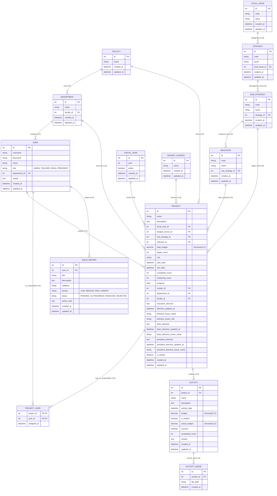

# คู่มือเตรียมสอบโครงการจบ: ระบบติดตามและประเมินผลโครงการตามยุทธศาสตร์มหาวิทยาลัย
## BRU Strategic Tracking System — Defense & Presentation Masterplan

---

## สารบัญหัวข้อหลัก (ตรงตามแนวทางการประเมินของคณะกรรมการ)

1. [วิธีการทำงานของระบบ: ต้องเริ่มนำเสนอจากส่วนไหน (System Workflow & Presentation Sequence)](#1-วิธีการทำงานของระบบ-ต้องเริ่มนำเสนอจากส่วนไหน)
2. [เครื่องมือที่ใช้ในการสร้างระบบ (Tech Stack & Development Tools)](#2-เครื่องมือที่ใช้ในการสร้างระบบ)
3. [ส่วนของระบบอยู่โค้ดไหน ไฟล์ไหน โฟลเดอร์ไหน (Source Code & Folder Mapping)](#3-ส่วนของระบบอยู่โค้ดไหน-ไฟล์ไหน-โฟลเดอร์ไหน)
4. [วิธีรับมือเมื่อถูกถามให้อธิบายโค้ดระบบและการทำงานแต่ละส่วน (Code Explanation Defense)](#4-วิธีรับมือเมื่อถูกถามให้อธิบายโค้ดระบบ)
5. [วิธีรับมือเมื่อถูกสั่งให้แก้โค้ดสดเพื่อพิสูจน์ความเข้าใจ (Live Coding & Anti-Plagiarism Defense)](#5-วิธีรับมือเมื่อถูกสั่งให้แก้โค้ดสดเพื่อพิสูจน์ว่าทำเอง)
6. [การอธิบายฐานข้อมูลในระบบ (Database Architecture, ERD & Data Dictionary)](#6-การอธิบายฐานข้อมูลในระบบ)

---

## 1. วิธีการทำงานของระบบ: ต้องเริ่มนำเสนอจากส่วนไหน

การนำเสนอที่ดีต้องมี **"Storyline"** จากต้นน้ำไปปลายน้ำ ห้ามเปิดหน้าจอสลับไปมาอย่างไร้ทิศทาง โดยให้เริ่มนำเสนอตามลำดับ **4 ขั้นตอน** ดังนี้:

```
[จุดเริ่มต้น: ปัญหาและที่มา] 
       │
       ▼
[สเต็ป 1: อาจารย์ (TEACHER)] ──► สร้างโครงการ ➔ ล็อกเป้าหมายยุทธศาสตร์ ➔ บันทึกกิจกรรม/รูปภาพ ➔ คำนวณ %
       │
       ▼
[สเต็ป 2: คณบดี (DEAN)]      ──► ตรวจสอบแดชบอร์ดระดับคณะ ➔ ติดตามความคืบหน้ารายสาขา ➔ ตรวจสอบงบประมาณ
       │
       ▼
[สเต็ป 3: อธิการบดี (PRESIDENT)] ──► Strategic Dashboard ระดับมหาวิทยาลัย ➔ ตรวจจับโครงการติดธงแดง ➔ สั่งการ
       │
       ▼
[สเต็ป 4: ผู้ดูแลระบบ (ADMIN)] ──► บริหารข้อมูลหลัก (Master Data) ➔ ตรวจสอบระบบและรับเรื่องแจ้งปัญหา
```

---

### รายละเอียดการเดินเรื่อง (Presentation Script & Screenplay)

#### จุดเริ่มต้น (1-2 นาทีแรก): เกริ่นที่มาและปัญหา
> *"สวัสดีครับอาจารย์ทุกท่าน ระบบนี้คือ 'ระบบติดตามและประเมินผลโครงการตามยุทธศาสตร์มหาวิทยาลัยราชภัฏบุรีรัมย์' ครับ ปัญหาเดิมคือมหาวิทยาลัยติดตามโครงการผ่านเอกสารกระดาษและ Excel ทำให้ข้อมูลกระจัดกระจาย ผู้บริหารมองไม่เห็นภาพรวมว่างบประมาณถูกใช้จริงหรือไม่ และไม่รู้ว่าโครงการติดขัดที่จุดใด เราจึงพัฒนาระบบนี้ขึ้นมาเพื่อแปลงยุทธศาสตร์มหาวิทยาลัยลงสู่โครงการระดับปฏิบัติการจริงที่มีหลักฐานเชิงประจักษ์ครับ"*

#### สเต็ปที่ 1: นำเสนอในมุมมองอาจารย์ผู้รับผิดชอบโครงการ (Role: TEACHER)
1. เข้าสู่ระบบด้วย User อาจารย์ ➔ ไปที่เมนู **"เพิ่มโครงการใหม่"**
2. **โชว์จุดเด่นที่ 1 (Strategic Cascading Dropdown):** แสดงให้เห็นการเลือกความเชื่อมโยง 4 ระดับ (ประเด็นการพัฒนา ➔ แผนงานหลัก ➔ แผนงานย่อย ➔ โครงการหลัก MP) พร้อมชี้ให้ดูกล่อง **"Strategic Alignment Pipeline"** ด้านล่างที่แสดงสรุปเส้นทางยุทธศาสตร์
3. **โชว์จุดเด่นที่ 2 (การผูกผู้รับผิดชอบร่วม):** แสดงระบบเลือกอาจารย์ในคณะเดียวกันมาร่วมรับผิดชอบโครงการ
4. กดบันทึกโครงการ ➔ ระบบพาเข้าสู่หน้า **"รายละเอียดโครงการ"**
5. **โชว์จุดเด่นที่ 3 (การบันทึกกิจกรรมและคำนวณ % อัตโนมัติ):** 
   - กดปุ่ม "เพิ่มกิจกรรม" กรอกงบที่ใช้จริง และผลผลิตที่ทำได้
   - อัปโหลดรูปภาพหลักฐานการลงพื้นที่จริง
   - **ชี้ให้กรรมการดู:** แถบ Progress Bar ของโครงการจะขยับคำนวณ % ใหม่ทันทีแบบ Real-time
6. **โชว์จุดเด่นที่ 4 (ระบบล็อกแผนงาน - Plan Locking):**
   - พอกิจกรรมถูกบันทึกแล้ว ให้กด "แก้ไขโครงการ" 
   - **ชี้ให้กรรมการดู:** ช่องงบประมาณรวมและเป้าหมายจะขึ้นสัญลักษณ์แม่กุญแจ 🔒 และเป็นสีเทาพิมพ์แก้ไม่ได้ เพื่อป้องกันการลดเป้าหมายย้อนหลังตามหลักธรรมาภิบาล

#### สเต็ปที่ 2: นำเสนอในมุมมองคณบดี (Role: DEAN)
1. สลับล็อกอินด้วย User คณบดี
2. **ชี้ให้กรรมการดู:** หน้า **Dean Dashboard** จะสรุปเฉพาะตัวเลขของคณะตนเอง และในหน้ารายการโครงการจะไม่เห็นข้อมูลของคณะอื่น (พิสูจน์การจำกัดสิทธิ์ Data Isolation / RBAC)
3. โชว์ตารางเปรียบเทียบผลงานและอัตราการเบิกจ่ายระหว่างสาขาวิชาในคณะ
4. **โชว์การออกข้อสั่งการระดับคณะ (Dean Directive):** คณบดีสามารถกดดูโครงการในคณะและพิมพ์ข้อสั่งการเร่งรัดงาน โดยระบบมีระบบป้องกัน IDOR Protection ป้องกันการสั่งการข้ามคณะโดยเด็ดขาด

#### สเต็ปที่ 3: นำเสนอในมุมมองอธิการบดี/ผู้บริหารระดับสูง (Role: PRESIDENT)
1. สลับล็อกอินด้วย User อธิการบดี
2. **ชี้ให้กรรมการดู:** หน้า **Strategic Dashboard ระดับมหาวิทยาลัย** แสดงสถิติงบประมาณรวม อัตราเบิกจ่าย และความสำเร็จภาพรวมทุกยุทธศาสตร์
3. **โชว์จุดเด่นที่ 5 (Management by Exception - ระบบตรวจจับธงแดง):** 
   - เลื่อนมาที่กล่อง **"โครงการที่ต้องเร่งรัด/ติดธงแดง (Bottlenecks)"** ชี้ให้เห็นว่าระบบคัดกรองโครงการที่ใกล้หมดเวลาแต่งานยังไม่คืบหน้าขึ้นมาเตือนผู้บริหารทันที
   - กดเปิดดูรายละเอียด ➔ โชว์การพิมพ์ **"ข้อสั่งการอธิการบดี (President Directive)"** ส่งตรงไปยังโครงการนั้นแบบ Real-time
   - เมื่ออาจารย์ล็อกอินกลับเข้ามา จะเห็นกล่องข้อสั่งการแยกสัดส่วนชัดเจนระหว่างข้อสั่งการคณบดีและอธิการบดี เพื่อนำไปปรับปรุงการทำงานจริง

#### สเต็ปที่ 4: นำเสนอในมุมมองผู้ดูแลระบบ (Role: ADMIN)
1. สลับล็อกอินด้วย User แอดมิน
2. โชว์หน้า **Master Data** ที่สามารถจัดการยุทธศาสตร์, ปีงบประมาณ, คณะ/สาขา และบัญชีผู้ใช้
3. โชว์หน้า **Issue Management** ที่รับเรื่องแจ้งปัญหาระบบจากผู้ใช้งาน

---

## 2. เครื่องมือที่ใช้ในการสร้างระบบ (Tech Stack & Tools)

หากกรรมการถามว่า *"ระบบนี้ใช้อะไรสร้างบ้าง และทำไมถึงเลือกเครื่องมือเหล่านี้?"* ให้ตอบแบ่งตามหมวดหมู่ดังนี้:

| หมวดหมู่ | เทคโนโลยี / เครื่องมือ | เหตุผลความจำเป็นในการเลือกใช้ (Why this tool?) |
| :--- | :--- | :--- |
| **Frontend Framework** | **React 19 + Vite** | React ใช้แนวคิด Component-based ทำให้จัดการ UI ซับซ้อนได้ง่าย และ Vite ช่วยให้ Build และ Hot-Reload ได้รวดเร็วกว่า Webpack แบบเดิมมาก |
| **Styling & UI** | **Tailwind CSS** | เป็น Utility-first CSS ช่วยให้ปรับแต่งหน้าจอแบบ Responsive ได้ยืดหยุ่น ดีไซน์สะอาด โทนโค้งมนขาว คุมธีมทั้งระบบได้สม่ำเสมอ |
| **Form Management** | **React Hook Form** | จัดการ State ของฟอร์มขนาดใหญ่ที่มี Dropdown ซ้อนกันได้โดยไม่ทำให้ Component Re-render ทั้งหน้าแบบพร่ำเพรื่อ ประสิทธิภาพสูงมาก |
| **Data Visualization** | **Chart.js + React-Chartjs-2** | ใช้สร้างกราฟแดชบอร์ด เช่น กราฟแท่งเปรียบเทียบงบประมาณ และกราฟวงกลมแสดงสัดส่วนโครงการ เรนเดอร์บน Canvas ลื่นไหล |
| **Alerts & Modals** | **SweetAlert2** | ใช้ทำกล่องแจ้งเตือน Pop-up และกล่องยืนยันการลบข้อมูล (Confirmation Dialog) ที่สวยงามและจัดการ Promise ได้ง่าย |
| **Backend Runtime** | **Node.js + Express.js** | Node.js ทำงานแบบ Non-blocking I/O รองรับ Request ได้พร้อมกันจำนวนมาก ส่วน Express มี Middleware Ecosystem ที่แข็งแกร่ง |
| **Database & ORM** | **MySQL + Prisma ORM** | MySQL เป็น Relational Database ที่เสถียรสูง เหมาะกับข้อมูลที่มีความสัมพันธ์ซับซ้อน ส่วน Prisma ให้ Type-safety ป้องกัน SQL Injection 100% |
| **Security & Auth** | **JWT + bcryptjs** | ใช้ JSON Web Token สำหรับ Stateless Authentication เพื่อยืนยันตัวตน และใช้ bcrypt แฮชรหัสผ่านความปลอดภัยสูง |
| **Data Validation** | **Express-Validator** | ตรวจสอบชนิดข้อมูล (Sanitization & Validation) ฝั่ง Server ก่อนเขียนลงฐานข้อมูล ป้องกันข้อมูลผิดรูปแบบ |
| **File Uploading** | **Multer** | จัดการอัปโหลดไฟล์รูปภาพหลักฐานกิจกรรม จัดเก็บลงโฟลเดอร์ `/uploads` อย่างเป็นระบบ |

---

## 3. ส่วนของระบบอยู่โค้ดไหน ไฟล์ไหน โฟลเดอร์ไหน

### 3.1 แผนผังโฟลเดอร์ภาพรวม
* **`c:\St_bru\backend\`** : แหล่งรวมโค้ดฝั่ง Server, API Routes, Logic, Middlewares และฐานข้อมูล
* **`c:\St_bru\frontend\`** : แหล่งรวมโค้ดฝั่ง Client หน้าจอ React, Components, Contexts และ Styling

---

### 3.2 ตารางค้นหาตำแหน่งไฟล์ตามโมดูลการทำงาน (Cheat Sheet)

| โมดูลการทำงานของระบบ | ไฟล์โค้ดหน้าบ้าน (Frontend) | ไฟล์โค้ดหลังบ้าน (Backend) | ตารางฐานข้อมูลที่เกี่ยวข้อง |
| :--- | :--- | :--- | :--- |
| **1. ระบบล็อกอิน และ RBAC** | `src/pages/auth/Login.jsx`<br>`src/contexts/AuthContext.jsx`<br>`src/App.jsx` (`ProtectedRoute`) | `controllers/auth.controller.js`<br>`routes/auth.routes.js`<br>`middleware/auth.middleware.js` | `users`, `departments`, `faculties` |
| **2. ยุทธศาสตร์ 4 ระดับ (Cascading)** | `src/pages/teacher/ProjectForm.jsx`<br>`src/components/CustomSelect.jsx` | `controllers/master.controller.js`<br>`routes/master.routes.js` | `local_development_issues`,<br>`strategies`,<br>`sub_strategies`, `indicators` |
| **3. การสร้าง/แก้ไขโครงการ** | `src/pages/teacher/ProjectForm.jsx`<br>`src/pages/teacher/Projects.jsx` | `controllers/project.controller.js`<br>`routes/project.routes.js`<br>`middleware/validation.middleware.js` | `projects`, `project_users`,<br>`fiscal_years`, `budget_sources` |
| **4. ระบบล็อกแผนงาน (Plan Lock)** | `src/pages/teacher/ProjectForm.jsx`<br>(ค้นหา `isPlanLocked`) | `controllers/project.controller.js`<br>(บรรทัด 330–340 ใน `updateProject`) | ฟิลด์ `projects.is_locked` |
| **5. การบันทึกกิจกรรม & คำนวณ %** | `src/pages/teacher/ProjectDetails.jsx`<br>`src/pages/teacher/ActivitiesList.jsx` | `controllers/project.controller.js`<br>(ฟังก์ชัน `updateProjectProgress`)<br>`controllers/activity.controller.js` | `activities`, `projects` |
| **6. อัปโหลดรูปภาพหลักฐาน** | `src/pages/teacher/ProjectDetails.jsx`<br>`src/pages/teacher/Gallery.jsx` | `controllers/activity.controller.js`<br>`middleware/upload.middleware.js` | `activity_images` |
| **7. แดชบอร์ดอธิการบดี (President)** | `src/pages/president/Dashboard.jsx`<br>`src/components/ExecutiveProjectModal.jsx` | `controllers/dashboard.controller.js`<br>(ฟังก์ชัน `getPresidentDashboard`) | ทุกตารางรวมกัน (Aggregate Queries) |
| **8. แดชบอร์ดคณบดี (Dean)** | `src/pages/dean/Dashboard.jsx` | `controllers/dashboard.controller.js`<br>(ฟังก์ชัน `getDeanDashboard`) | `projects`, `departments`, `activities` |
| **9. ข้อสั่งการผู้บริหาร (Directives)** | `src/components/ExecutiveProjectModal.jsx`<br>`src/pages/teacher/ProjectDetails.jsx` | `controllers/project.controller.js`<br>(ฟังก์ชัน `updateExecutiveDirective`)<br>`routes/directive.routes.js`<br>`routes/project.routes.js` | ฟิลด์ `projects.executive_directive`,<br>`projects.dean_directive`,<br>`projects.president_directive` |
| **10. จัดการข้อมูลหลัก (Master Data)**| `src/pages/admin/MasterData.jsx` | `controllers/master.controller.js`<br>`routes/master.routes.js` | ทุกตาราง Master Data (`faculties`, `departments`, `fiscal_years`, `budget_sources`, ฯลฯ) |
| **11. การแจ้งปัญหา (Issue Report)** | `src/components/ReportIssueModal.jsx`<br>`src/pages/admin/Issues.jsx` | `controllers/issue.controller.js`<br>`routes/issue.routes.js` | `issue_reports` |
| **12. รายงานและสถิติภาพรวม (Reports)** | `src/pages/president/Dashboard.jsx`<br>`src/pages/dean/Dashboard.jsx` | `controllers/report.controller.js`<br>`routes/report.routes.js` | Aggregate จาก `projects`, `activities`, `fiscal_years` |

---

## 4. วิธีรับมือเมื่อถูกถามให้อธิบายโค้ดระบบ

เมื่อกรรมการสุ่มชี้โค้ด ให้ใช้ **"หลักการอธิบาย 3 ชั้น (Why ➔ What ➔ How)"**:
1. **Why:** ท่อนนี้สร้างขึ้นมาเพื่อแก้โจทย์อะไรในระบบ
2. **What:** รับข้อมูลตัวแปรอะไรเข้ามา (Inputs)
3. **How:** ประมวลผลอย่างไร และส่งผลลัพธ์อะไรออกไป (Process & Outputs)

---

### เจาะลึก 6 จุดที่กรรมการชอบชี้ถามมากที่สุด:

#### จุดที่ 1: ฟังก์ชันคำนวณ % ความก้าวหน้า (`backend/controllers/project.controller.js`)
```javascript
const updateProjectProgress = async (projectId, txClient = prisma) => {
  const project = await txClient.project.findUnique({
    where: { id: projectId },
    include: { activities: true }
  });

  const completedCount = project.activities.reduce((sum, a) => {
    return sum + (a.completedCount > 0 ? a.completedCount : (a.success ? 1 : 0));
  }, 0);

  const targetCount = Math.max(1, project.targetCount || 1);
  const remainingCount = Math.max(0, targetCount - completedCount);
  let progress = parseFloat(((completedCount / targetCount) * 100).toFixed(2));
  progress = Math.min(Math.max(0, progress), 100.0);

  await txClient.project.update({
    where: { id: projectId },
    data: { completedCount, remainingCount, progress }
  });
};
```
* **บทพูดอธิบาย:**  
  > *"ฟังก์ชันนี้คือหัวใจการประเมินผลของระบบครับ (Why) รับรหัสโครงการ `projectId` เข้ามา (What) จากนั้นนำกิจกรรมทั้งหมดของโครงการมารวมผลผลิตจริงด้วย `.reduce()` เทียบกับเป้าหมาย `targetCount` ที่ตั้งไว้ แล้วคำนวณเป็นเปอร์เซ็นต์ทศนิยม 2 ตำแหน่ง โดยมี `Math.min(..., 100.0)` ป้องกันเปอร์เซ็นต์ล้นเกิน 100% จากนั้นอัปเดตกลับเข้าฐานข้อมูลแบบ Real-time ทันทีที่มีการเพิ่มหรือแก้กิจกรรมครับ (How)"*

---

#### จุดที่ 2: ตรรกะ Plan Locking (`backend/controllers/project.controller.js` บรรทัด 330–340)
```javascript
const hasActivities = project.activities && project.activities.length > 0;
const isChangingTargetOrBudget = 
  parseFloat(totalBudget) !== parseFloat(project.totalBudget) ||
  parseInt(targetCount) !== parseInt(project.targetCount);

if (hasActivities && isChangingTargetOrBudget && userRole !== 'ADMIN') {
  return res.status(400).json({
    message: 'ไม่สามารถแก้ไขงบประมาณรวมหรือเป้าหมายได้ เนื่องจากโครงการนี้มีกิจกรรมในแผนงานแล้ว (Plan Locked)'
  });
}
```
* **บทพูดอธิบาย:**  
  > *"ท่อนนี้คือระบบควบคุมธรรมาภิบาลข้อมูลครับ (Why) เพื่อป้องกันไม่ให้อาจารย์แอบลดเป้าหมายหรือปรับงบย้อนหลังหลังจากเริ่มทำงานไปแล้ว โดยตรวจสอบว่าถ้าโครงการมีกิจกรรมแล้ว (`hasActivities`) และผู้ใช้พยายามเปลี่ยนค่างบหรือเป้าหมาย โดยที่ไม่ได้มีสิทธิ์เป็น `ADMIN` ระบบจะตัดการทำงานและส่ง HTTP 400 ปฏิเสธทันทีครับ (How)"*

---

#### จุดที่ 3: ระบบตรวจจับโครงการติดธงแดง (`backend/controllers/dashboard.controller.js`)
```javascript
const isDelayed = (progress < 100 && now > new Date(p.endDate)) || 
                  (timeElapsedRatio > 0.5 && progress < 25);
```
* **บทพูดอธิบาย:**  
  > *"นี่คือตรรกะ Management by Exception สำหรับผู้บริหารครับ (Why) ระบบจะเปรียบเทียบสัดส่วนเวลาที่ผ่านไปกับความก้าวหน้าจริง หากโครงการหมดเวลาแล้วแต่งานยังไม่เสร็จ หรือเวลาผ่านไปเกินครึ่งหนึ่ง (50%) แต่งานทำได้ไม่ถึง 25% ระบบจะติดธงแดงว่าเป็นโครงการคอขวด (Bottleneck) ส่งขึ้นหน้าจอ Dashboard ของอธิการบดีทันทีครับ (How)"*

---

#### จุดที่ 4: Middleware ตรวจสอบสิทธิ์ RBAC (`backend/middleware/auth.middleware.js`)
```javascript
const authorize = (...roles) => {
  return (req, res, next) => {
    if (!req.user || !roles.includes(req.user.role)) {
      return res.status(403).json({ message: 'Access denied: insufficient permissions' });
    }
    next();
  };
};
```
* **บทพูดอธิบาย:**  
  > *"ส่วนนี้คือตัวกรองสิทธิ์ระดับ Route ครับ (Why) รับรายชื่อ Role ที่ได้รับอนุญาตเข้ามา เช่น `authorize('ADMIN', 'PRESIDENT')` (What) แล้วเทียบกับ `req.user.role` ที่ถอดรหัสมาจาก JWT Token ถ้าไม่ตรงจะคืนค่า 403 Forbidden ทันที ทำให้ผู้ใช้ไม่สามารถแอบยิง API ข้ามสิทธิ์ของตนเองได้ครับ (How)"*

---

#### จุดที่ 5: การกรองยุทธศาสตร์แบบ Cascading (`frontend/src/pages/teacher/ProjectForm.jsx`)
```javascript
const filteredStrategies = selectedLocalIssueId
  ? strategies.filter(s => s.localIssueId === parseInt(selectedLocalIssueId, 10))
  : strategies;
```
* **บทพูดอธิบาย:**  
  > *"ตรงนี้คือตรรกะคัดกรองข้อมูลฝั่ง Client ครับ (Why) เมื่อผู้ใช้เลือกประเด็นการพัฒนา `selectedLocalIssueId` ตัวแปร `filteredStrategies` จะถูกกรองด้วย `.filter()` ให้เหลือเฉพาะแผนงานหลักที่สังกัดประเด็นนั้น ส่งผลให้ Dropdown แผนงานหลักแสดงเฉพาะตัวเลือกที่เกี่ยวข้องโดยอัตโนมัติครับ (How)"*

---

#### จุดที่ 6: การป้องกันการสั่งการข้ามคณะ (IDOR Protection) (`backend/controllers/project.controller.js` บรรทัด 510–517)
```javascript
// IDOR Check: DEAN can only issue directive to projects belonging to their faculty
if (userRole === 'DEAN') {
  const userFacultyId = req.user.department?.facultyId;
  const projFacultyId = project.facultyId || 
    (await prisma.department.findUnique({ where: { id: project.departmentId } }))?.facultyId;
  if (!userFacultyId || projFacultyId !== userFacultyId) {
    return res.status(403).json({ 
      message: 'Access denied: Cannot issue directive to project outside your faculty' 
    });
  }
}
```
* **บทพูดอธิบาย:**  
  > *"ท่อนนี้คือความปลอดภัยระดับ Data Isolation และป้องกันช่องโหว่ Insecure Direct Object References (IDOR) ครับ (Why) รับ `userRole` และข้อมูลโครงการเป้าหมายเข้ามา (What) โดยตรวจสอบว่าหากผู้สั่งการมีบทบาทเป็น `DEAN` คณะของคณบดีจะต้องตรงกับคณะเจ้าของโครงการเท่านั้น หากไม่ตรงหรือพยายามสั่งการข้ามคณะ ระบบจะปฏิเสธด้วย HTTP 403 Forbidden ทันที ส่วนอธิการบดี (`PRESIDENT`) หรือ `ADMIN` จะมีสิทธิ์สั่งการข้ามคณะได้ทั้งมหาวิทยาลัยครับ (How)"*

---

## 5. วิธีรับมือเมื่อถูกสั่งให้แก้โค้ดสดเพื่อพิสูจน์ว่าทำเอง

กรรมการมักสั่งให้แก้โค้ดเพื่อทดสอบว่า **"เราเป็นคนเขียนระบบเองจริง หรือจ้างคนอื่นทำมา"**

### กฎเหล็ก 5 ข้อเพื่อความมั่นใจและปลอดภัย:
1. **อย่าลนลานและอย่าเพิ่งพิมพ์:** ให้ทวนโจทย์ซ้ำเสียงดังฟังชัด เช่น *"อาจารย์ต้องการให้เปลี่ยนเงื่อนไขตรงนี้ ให้แสดงผลแบบนี้ ถูกต้องไหมครับ"*
2. **บอกชื่อไฟล์ที่จะแก้ก่อนเปิด:** (แสดงว่าเรารู้จักโครงสร้างโค้ดทุกซอกทุกมุม)
3. **บอกสิ่งที่จะทำก่อนเคาะแป้นพิมพ์:** เช่น *"ผมจะเข้าไปเพิ่มเงื่อนไข `if` ใน Controller ตัวนี้ครับ"*
4. **ลงมือแก้แบบใจเย็น:** เซฟ แล้วรันแสดงผลให้ดู
5. **ก่อนเริ่มสอบ:** ให้พิมพ์ `git status` หรือ Commit งานไว้ก่อนเสมอ หากแก้แล้วหลงทางสามารถกด `Ctrl + Z` หรือใช้คำสั่ง `git checkout -- .` เพื่อย้อนกลับมาจุดปลอดภัยได้ทันที

---

### 4 รูปแบบโจทย์แก้สดที่พบบ่อย พร้อมแนวทางแก้:

#### โจทย์ที่ 1: "ลองแก้ให้ช่องเป้าหมายห้ามกรอกน้อยกว่า 10 สิ"
* **ไฟล์ที่ต้องแก้:**
  1. Frontend: `frontend/src/pages/teacher/ProjectForm.jsx`
     * หา `min: { value: 1, ... }` ➔ เปลี่ยนเป็น `min: { value: 10, message: 'เป้าหมายต้องไม่น้อยกว่า 10' }`
  2. Backend: `backend/middleware/validation.middleware.js`
     * หา `body('targetCount').isInt({ min: 1 })` ➔ เปลี่ยนเป็น `.isInt({ min: 10 })`
* **การทดสอบ:** กรอกเลข 5 แล้วกดบันทึก โชว์ให้กรรมการดูว่าระบบบล็อกทั้งหน้าบ้านและหลังบ้าน

#### โจทย์ที่ 2: "ซ่อนปุ่มลบโครงการ ไม่ให้อาจารย์เห็น ให้เห็นเฉพาะ Admin"
* **ไฟล์ที่ต้องแก้:** `frontend/src/pages/teacher/ProjectDetails.jsx` (หรือ `Projects.jsx`)
* **วิธีแก้:** นำตัวแปร `user` จาก `useContext(AuthContext)` มาครอบปุ่ม:
  ```jsx
  {user?.role === 'ADMIN' && (
    <button onClick={handleDelete} className="btn-delete">
      ลบโครงการ
    </button>
  )}
  ```
* **การทดสอบ:** สลับบัญชีให้อาจารย์ดูว่าปุ่มลบหายไป พอสลับเป็น Admin ปุ่มลบจะกลับมา

#### โจทย์ที่ 3: "ลองเปลี่ยนข้อความแจ้งเตือน หรือเปลี่ยนสี Badge สถานะ"
* **ไฟล์ที่ต้องแก้:** `frontend/src/pages/teacher/ProjectDetails.jsx` หรือ `frontend/src/utils/statusHelper.js`
* **วิธีแก้:** เปลี่ยนคลาส Tailwind เช่น จาก `bg-emerald-100 text-emerald-800` เป็น `bg-blue-100 text-blue-800`

#### โจทย์ที่ 4: "ถ้าคำสั่งลึกเกินไป เช่น สั่งแก้โครงสร้างตารางฐานข้อมูลสด"
* **แนวทางการตอบอย่างมืออาชีพ (เพื่อไม่ให้เสียคะแนนและไม่ทำระบบพัง):**
  > *"โจทย์นี้น่าสนใจมากครับอาจารย์ ในทางปฏิบัติระบบของเราใช้ Prisma ORM การจะเพิ่มฟิลด์นี้จะต้องเริ่มจากเข้าไปแก้ Model ใน `schema.prisma` จากนั้นรันคำสั่ง `npx prisma migrate dev` เพื่อสั่งสร้างคอลัมน์ใน MySQL แล้วจึงมาอัปเดต validation middleware และ controller  
  > แต่เนื่องจากการ Migrate ฐานข้อมูลสดในขณะนี้อาจกระทบกับข้อมูลทดสอบเดิมที่มีอยู่ ผมขออนุญาต **เขียนโค้ดจำลองในไฟล์และอธิบายขั้นตอนการทำงานทีละสเต็ป** ให้อาจารย์เห็นภาพแทนการสั่ง Migrate จริงได้ไหมครับ"*  
  *(กรรมการจะยอมรับทันที เพราะแสดงถึงวุฒิภาวะของนักพัฒนาที่คำนึงถึงความปลอดภัยของฐานข้อมูล)*

## 6. การอธิบายฐานข้อมูลในระบบ (Database Architecture & ERD)

ฐานข้อมูลของระบบพัฒนาบน **MySQL** จัดการโครงสร้างความสัมพันธ์ผ่าน **Prisma ORM (`backend/prisma/schema.prisma`)** ออกแบบตามหลัก **Third Normal Form (3NF)** ประกอบด้วย **14 ตารางหลัก** แบ่งออกเป็น 5 กลุ่มโดเมนธุรกิจ ดังนี้:

---

### 6.1 รายชื่อตารางทั้งหมด 14 ตารางในระบบ (14 Tables Breakdown)

#### กลุ่มที่ 1: โครงสร้างองค์กรและผู้ใช้งาน (3 ตาราง)
1. **`faculties`** (Model: `Faculty`) : จัดเก็บข้อมูลคณะในมหาวิทยาลัย (เช่น คณะวิทยาศาสตร์, คณะครุศาสตร์)
2. **`departments`** (Model: `Department`) : จัดเก็บข้อมูลภาควิชา/สาขาวิชา ที่สังกัดแต่ละคณะ
3. **`users`** (Model: `User`) : จัดเก็บข้อมูลบัญชีผู้ใช้งาน, รหัสผ่านที่แฮชแล้ว, และบทบาทสิทธิ์ (Enum: `ADMIN`, `TEACHER`, `DEAN`, `PRESIDENT`)

#### กลุ่มที่ 2: ปีงบประมาณและแหล่งเงินทุน (2 ตาราง)
4. **`fiscal_years`** (Model: `FiscalYear`) : จัดเก็บปีงบประมาณ (พ.ศ.) และสถานะปีงบปัจจุบัน (`active`)
5. **`budget_sources`** (Model: `BudgetSource`) : จัดเก็บแหล่งที่มาของเงินงบประมาณ (เช่น งบแผ่นดิน, งบรายได้)

#### กลุ่มที่ 3: สายสัมพันธ์ยุทธศาสตร์ 4 ระดับ (4 ตาราง)
6. **`local_development_issues`** (Model: `LocalIssue`) : ประเด็นการพัฒนาท้องถิ่น (ยุทธศาสตร์ระดับที่ 1 มี 4 ด้าน)
7. **`strategies`** (Model: `Strategy`) : แผนงานหลักของมหาวิทยาลัย (ยุทธศาสตร์ระดับที่ 2)
8. **`sub_strategies`** (Model: `SubStrategy`) : แผนงานย่อย (ยุทธศาสตร์ระดับที่ 3)
9. **`indicators`** (Model: `Indicator`) : โครงการหลักระดับมหาวิทยาลัย / Main Project - MP (ยุทธศาสตร์ระดับที่ 4)

#### กลุ่มที่ 4: โครงการปฏิบัติการ กิจกรรม และหลักฐานเชิงประจักษ์ (4 ตาราง)
10. **`projects`** (Model: `Project`) : **ตารางหลักศูนย์กลางของระบบ** จัดเก็บชื่อโครงการ, งบประมาณรวม, เป้าหมาย, หน่วยนับ, วันที่เริ่ม-สิ้นสุด, สรุปผลผลิตจริง (`completed_count`), ผลผลิตคงเหลือ (`remaining_count`), เปอร์เซ็นต์ความก้าวหน้า (`progress`), สถานะล็อกแผนงาน (`is_locked`), และระบบข้อสั่งการ 3 ระดับ (`executive_directive`, `dean_directive`, `president_directive` พร้อมประวัติวันเวลาและผู้สั่งการ)
11. **`project_users`** (Model: `ProjectUser`) : **ตาราง Junction Table (Many-to-Many)** เชื่อมโยงอาจารย์ผู้รับผิดชอบร่วมหลายท่านเข้ากับโครงการ โดยใช้ Composite Primary Key `[project_id, user_id]`
12. **`activities`** (Model: `Activity`) : จัดเก็บแผนกิจกรรมย่อยภายใต้โครงการ, วันที่จัด, งบประมาณที่ตั้งไว้ (`budget`), งบประมาณที่ใช้จริง (`actual_budget`), ผลผลิตที่ทำได้จริง (`completed_count`), สถานะความสำเร็จ (`success`), สถานะล็อกกิจกรรม (`is_locked`), และหมายเหตุผลดำเนินงาน
13. **`activity_images`** (Model: `ActivityImage`) : จัดเก็บพาธที่อยู่ไฟล์รูปภาพหลักฐานการลงพื้นที่จัดกิจกรรมจริง (Evidence-based)

#### กลุ่มที่ 5: การดูแลระบบและรับแจ้งปัญหา (1 ตาราง)
14. **`issue_reports`** (Model: `IssueReport`) : จัดเก็บรายการแจ้งปัญหาการใช้งานระบบจากผู้ใช้ส่งถึง Admin พร้อมระดับความสำคัญ (Enum: `LOW`, `MEDIUM`, `HIGH`, `URGENT`) และสถานะการแก้ไข (Enum: `PENDING`, `IN_PROGRESS`, `RESOLVED`, `REJECTED`)

### 6.2 คำอธิบายฟิลด์และความหมายของแต่ละตารางอย่างละเอียด (Field-by-Field Meaning Breakdown)

#### 1. ตาราง `faculties` (ข้อมูลคณะในมหาวิทยาลัย)
* **ความหมายในระบบ:** เป็นเอนทิตีระดับบนสุดของโครงสร้างองค์กร ใช้จัดกลุ่มภาควิชา/สาขาวิชา และใช้เป็นขอบเขตข้อมูล (Data Boundary) สำหรับผู้บริหารระดับคณบดี (`DEAN`)
| ฟิลด์ (Column) | ชนิดข้อมูล (Data Type) | Constraints | ความหมายและการนำไปใช้งาน |
| :--- | :--- | :--- | :--- |
| `id` | `Int` | Primary Key, Auto Increment | รหัสระบุคณะ |
| `name` | `VarChar(191)` | Unique, Not Null | ชื่อคณะ (เช่น "คณะวิทยาศาสตร์", "คณะครุศาสตร์") |
| `created_at` / `updated_at` | `DateTime` | Default Now, Auto Update | วันเวลาที่สร้างและแก้ไขข้อมูลล่าสุด |

---

#### 2. ตาราง `departments` (ข้อมูลภาควิชา / สาขาวิชา)
* **ความหมายในระบบ:** สังกัดย่อยภายใต้คณะ เป็นต้นสังกัดของอาจารย์และโครงการ ใช้สำหรับแสดงสถิติเปรียบเทียบผลงานและงบประมาณรายสาขาวิชาบนหน้าจอคณบดี
| ฟิลด์ (Column) | ชนิดข้อมูล (Data Type) | Constraints | ความหมายและการนำไปใช้งาน |
| :--- | :--- | :--- | :--- |
| `id` | `Int` | Primary Key, Auto Increment | รหัสระบุสาขาวิชา |
| `name` | `VarChar(191)` | Unique, Not Null | ชื่อสาขาวิชา (เช่น "สาขาวิชาวิทยาการคอมพิวเตอร์") |
| `faculty_id` | `Int` | Foreign Key (`faculties.id`) | รหัสคณะต้นสังกัด (เชื่อมโยงแบบ N:1 กับ `faculties`) |

---

#### 3. ตาราง `users` (ข้อมูลบัญชีผู้ใช้งานระบบ)
* **ความหมายในระบบ:** เก็บบัญชีผู้ใช้งานทั้งหมด เป็นตัวกำหนดสิทธิ์การเข้าถึงหน้าจอและฟังก์ชันการทำงานตามหลัก Role-Based Access Control (RBAC)
| ฟิลด์ (Column) | ชนิดข้อมูล (Data Type) | Constraints | ความหมายและการนำไปใช้งาน |
| :--- | :--- | :--- | :--- |
| `id` | `Int` | Primary Key, Auto Increment | รหัสระบุผู้ใช้งาน |
| `username` | `VarChar(191)` | Unique, Not Null | ชื่อผู้ใช้สำหรับล็อกอินเข้าสู่ระบบ |
| `password` | `VarChar(191)` | Not Null | รหัสผ่านที่ผ่านการแฮชความปลอดภัยสูงด้วย `bcrypt` |
| `name` | `VarChar(191)` | Not Null | ชื่อ-นามสกุลจริง พร้อมตำแหน่งทางวิชาการ |
| `role` | `Enum` | Not Null | บทบาทสิทธิ์: `ADMIN`, `TEACHER`, `DEAN`, `PRESIDENT` |
| `department_id` | `Int` | Foreign Key (`departments.id`), Nullable | สาขาสังกัด (ถ้าเป็น Admin หรือ President จะเป็น Null ได้) |
| `avatar` | `LongText` | Nullable | พาธหรือ Base64 รูปโปรไฟล์ประจำตัวผู้ใช้ |

---

#### 4. ตาราง `fiscal_years` (ข้อมูลปีงบประมาณ)
* **ความหมายในระบบ:** ใช้กำหนดกรอบเวลาการบริหารงบประมาณแผ่นดินในแต่ละรอบปี ช่วยให้ผู้บริหารเลือกสลับปีงบประมาณเพื่อดูข้อมูลย้อนหลังหรือปีปัจจุบันได้
| ฟิลด์ (Column) | ชนิดข้อมูล (Data Type) | Constraints | ความหมายและการนำไปใช้งาน |
| :--- | :--- | :--- | :--- |
| `id` | `Int` | Primary Key, Auto Increment | รหัสระบุปีงบประมาณ |
| `year` | `Int` | Unique, Not Null | ปีงบประมาณ พ.ศ. (เช่น 2567, 2568) |
| `active` | `Boolean` | Default: `false` | สถานะปีงบประมาณปัจจุบัน (ใช้เป็นค่าเริ่มต้นในฟอร์มและแดชบอร์ด) |

---

#### 5. ตาราง `budget_sources` (แหล่งที่มาของเงินงบประมาณ)
* **ความหมายในระบบ:** จัดหมวดหมู่แหล่งเงินทุน เช่น งบแผ่นดิน, งบรายได้ (บ.กศ.), งบกองทุนพัฒนา เพื่อให้ผู้บริหารตรวจสอบอัตราการเบิกจ่ายแยกตามประเภทเงินได้
| ฟิลด์ (Column) | ชนิดข้อมูล (Data Type) | Constraints | ความหมายและการนำไปใช้งาน |
| :--- | :--- | :--- | :--- |
| `id` | `Int` | Primary Key, Auto Increment | รหัสระบุแหล่งงบประมาณ |
| `name` | `VarChar(191)` | Unique, Not Null | ชื่อแหล่งงบ (เช่น "งบประมาณแผ่นดิน", "งบรายได้") |

---

#### 6. ตาราง `local_development_issues` (ประเด็นการพัฒนาท้องถิ่น - ยุทธศาสตร์ระดับ 1)
* **ความหมายในระบบ:** ยุทธศาสตร์ระดับสูงสุดของมหาวิทยาลัยราชภัฏ มี 4 ด้านหลัก (การพัฒนาท้องถิ่น, ผลิตและพัฒนาครู, ยกระดับคุณภาพการศึกษา, พัฒนาระบบบริหารจัดการ)
| ฟิลด์ (Column) | ชนิดข้อมูล (Data Type) | Constraints | ความหมายและการนำไปใช้งาน |
| :--- | :--- | :--- | :--- |
| `id` | `Int` | Primary Key, Auto Increment | รหัสระบุประเด็นการพัฒนา |
| `code` | `VarChar(191)` | Unique, Not Null | รหัสอ้างอิงยุทธศาสตร์ เช่น "LI-01", "LI-02" |
| `name` | `VarChar(191)` | Not Null | ชื่อประเด็นการพัฒนาท้องถิ่นเต็ม |

---

#### 7. ตาราง `strategies` (แผนงานหลัก - ยุทธศาสตร์ระดับ 2)
* **ความหมายในระบบ:** แผนงานหลักที่แตกตัวออกมาจากประเด็นการพัฒนาท้องถิ่น เป็นตัวกรองชั้นที่ 2 ในแบบฟอร์มโครงการ
| ฟิลด์ (Column) | ชนิดข้อมูล (Data Type) | Constraints | ความหมายและการนำไปใช้งาน |
| :--- | :--- | :--- | :--- |
| `id` | `Int` | Primary Key, Auto Increment | รหัสระบุแผนงานหลัก |
| `code` | `VarChar(191)` | Unique, Not Null | รหัสแผนงานหลัก เช่น "ST-01" |
| `name` | `VarChar(191)` | Not Null | ชื่อแผนงานหลักของมหาวิทยาลัย |
| `local_issue_id` | `Int` | Foreign Key (`local_development_issues.id`) | ประเด็นการพัฒนาต้นสังกัด (เชื่อมแบบ N:1) |

---

#### 8. ตาราง `sub_strategies` (แผนงานย่อย - ยุทธศาสตร์ระดับ 3)
* **ความหมายในระบบ:** แผนงานย่อยที่ระบุเป้าหมายเฉพาะเจาะจง เป็นข้อต่อบังคับที่โครงการปฏิบัติการทุกโครงการต้องสังกัด
| ฟิลด์ (Column) | ชนิดข้อมูล (Data Type) | Constraints | ความหมายและการนำไปใช้งาน |
| :--- | :--- | :--- | :--- |
| `id` | `Int` | Primary Key, Auto Increment | รหัสระบุแผนงานย่อย |
| `code` | `VarChar(191)` | Unique, Not Null | รหัสแผนงานย่อย เช่น "SS-01" |
| `name` | `VarChar(191)` | Not Null | ชื่อแผนงานย่อย |
| `strategy_id` | `Int` | Foreign Key (`strategies.id`), Cascade | แผนงานหลักต้นสังกัด (เชื่อมแบบ N:1) |

---

#### 9. ตาราง `indicators` (โครงการหลักมหาวิทยาลัย / ตัวชี้วัด - ยุทธศาสตร์ระดับ 4)
* **ความหมายในระบบ:** โครงการหลักระดับมหาวิทยาลัย (Main Project - MP) หรือตัวชี้วัดความสำเร็จระดับ Macro ที่โครงการย่อยในคณะเลือกเชื่อมโยงได้
| ฟิลด์ (Column) | ชนิดข้อมูล (Data Type) | Constraints | ความหมายและการนำไปใช้งาน |
| :--- | :--- | :--- | :--- |
| `id` | `Int` | Primary Key, Auto Increment | รหัสระบุโครงการหลัก/ตัวชี้วัด |
| `code` | `VarChar(191)` | Unique, Not Null | รหัสโครงการหลัก เช่น "MP-01", "IND-01" |
| `name` | `VarChar(191)` | Not Null | ชื่อโครงการหลักระดับมหาวิทยาลัย |
| `sub_strategy_id` | `Int` | Foreign Key (`sub_strategies.id`), Cascade | แผนงานย่อยต้นสังกัด (เชื่อมแบบ N:1) |

---

#### 10. ตาราง `projects` (โครงการปฏิบัติการ - ตารางศูนย์กลางหลัก)
* **ความหมายในระบบ:** **ตารางหัวใจหลักของระบบ** จัดเก็บรายละเอียดข้อเสนอโครงการ งบประมาณรวม เป้าหมายผลผลิต ผลการดำเนินงานสะสม และข้อสั่งการผู้บริหารระดับต่างๆ (ครบทั้ง 31 แอตทริบิวต์)
| ฟิลด์ (Column) | ชนิดข้อมูล (Data Type) | Constraints | ความหมายและการนำไปใช้งาน |
| :--- | :--- | :--- | :--- |
| `id` | `Int` | Primary Key, Auto Increment | รหัสระบุโครงการปฏิบัติการ (PK) |
| `name` | `VarChar(191)` | Not Null | ชื่อโครงการปฏิบัติการของคณะ/สาขา |
| `description` | `Text` | Nullable | รายละเอียด หลักการและเหตุผล/วัตถุประสงค์โครงการ |
| `fiscal_year_id` | `Int` | Foreign Key (`fiscal_years.id`) | รหัสปีงบประมาณที่สังกัด |
| `budget_source_id`| `Int` | Foreign Key (`budget_sources.id`) | รหัสแหล่งงบประมาณที่ได้รับการจัดสรร |
| `sub_strategy_id` | `Int` | Foreign Key (`sub_strategies.id`) | รหัสแผนงานย่อยที่โครงการตอบสนองโดยตรง |
| `indicator_id` | `Int` | Foreign Key (`indicators.id`), Nullable | รหัสโครงการหลัก/ตัวชี้วัดความสำเร็จระดับ Macro (Optional) |
| `total_budget` | `Decimal(12, 2)` | Not Null | งบประมาณโครงการรวมที่ได้รับการอนุมัติ (บาท) |
| `target_count` | `Int` | Not Null (Min: 1) | จำนวนเป้าหมายผลผลิตรวมตามตัวชี้วัด |
| `unit` | `VarChar(191)` | Not Null | หน่วยนับความสำเร็จ เช่น "กิจกรรม", "ครั้ง", "คน", "แห่ง" |
| `start_date` | `DateTime` | Not Null | วันเริ่มต้นโครงการตามแผน |
| `end_date` | `DateTime` | Not Null | วันสิ้นสุดโครงการตามแผน |
| `completed_count` | `Int` | Default: `0`, Not Null | ผลผลิตที่ทำได้สะสมจริง (คำนวณอัตโนมัติจากกิจกรรม) |
| `remaining_count` | `Int` | Default: `0`, Not Null | ผลผลิตคงเหลือตามเป้าหมาย (คำนวณอัตโนมัติ) |
| `progress` | `Float` (Double) | Default: `0.0`, Not Null | ร้อยละความก้าวหน้ารวม (0.00% – 100.00%) |
| `creator_id` | `Int` | Foreign Key (`users.id`) | รหัสอาจารย์ผู้เสนอ/ผู้รับผิดชอบหลักของโครงการ |
| `department_id` | `Int` | Foreign Key (`departments.id`), Set Null | สาขาวิชาต้นสังกัดเจ้าของโครงการ |
| `faculty_id` | `Int` | Foreign Key (`faculties.id`), Set Null | คณะต้นสังกัดเจ้าของโครงการ |
| `executive_directive` | `Text` | Nullable | ข้อสั่งการล่าสุดจากผู้บริหารระดับสูง |
| `directive_updated_at`| `DateTime` | Nullable | วันเวลาที่ออกข้อสั่งการล่าสุด |
| `directive_issuer_name`| `VarChar(191)` | Nullable | ชื่อผู้บริหารที่ออกข้อสั่งการล่าสุด |
| `directive_issuer_role`| `VarChar(191)` | Nullable | ตำแหน่ง/บทบาทผู้ออกข้อสั่งการล่าสุด (`DEAN`, `PRESIDENT`, `ADMIN`) |
| `dean_directive` | `Text` | Nullable | ข้อสั่งการกำกับระดับคณบดี (Dean Directive) |
| `dean_directive_updated_at`| `DateTime` | Nullable | วันเวลาที่คณบดีออกข้อสั่งการ |
| `dean_directive_issuer_name`| `VarChar(191)` | Nullable | ชื่อคณบดีผู้ออกข้อสั่งการ |
| `president_directive` | `Text` | Nullable | ข้อสั่งการกำกับระดับอธิการบดี (President Directive) |
| `president_directive_updated_at`| `DateTime` | Nullable | วันเวลาที่อธิการบดีออกข้อสั่งการ |
| `president_directive_issuer_name`| `VarChar(191)` | Nullable | ชื่ออธิการบดีผู้ออกข้อสั่งการ |
| `is_locked` | `Boolean` | Default: `true`, Not Null | สถานะล็อกแผนงาน (เมื่อมีกิจกรรมแล้วจะห้ามแก้งบ/เป้าหมาย) |
| `created_at` | `DateTime` | Default: Current Timestamp | วันเวลาที่บันทึกโครงการ |
| `updated_at` | `DateTime` | Auto Update | วันเวลาที่แก้ไขข้อมูลโครงการล่าสุด |

---

#### 11. ตาราง `project_users` (ผู้รับผิดชอบร่วมในโครงการ - Many-to-Many)
* **ความหมายในระบบ:** ตาราง Junction Table ที่เชื่อมโยงอาจารย์หลายท่านมาร่วมบริหารจัดการโครงการเดียวกัน รองรับการทำงานแบบทีมสหวิทยาการ
| ฟิลด์ (Column) | ชนิดข้อมูล (Data Type) | Constraints | ความหมายและการนำไปใช้งาน |
| :--- | :--- | :--- | :--- |
| `project_id` | `Int` | PK ร่วม, FK (`projects.id`), Cascade | รหัสโครงการ |
| `user_id` | `Int` | PK ร่วม, FK (`users.id`), Cascade | รหัสอาจารย์ผู้รับผิดชอบร่วม |
| `assigned_at` | `DateTime` | Default: Current Timestamp | วันเวลาที่ถูกแต่งตั้งหรือเลือกเข้าสู่โครงการ |

---

#### 12. ตาราง `activities` (กิจกรรมและการลงมือปฏิบัติงานจริง)
* **ความหมายในระบบ:** จัดเก็บแผนกิจกรรมย่อยและการลงพื้นที่จริงแต่ละครั้ง เป็นตัวป้อนข้อมูลคำนวณงบเบิกจ่ายจริงและ % ความก้าวหน้าให้แก่โครงการแม่ (ครบทั้ง 13 แอตทริบิวต์)
| ฟิลด์ (Column) | ชนิดข้อมูล (Data Type) | Constraints | ความหมายและการนำไปใช้งาน |
| :--- | :--- | :--- | :--- |
| `id` | `Int` | Primary Key, Auto Increment | รหัสระบุกิจกรรม (PK) |
| `project_id` | `Int` | Foreign Key (`projects.id`), Cascade | รหัสโครงการแม่ที่กิจกรรมนี้สังกัด |
| `name` | `VarChar(191)` | Not Null | ชื่อกิจกรรมที่ลงมือปฏิบัติจริง |
| `description` | `Text` | Nullable | รายละเอียดการจัดกิจกรรม |
| `activity_date` | `DateTime` | Not Null | วันที่จัดกิจกรรมลงพื้นที่ตามแผน |
| `budget` | `Decimal(12, 2)` | Not Null | งบประมาณที่ตั้งไว้สำหรับกิจกรรมนี้ตามแผน (บาท) |
| `is_locked` | `Boolean` | Default: `true`, Not Null | สถานะล็อกรายละเอียดแผนกิจกรรม |
| `actual_budget` | `Decimal(12, 2)` | Nullable | งบประมาณที่เบิกจ่ายใช้จริงในกิจกรรมนี้ (บาท) |
| `success` | `Boolean` | Default: `false`, Not Null | ธงสถานะว่ากิจกรรมนี้บรรลุเป้าหมายแล้วหรือไม่ |
| `completed_count` | `Int` | Default: `0`, Not Null | จำนวนผลผลิตที่ทำสำเร็จจริงในกิจกรรมนี้ |
| `remark` | `Text` | Nullable | บันทึกปัญหา อุปสรรค หรือข้อเสนอแนะในการจัดงาน |
| `created_at` | `DateTime` | Default: Current Timestamp | วันเวลาที่บันทึกกิจกรรม |
| `updated_at` | `DateTime` | Auto Update | วันเวลาที่รายงานผลหรือแก้ไขล่าสุด |

---

#### 13. ตาราง `activity_images` (รูปภาพหลักฐานเชิงประจักษ์)
* **ความหมายในระบบ:** จัดเก็บไฟล์รูปภาพหลักฐานจากการลงพื้นที่จัดกิจกรรมจริง (Evidence-based) เพื่อสร้างความโปร่งใสและให้ผู้บริหารเปิดตรวจสอบได้
| ฟิลด์ (Column) | ชนิดข้อมูล (Data Type) | Constraints | ความหมายและการนำไปใช้งาน |
| :--- | :--- | :--- | :--- |
| `id` | `Int` | Primary Key, Auto Increment | รหัสระบุรูปภาพ |
| `activity_id` | `Int` | Foreign Key (`activities.id`), Cascade | รหัสกิจกรรมต้นเรื่องที่รูปภาพนี้ใช้เป็นหลักฐาน |
| `file_path` | `Text` | Not Null | พาธที่อยู่ไฟล์รูปภาพบน Server (เช่น `/uploads/...`) |
| `created_at` | `DateTime` | Default: Now | วันเวลาที่อัปโหลดไฟล์เข้าระบบ |

---

#### 14. ตาราง `issue_reports` (การแจ้งปัญหาและการดูแลระบบ)
* **ความหมายในระบบ:** ช่องทางรับเรื่องร้องเรียนหรือปัญหาขัดข้องจากผู้ใช้ทุกระดับ เพื่อให้ผู้ดูแลระบบ (Admin) ติดตามและอัปเดตสถานะการแก้ไขได้อย่างเป็นระบบ
| ฟิลด์ (Column) | ชนิดข้อมูล (Data Type) | Constraints | ความหมายและการนำไปใช้งาน |
| :--- | :--- | :--- | :--- |
| `id` | `Int` | Primary Key, Auto Increment | รหัสระบุรายการแจ้งปัญหา |
| `user_id` | `Int` | Foreign Key (`users.id`), Cascade | รหัสผู้ใช้งานที่แจ้งปัญหา |
| `title` | `VarChar(191)` | Not Null | หัวข้อปัญหาหรือข้อขัดข้องที่พบ |
| `description` | `Text` | Not Null | รายละเอียดของปัญหา |
| `category` | `VarChar(191)` | Nullable | หมวดหมู่ปัญหา เช่น "ระบบ", "ข้อมูล", "การคำนวณ" |
| `priority` | `Enum` | Default: `MEDIUM` | ระดับความเร่งด่วน: `LOW`, `MEDIUM`, `HIGH`, `URGENT` |
| `status` | `Enum` | Default: `PENDING` | สถานะการแก้ไข: `PENDING`, `IN_PROGRESS`, `RESOLVED`, `REJECTED` |
| `admin_note` | `Text` | Nullable | บันทึกการดำเนินงานหรือคำชี้แจงจาก Admin |

---

### 6.3 แผนผังความสัมพันธ์เอนทิตี (Mermaid ER-Diagram 14 ตารางครบถ้วน)



---

### 6.4 จุดเด่นทางเทคนิคในการออกแบบฐานข้อมูลที่ต้องพูดนำเสนอ:
1. **จัดเก็บงบประมาณด้วย `Decimal(12, 2)`:** ป้องกันความคลาดเคลื่อนของทศนิยมทางการเงิน รองรับได้สูงสุด 9,999,999,999.99 บาท ไม่ใช้ Float
2. **ความสัมพันธ์ Many-to-Many ด้วย Composite Key:** ตาราง `project_users` กำหนด `@@id([projectId, userId])` เพื่อป้องกันการมอบหมายอาจารย์คนเดิมซ้ำในโครงการเดียวกัน
3. **การรักษา Referential Integrity:**
   * ใช้ `onDelete: Cascade` กับความสัมพันธ์ลูกแท้ เช่น ลบ Project แล้ว Activity, ActivityImage และ ProjectUser จะถูกลบตามอัตโนมัติ ไม่ทิ้งข้อมูลขยะ
   * ใช้ `onDelete: SetNull` กับข้อมูลเชิงองค์กร เช่น ลบภาควิชาแล้ว บัญชีอาจารย์ยังคงอยู่ โดยฟิลด์ `department_id` กลายเป็น `NULL`
4. **ACID Transactions (`prisma.$transaction`):** ใช้ในการบันทึกโครงการพร้อมผู้รับผิดชอบร่วม และการบันทึกกิจกรรมพร้อมคำนวณ % เพื่อความปลอดภัยของข้อมูลแบบสมบูรณ์ 100%

