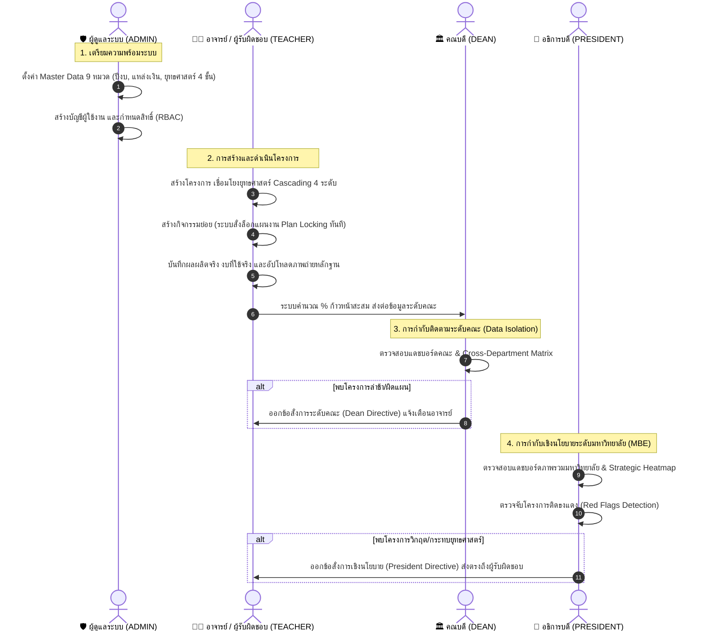

# คำอธิบายลำดับขั้นตอนการทำงานของแต่ละบทบาท (Role Workflow & Lifecycle)
## ระบบติดตามและประเมินผลโครงการตามยุทธศาสตร์ มหาวิทยาลัยราชภัฏบุรีรัมย์ (BRU Strategic Tracking System)

---

## 📌 ภาพรวมวงจรการทำงานร่วมกันข้ามบทบาท (Cross-Role Interaction Flow)

ระบบติดตามและประเมินผลโครงการตามยุทธศาสตร์ ทำงานสอดประสานกัน 4 บทบาท (Role-Based Access Control - RBAC) ตั้งแต่การตั้งค่าระบบ ➔ การดำเนินงานจริง ➔ การกำกับดูแล ➔ จนถึงการติดตามเชิงนโยบายระดับมหาวิทยาลัย:

---

## 1. 👨‍🏫 บทบาทอาจารย์ / เจ้าหน้าที่ผู้รับผิดชอบโครงการ (TEACHER)
> **เป้าหมายหลัก:** แปลงนโยบายสู่การปฏิบัติจริง จัดทำโครงการ บันทึกผลการลงพื้นที่ และส่งหลักฐานเชิงประจักษ์

### ลำดับขั้นตอนการทำงาน (Step-by-Step Workflow):

1. **เข้าสู่ระบบ (Authentication & Dashboard):**
   * เข้าสู่ระบบด้วย Username/Password ➔ ระบบจะแสดงแดชบอร์ดเฉพาะโครงการที่ตนเองเป็นผู้สร้าง หรือเป็นคณะทำงานร่วม
2. **สร้างข้อเสนอโครงการ (Create Strategic Project):**
   * **กรอกข้อมูลพื้นฐาน:** ชื่อโครงการ, วัตถุประสงค์, ระยะเวลาเริ่มต้น-สิ้นสุด, วงเงินงบประมาณรวม, เป้าหมายผลผลิตรวม (Target), และหน่วยนับ
   * **เชื่อมโยงยุทธศาสตร์แบบ Cascading 4 ขั้น (Strategic Alignment):**
     * ขั้น 1: เลือกประเด็นการพัฒนาท้องถิ่น
     * ขั้น 2: เลือกประเด็นยุทธศาสตร์มหาวิทยาลัย
     * ขั้น 3: เลือกแผนงานย่อย / กลยุทธ์
     * ขั้น 4: เลือกโครงการหลัก / ตัวชี้วัดความสำเร็จ
   * **ระบุทีมงาน:** เลือกผู้ร่วมดำเนินโครงการจากรายชื่อบุคลากรในสังกัด
3. **กำหนดกิจกรรมย่อยและล็อกแผนงาน (Activity Definition & Plan Locking):**
   * เพิ่มกิจกรรมย่อย (Sub-activities) เช่น การจัดอบรม, การลงพื้นที่ชุมชน, การจัดซื้ออุปกรณ์
   * กำหนดงบประมาณจัดสรรรายกิจกรรม และวันที่จัด
   * 🔒 **ระบบล็อกแผนงานอัตโนมัติ (Plan Locking):** ทันทีที่มีการบันทึกกิจกรรมย่อย ระบบจะล็อกข้อมูลเป้าหมายและงบรวมของโครงการหลักทันที เพื่อป้องกันการแอบลดเป้าหมายย้อนหลังตามหลักธรรมาภิบาล
4. **บันทึกผลการดำเนินงานและส่งหลักฐานจริง (Execution & Evidence Upload):**
   * บันทึกผลผลิตที่ทำได้จริงในแต่ละกิจกรรม (Completed Count)
   * บันทึกยอดเงินที่ใช้จ่ายจริง (Actual Budget)
   * อัปโหลดรูปภาพหลักฐานการจัดกิจกรรมจริงจากพื้นที่ (Evidence Photos)
   * ⚡ **ระบบ Rollup อัตโนมัติ:** ระบบจะนำตัวเลขกิจกรรมย่อยมารวมเป็นผลงานสะสม และคำนวณร้อยละความก้าวหน้ารวมของโครงการ (`progress`) ให้ทันที
5. **ติดตามและปฏิบัติตามข้อสั่งการ (Follow Directives):**
   * ตรวจสอบกล่องข้อความสั่งการ หากมีคำสั่งเร่งรัดจากคณบดีหรืออธิการบดี จะมีข้อความแสดงเตือนให้ปรับปรุงการดำเนินงาน

---

## 2. 🏛️ บทบาทคณบดี / ผู้บริหารระดับคณะ (DEAN)
> **เป้าหมายหลัก:** กำกับดูแลผลงานทุกสาขาวิชาในคณะตนเอง บริหารงบประมาณระดับคณะ และเร่งรัดโครงการที่ล่าช้า

### ลำดับขั้นตอนการทำงาน (Step-by-Step Workflow):

1. **เข้าสู่ระบบแบบแบ่งแยกข้อมูล (Faculty Data Isolation):**
   * คณบดีเข้าสู่ระบบ ➔ ระบบจะคัดกรองข้อมูลให้เห็นเฉพาะโครงการและบุคลากรที่สังกัดภายในคณะของตนเองเท่านั้น (ป้องกันการดูหรือแทรกแซงข้ามคณะตามหลักความปลอดภัย IDOR)
2. **ตรวจสอบแดชบอร์ดภาพรวมระดับคณะ (Faculty Overview Dashboard):**
   * ดูร้อยละความก้าวหน้ารวมเฉลี่ยของทั้งคณะ
   * ตรวจสอบสัดส่วนการใช้งบประมาณรวมของคณะ (งบที่ได้รับจัดสรร vs งบที่ใช้จริง)
   * ดูจำนวนโครงการทั้งหมด จำแนกตามสถานะ (ปกติ, ใกล้ครบกำหนด, ล่าช้า)
3. **วิเคราะห์ผลงานเปรียบเทียบระหว่างสาขาวิชา (Cross-Department Matrix):**
   * ตรวจสอบตารางและกราฟเปรียบเทียบผลงานของแต่ละสาขาวิชาภายในคณะ
   * วิเคราะห์ว่าสาขาวิชาใดมีความก้าวหน้าเร็ว และสาขาวิชาใดมีการเบิกจ่ายงบประมาณล่าช้ากว่าเป้าหมาย
4. **ตรวจจับโครงการคอขวดระดับคณะ (Faculty Exception Monitoring):**
   * คัดกรองดูเฉพาะโครงการที่เกิดปัญหา เช่น โครงการที่เลยกำหนดเวลาแล้วแต่ผลงานยังไม่เสร็จ หรือโครงการที่ไม่มีการเคลื่อนไหวเกินกว่าเกณฑ์
5. **ออกข้อสั่งการเร่งรัดระดับคณะ (Issue Dean Directive):**
   * พิมพ์ข้อสั่งการลงในโครงการที่มีปัญหา เช่น *"ขอให้ภาควิชาเร่งลงพื้นที่และรายงานยอดเบิกจ่ายภายในสิ้นเดือนนี้"*
   * ระบบจะบันทึกชื่อคณบดีผู้สั่งการ พร้อมวันที่และเวลา (Timestamp) และสะท้อนไปยังหน้าจอของอาจารย์เจ้าของโครงการทันที

---

## 3. 👑 บทบาทอธิการบดี / ผู้บริหารระดับสูง (PRESIDENT)
> **เป้าหมายหลัก:** กำกับติดตามยุทธศาสตร์ภาพรวมมหาวิทยาลัย ตรวจจับโครงการวิกฤต (Management by Exception) และออกข้อสั่งการเชิงนโยบาย

### ลำดับขั้นตอนการทำงาน (Step-by-Step Workflow):

1. **เข้าสู่ระบบแดชบอร์ดผู้บริหารสูงสุด (Executive Strategic Dashboard):**
   * อธิการบดีเข้าสู่ระบบ ➔ แสดงภาพรวมโครงการและงบประมาณของมหาวิทยาลัยราชภัฏบุรีรัมย์ทั้งระบบ
2. **ติดตามผลลัพธ์ตามยุทธศาสตร์มหาวิทยาลัย (Strategic Heatmap):**
   * ดูแดชบอร์ดจำแนกตามประเด็นยุทธศาสตร์ เพื่อดูว่ามหาวิทยาลัยขับเคลื่อนยุทธศาสตร์ด้านใดได้ตามเป้าหมาย และด้านใดยังมีช่องว่าง
   * ดูกราฟเปรียบเทียบผลงานระหว่างคณะต่าง ๆ ทั่วมหาวิทยาลัย
3. **ระบบตรวจจับโครงการติดธงแดง (Early Warning Red Flags System):**
   * ใช้วิธีบริหารแบบ **Management by Exception (MBE)** คือ ผู้บริหารไม่ต้องตรวจโครงการที่ปกติ แต่ระบบจะดึงเฉพาะโครงการที่ **"ติดธงแดง (Red Flags)"** ขึ้นมาเตือนทันที เช่น:
     * โครงการที่มีงบประมาณสูงแต่ผลงานล่าช้ากว่าเกณฑ์มากกว่า 30%
     * โครงการที่เลยกำหนดระยะเวลาสิ้นสุดตามแผนแต่งานยังไม่เสร็จ
4. **ออกข้อสั่งการเชิงนโยบาย (Issue President Directive):**
   * สั่งการเชิงนโยบายส่งตรงถึงผู้รับผิดชอบและคณบดี เช่น *"ให้จัดสรรงบช่วยเหลือและรายงานผลต่อนายกสภามหาวิทยาลัย"*
   * ระบบบันทึกประวัติการสั่งการที่โปร่งใส ตรวจสอบย้อนหลังได้ตามหลักธรรมาภิบาล
5. **ส่งออกรายงานสรุปสำหรับฝ่ายบริหาร (Export Executive Report):**
   * พิมพ์และส่งออกรายงานสรุปความก้าวหน้าโครงการประจำรอบปีงบประมาณ สำหรับนำเข้าที่ประชุมคณะกรรมการบริหารมหาวิทยาลัย (ก.บ.) หรือสภามหาวิทยาลัย

---

## 4. 🛡️ บทบาทผู้ดูแลระบบ (ADMIN)
> **เป้าหมายหลัก:** บริหารจัดการโครงสร้างพื้นฐานระบบ (Master Data) ดูแลความปลอดภัย สิทธิ์ผู้ใช้งาน และสนับสนุนการทำงาน

### ลำดับขั้นตอนการทำงาน (Step-by-Step Workflow):

1. **ตั้งค่าข้อมูลหลักของมหาวิทยาลัย (Master Data Configuration - 9 หมวด):**
   * ก่อนเริ่มปีงบประมาณ Admin ทำการสร้างและเปิดใช้งานข้อมูลพื้นฐาน:
     * กำหนดปีงบประมาณปัจจุบัน (เช่น 2569) และเปิดใช้งานหลัก
     * กำหนดแหล่งงบประมาณ (งบแผ่นดิน, งบรายได้)
     * นำเข้าโครงสร้างยุทธศาสตร์ 4 ระดับ (ประเด็นท้องถิ่น ➔ แผนงานหลัก ➔ แผนงานย่อย ➔ โครงการหลัก/ตัวชี้วัด)
     * กำหนดรายชื่อคณะ และรายชื่อภาควิชา/หน่วยงาน
2. **บริหารจัดการบัญชีผู้ใช้งานและสิทธิ์ (User Management & RBAC):**
   * สร้างบัญชีผู้ใช้งานใหม่ กำหนดสิทธิ์ตามบทบาท (TEACHER, DEAN, PRESIDENT, ADMIN)
   * ผูกผู้ใช้งานเข้ากับสังกัดคณะและสาขาวิชาอย่างถูกต้อง เพื่อให้ระบบ Data Isolation ทำงานได้อย่างแม่นยำ
   * รีเซ็ตรหัสผ่าน (Reset Password) ให้ผู้ใช้งานเมื่อลืมรหัสผ่าน (คืนค่าเป็นรหัสเริ่มต้น 123456 ในคลิกเดียว)
3. **ดูแลความปลอดภัยและโครงสร้างรหัส (Hierarchical Auto-Coding):**
   * ตรวจสอบความถูกต้องของระบบสร้างรหัสอัตโนมัติ: รหัสคณะ (2 หลัก) ➔ รหัสสาขา (4 หลัก) ➔ รหัสบุคลากร (6 หลัก)
   * ตรวจสอบการทำงานของ Foreign Key Constraints ป้องกันข้อมูลขยะหรือข้อมูลกำพร้า
4. **จัดการปัญหาการใช้งานระบบ (Issue & Support Management):**
   * ตรวจสอบรายการแจ้งปัญหาจากอาจารย์และเจ้าหน้าที่ (Issue Reports)
   * ดำเนินการแก้ไขปัญหา และปรับสถานะ (PENDING ➔ IN_PROGRESS ➔ RESOLVED)
   * บันทึกคำอธิบายแนวทางแก้ไข (Admin Note) ให้ผู้แจ้งปัญหาทราบ
5. **ดูแลความพร้อมและการบำรุงรักษาระบบ (System Maintenance):**
   * สั่งล้างแคชระบบ (Clear Cache) เมื่อมีการปรับปรุงโครงสร้างข้อมูล
   * ตรวจสอบการสำรองข้อมูลฐานข้อมูล MySQL (Database Backup)

---

## 📊 ตารางเปรียบเทียบหน้าที่และความรับผิดชอบของ 4 บทบาท

| กิจกรรม / ความสามารถของระบบ | 👨‍🏫 TEACHER (อาจารย์) | 🏛️ DEAN (คณบดี) | 👑 PRESIDENT (อธิการบดี) | 🛡️ ADMIN (ผู้ดูแลระบบ) |
| :--- | :---: | :---: | :---: | :---: |
| **ตั้งค่า Master Data 9 หมวด** | ❌ ไม่มีสิทธิ์ | ❌ ไม่มีสิทธิ์ | ❌ ไม่มีสิทธิ์ | ✅ **จัดการได้ 100%** |
| **จัดการบัญชีผู้ใช้ / รีเซ็ตรหัส** | ❌ ไม่มีสิทธิ์ | ❌ ไม่มีสิทธิ์ | ❌ ไม่มีสิทธิ์ | ✅ **จัดการได้ 100%** |
| **สร้างโครงการ Cascading 4 ขั้น** | ✅ **สร้างได้** | ❌ ดูอย่างเดียว | ❌ ดูอย่างเดียว | ✅ ดู/ช่วยจัดการได้ |
| **บันทึกกิจกรรมย่อย & รูปถ่ายจริง** | ✅ **บันทึกได้** | ❌ ดูอย่างเดียว | ❌ ดูอย่างเดียว | ✅ ดู/ช่วยจัดการได้ |
| **ขอบเขตการมองเห็นข้อมูล** | เฉพาะโครงการตนเอง | เฉพาะภายในคณะ | **ทุกโครงการทั่วมหาวิทยาลัย** | **ทุกข้อมูลในระบบ** |
| **ตรวจจับโครงการติดธงแดง (Red Flags)** | ดูเฉพาะโครงการตนเอง | ดูระดับคณะ | ✅ **ดูภาพรวมทั้งมหาวิทยาลัย** | ตรวจสอบเชิงเทคนิค |
| **ออกข้อสั่งการ (Directives)** | ❌ ไม่มีสิทธิ์ | ✅ **ออกคำสั่งระดับคณะ** | ✅ **ออกคำสั่งระดับมหาวิทยาลัย** | ❌ ไม่มีสิทธิ์ |
| **จัดการปัญหาแจ้งซ่อม (Issues)** | ส่งแจ้งปัญหาได้ | ส่งแจ้งปัญหาได้ | ส่งแจ้งปัญหาได้ | ✅ **ตอบรับและแก้ไขปัญหา** |
