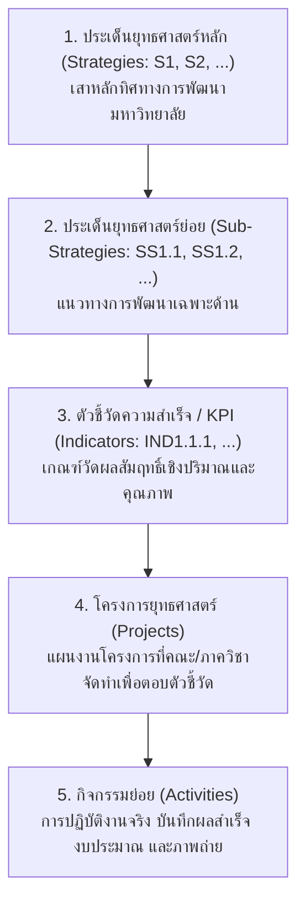
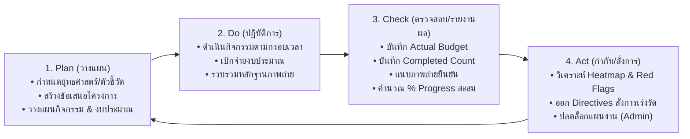
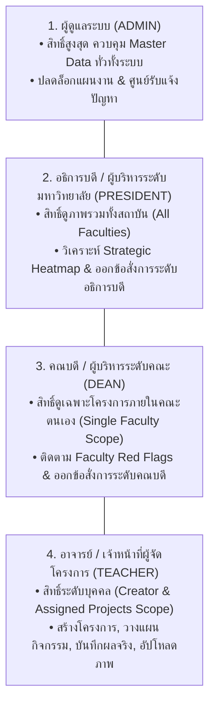
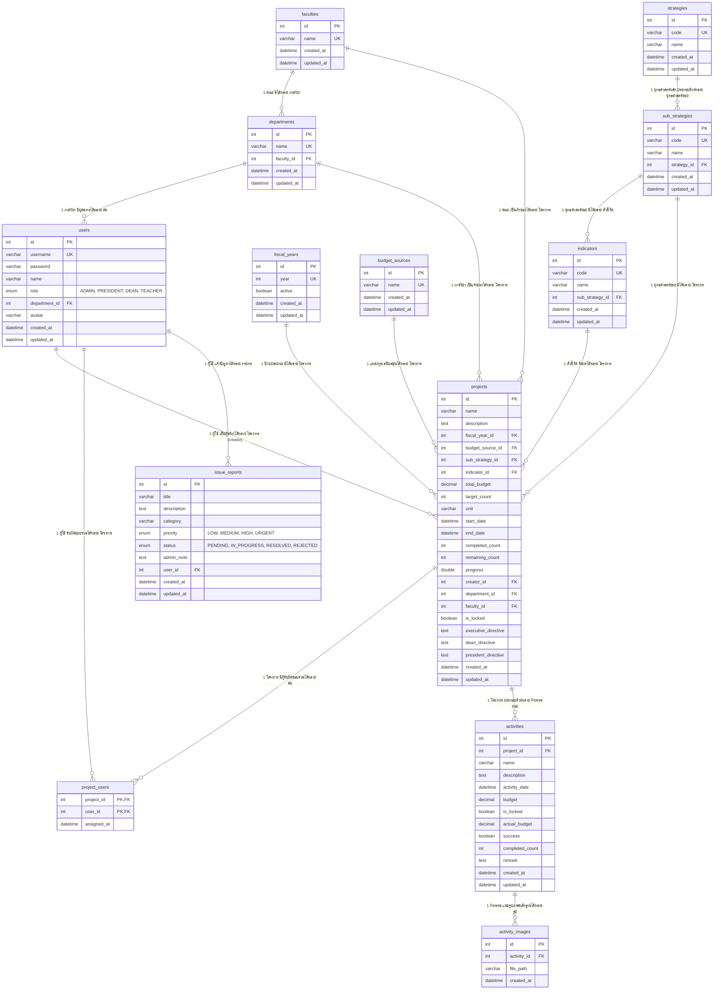
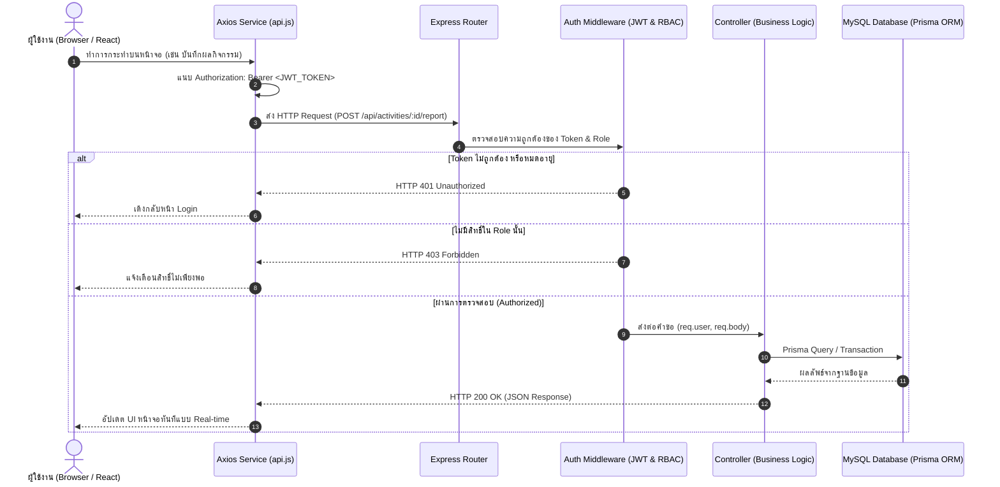
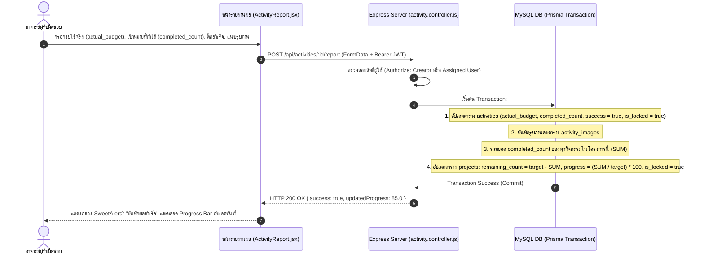
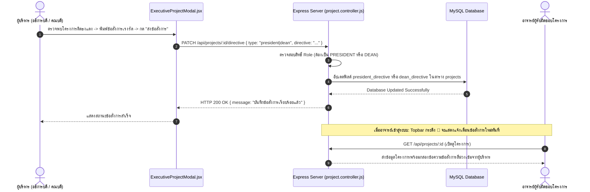

# เอกสารวิเคราะห์และออกแบบระบบ (System Analyst Specification Manual)
## Strategic Performance Tracking System — มหาวิทยาลัยราชภัฏบุรีรัมย์ (BRU)
**ผู้จัดทำ:** Teeraphon  
**ชื่อเอกสาร:** `sasystem.md`  
**สถานะ:** เอกสารข้อกำหนดระบบฉบับทางการ (Official System Specification)

---

# สารบัญ (Table of Contents)
1. [ยุทธศาสตร์คืออะไร วงจรการดำเนินงาน และวัตถุประสงค์ของระบบ](#1-ยุทธศาสตร์คืออะไร-วงจรการดำเนินงาน-และวัตถุประสงค์ของระบบ)
2. [สิทธิและหน้าที่ของแต่ละบทบาทผู้ใช้งาน (RBAC & Feature Matrix)](#2-สิทธิและหน้าที่ของแต่ละบทบาทผู้ใช้งาน-rbac--feature-matrix)
3. [เครื่องมือที่ใช้ โครงสร้างโฟลเดอร์ และสถาปัตยกรรมระบบ (Tech Stack & Architecture)](#3-เครื่องมือที่ใช้-โครงสร้างโฟลเดอร์-และสถาปัตยกรรมระบบ)
4. [โครงสร้างและองค์ประกอบหน้าจอเว็บไซต์ (UI/UX Breakdown)](#4-โครงสร้างและองค์ประกอบหน้าจอเว็บไซต์-uiux-breakdown)
5. [สถาปัตยกรรมฐานข้อมูล พจนานุกรมข้อมูล และความสัมพันธ์ (Database Architecture & ERD)](#5-สถาปัตยกรรมฐานข้อมูล-พจนานุกรมข้อมูล-และความสัมพันธ์)
6. [การทำงานของ API ในระบบ (RESTful API Architecture & Workflow)](#6-การทำงานของ-api-ในระบบ-restful-api-architecture--workflow)

---

# 1. ยุทธศาสตร์คืออะไร วงจรการดำเนินงาน และวัตถุประสงค์ของระบบ

## 1.1 ความหมายของยุทธศาสตร์ (What is Strategic Planning?)
**ยุทธศาสตร์ (Strategy)** ในบริบทของสถาบันอุดมศึกษา คือ กรอบทิศทาง แผนแม่บท และเป้าหมายระยะยาวที่มหาวิทยาลัยกำหนดขึ้นเพื่อขับเคลื่อนพันธกิจ วิสัยทัศน์ และการพัฒนาองค์กรให้สอดรับกับการเปลี่ยนแปลงทางเศรษฐกิจ สังคม และเทคโนโลยี

ในระบบนี้ ยุทธศาสตร์ของมหาวิทยาลัยราชภัฏบุรีรัมย์จะถูกถ่ายทอดลงสู่ระดับปฏิบัติการจริงอย่างเป็นระบบผ่าน **การถ่ายทอดแผน 5 ระดับ (Cascading Strategic Hierarchy)**:



* **ระดับที่ 1: ประเด็นยุทธศาสตร์หลัก (Strategies)** — เสาหลักและทิศทางใหญ่ของมหาวิทยาลัย (เช่น ยุทธศาสตร์ที่ 1 การยกระดับคุณภาพการศึกษา, ยุทธศาสตร์ที่ 2 การวิจัยและนวัตกรรมเพื่อท้องถิ่น)
* **ระดับที่ 2: ประเด็นยุทธศาสตร์ย่อย (Sub-Strategies)** — แนวทางการพัฒนาเฉพาะทางภายใต้ยุทธศาสตร์หลัก
* **ระดับที่ 3: ตัวชี้วัดความสำเร็จ (Indicators / KPIs)** — ดัชนีชี้วัดผลสัมฤทธิ์ที่มีเกณฑ์เป้าหมายชัดเจน (Target Value & Unit)
* **ระดับที่ 4: โครงการยุทธศาสตร์ (Projects)** — แผนงานโครงการที่คณะ สาขาวิชา หรือหน่วยงานจัดทำขึ้นเพื่อตอบโจทย์ตัวชี้วัด
* **ระดับที่ 5: กิจกรรมย่อย (Activities)** — การจัดกิจกรรมและการปฏิบัติงานจริง ซึ่งเป็นระดับที่มีการบันทึกงบประมาณจ่ายจริง ผลผลิตที่ทำได้ และรูปภาพหลักฐาน

---

## 1.2 วงจรการดำเนินงานเชิงยุทธศาสตร์ (Strategic Execution Lifecycle: PDCA)
การดำเนินงานโครงการในระบบถูกขับเคลื่อนตามวงจรบริหารคุณภาพ **PDCA Cycle** อย่างสมบูรณ์:



1. **Plan (การวางแผน):**
   * ผู้ดูแลระบบ (Admin) กำหนดโครงสร้างยุทธศาสตร์ ตัวชี้วัด และเปิดรอบปีงบประมาณ (`fiscal_years`)
   * อาจารย์/เจ้าหน้าที่ผู้รับผิดชอบโครงการ (Teacher) สร้างข้อเสนอโครงการ กำหนดเป้าหมายเชิงปริมาณ หน่วยนับ งบประมาณรวม และวางแผนกิจกรรมย่อย
2. **Do (การปฏิบัติการ):**
   * ผู้รับผิดชอบโครงการดำเนินงานตามกิจกรรมและกรอบเวลาที่ระบุในแผนงาน
   * ดำเนินการเบิกจ่ายงบประมาณตามระเบียบการเงินของมหาวิทยาลัย และจัดเก็บภาพถ่ายกิจกรรม
3. **Check (การตรวจสอบและรายงานผล):**
   * อาจารย์บันทึกผลการจัดกิจกรรมจริงลงในระบบ: ระบุงบใช้จริง (`actual_budget`), ผลสัมฤทธิ์ที่ทำได้ (`completed_count`), ติ๊กประเมินความสำเร็จ (`success = true/false`), และอัปโหลดภาพถ่ายหลักฐาน
   * เซิร์ฟเวอร์ประมวลผลคำนวณร้อยละความก้าวหน้าสะสม (`progress %`) ของโครงการให้อัตโนมัติแบบ Real-time
4. **Act (การกำกับและสั่งการ):**
   * ผู้บริหาร (อธิการบดี, คณบดี) ติดตามผลผ่าน **Strategic Heatmap Dashboard**
   * ระบบแจ้งเตือนโครงการติดธงแดง (Red Flags) หากการดำเนินงานล่าช้ากว่ากำหนดหรืองบประมาณเกินเกณฑ์
   * ผู้บริหารออก **ข้อสั่งการ (Executive Directives)** ส่งตรงถึงผู้รับผิดชอบโครงการเพื่อเร่งรัดหรือแก้ไขปัญหา

---

## 1.3 วัตถุประสงค์ของการพัฒนาระบบ (System Objectives)
1. **รวมศูนย์ข้อมูลยุทธศาสตร์แบบเรียลไทม์ (Single Source of Truth):** รวมศูนย์ข้อมูลโครงการ งบประมาณ และตัวชี้วัดทั้งมหาวิทยาลัยไว้ในฐานข้อมูลเดียว ทดแทนการส่งเอกสารกระดาษและไฟล์ Excel ที่กระจัดกระจาย
2. **กำกับติดตามแบบ Management by Exception (เตือนภัยธงแดง):** ช่วยให้ผู้บริหารระดับสูงและคณบดีมองเห็นภาพรวมความก้าวหน้า และตรวจพบโครงการที่มีปัญหาหรือล่าช้ากว่าแผน (Red Flags) ได้ทันที
3. **ส่งเสริมความโปร่งใสและตรวจสอบได้ (Transparency & Traceability):** บันทึกประวัติการเบิกจ่ายจริงเทียบกับงบประมาณที่ตั้งไว้ พร้อมมีรูปภาพยืนยันผลการปฏิบัติงานจริงจากพื้นที่
4. **รักษาความน่าเชื่อถือและความถูกต้องของแผนงาน (Plan Locking Integrity):** กิจกรรมและโครงการที่เริ่มดำเนินการแล้วจะถูกล็อกห้ามแก้ไขตัวเลขแผนงานตั้งต้น เพื่อป้องกันการเปลี่ยนเป้าหมายย้อนหลัง (มีเพียง Admin ที่สามารถปลดล็อกตามระเบียบ)
5. **ออกรายงานสารสนเทศอัตโนมัติ (Automated Multi-Format Reporting):** ส่งออกรายงานสรุปผลงานระดับมหาวิทยาลัย คณะ และภาควิชา เป็นไฟล์ PDF (ฟอนต์ไทยมาตรฐาน), Excel (.xlsx), และ CSV ได้ทันทีเพียงคลิกเดียว

---

# 2. สิทธิและหน้าที่ของแต่ละบทบาทผู้ใช้งาน (RBAC & Feature Matrix)

ระบบใช้มาตรฐานความปลอดภัย **Role-Based Access Control (RBAC)** แบ่งบทบาทผู้ใช้ออกเป็น 4 ระดับ เพื่อควบคุมขอบเขตการมองเห็นข้อมูล (Data Visibility Scope) และสิทธิ์การทำงาน (Operational Permissions):



---

## 2.1 ตารางเปรียบเทียบสิทธิและหน้าที่ (RBAC Feature Matrix)

| หมวดหมู่งาน / ฟังก์ชันการทำงาน | ผู้ดูแลระบบ<br/>`(ADMIN)` | อธิการบดี<br/>`(PRESIDENT)` | คณบดี<br/>`(DEAN)` | อาจารย์/เจ้าหน้าที่<br/>`(TEACHER)` |
| :--- | :---: | :---: | :---: | :---: |
| **ขอบเขตข้อมูลที่มองเห็น (Data Scope)** | ทุกคณะ / ทุกโครงการทั่วทั้งมหาวิทยาลัย | ทุกคณะ / ทุกโครงการทั่วทั้งมหาวิทยาลัย | เฉพาะโครงการภายใต้คณะของตนเอง | เฉพาะโครงการที่ตนเองสร้างหรือร่วมรับผิดชอบ |
| **แดชบอร์ดสรุปภาพรวม (Dashboard)** | ภาพรวมทั้งระบบ (System Analytics) | ยุทธศาสตร์สถาบัน (Strategic Heatmap) | ผลงานคณะ & ภาควิชา (Faculty KPIs) | แดชบอร์ดงานของฉัน (Personal Tasks) |
| **จัดการข้อมูลหลัก (Master Data CRUD)** | **จัดการได้สมบูรณ์ (8 หมวด)** | ดูได้อย่างเดียว (Read Only) | ดูได้อย่างเดียว (Read Only) | ดูได้อย่างเดียว (Read Only) |
| **การสร้างและแก้ไขโครงการ (Projects CRUD)** | สร้าง / แก้ไข / ลบ ได้ทุกโครงการ | ไม่มีสิทธิ์สร้าง/แก้ไข | ไม่มีสิทธิ์สร้าง/แก้ไข | **สร้าง / แก้ไขโครงการของตนเอง** |
| **การปลดล็อกแผนงาน (Unlock Plans)** | **มีสิทธิ์ปลดล็อกโครงการ/กิจกรรม** | ไม่มีสิทธิ์ | ไม่มีสิทธิ์ | ไม่มีสิทธิ์ (ต้องแจ้งขอผ่าน Admin) |
| **รายงานผลกิจกรรม & อัปโหลดภาพ** | รายงานผล/แก้ไขได้ทุกกิจกรรม | ไม่มีสิทธิ์รายงานผล | ไม่มีสิทธิ์รายงานผล | **บันทึกงบจริง, ผลสำเร็จ, แนบภาพ** |
| **การออกข้อสั่งการผู้บริหาร (Directives)** | ออกข้อสั่งการได้ทุกโครงการ | **ออกข้อสั่งการระดับอธิการบดี** (`presidentDirective`) | **ออกข้อสั่งการระดับคณบดี** (`deanDirective`) | ไม่มีสิทธิ์ (เป็นผู้รับข้อสั่งการไปปฏิบัติ) |
| **ระบบแจ้งเตือนธงแดง (Red Flags Alert)** | ตรวจสอบได้ทั้งมหาวิทยาลัย | ตรวจสอบได้ทั้งมหาวิทยาลัย | ตรวจสอบเฉพาะคณะตนเอง | ตรวจสอบเฉพาะโครงการตนเอง |
| **แกลเลอรีภาพกิจกรรม (Image Gallery)** | เข้าดูได้ทั้งหมด | ดูผ่านรายละเอียดโครงการ | ดูผ่านรายละเอียดโครงการ | **มีหน้าคลังภาพรวบรวมผลงาน** |
| **ส่งออกรายงาน (PDF / Excel / CSV)** | ส่งออกได้ทุกมิติ ทุกคณะ | ส่งออกรายงานภาพรวมสถาบัน | ส่งออกรายงานระดับคณะ/ภาควิชา | ส่งออกรายงานสรุปโครงการตนเอง |
| **ศูนย์รับแจ้งปัญหา (Issue Center)** | **จัดการ/ตอบกลับ/เปลี่ยนสถานะ** | ส่งแจ้งปัญหาได้ | ส่งแจ้งปัญหาได้ | ส่งแจ้งปัญหาได้ |

---

## 2.2 รายละเอียดหน้าที่ความรับผิดชอบแยกตามบทบาท

### 1. ผู้ดูแลระบบ (ADMIN)
* **Master Data Management:** เพิ่ม ลบ แก้ไข ข้อมูลหลัก 8 หมวด (คณะ, ภาควิชา, ปีงบประมาณ, แหล่งเงินทุน, ยุทธศาสตร์หลัก, ยุทธศาสตร์ย่อย, ตัวชี้วัด, และบัญชีผู้ใช้)
* **User & Role Management:** กำหนดสิทธิ์และรีเซ็ตรหัสผ่านของผู้ใช้งาน
* **Fiscal Year Control:** เปิด/ปิด สถานะปีงบประมาณ (`fiscal_years.active = true/false`)
* **Plan Unlock Service:** ปลดล็อกแผนงานโครงการหรือกิจกรรมย่อย (`is_locked = false`) เมื่อได้รับคำร้องขอแก้ไขแผนงาน
* **Issue Tracker Operations:** ตรวจสอบข้อร้องเรียน ตอบกลับคำแนะนำ และเปลี่ยนสถานะการแก้ปัญหา (`PENDING` $\rightarrow$ `IN_PROGRESS` $\rightarrow$ `RESOLVED`)

### 2. อธิการบดี และผู้บริหารมหาวิทยาลัย (PRESIDENT)
* **Institutional Executive Oversight:** ตรวจสอบความก้าวหน้าโครงการภาพรวมของทั้งมหาวิทยาลัย
* **Strategic Heatmap Matrix:** วิเคราะห์สถานะความสำเร็จของยุทธศาสตร์แต่ละด้านในรูปแบบ Heatmap สี (เขียว = ตามแผน, เหลือง = เฝ้าระวัง, แดง = ล่าช้า)
* **Budget Analytics:** เปรียบเทียบสัดส่วนการใช้งบประมาณแผ่นดิน vs งบประมาณรายได้
* **Presidential Directives:** พิมพ์ข้อสั่งการระดับอธิการบดี (`presidentDirective`) กำชับไปยังโครงการกลุ่มเสี่ยง
* **Council Reports:** ส่งออกรายงานสรุปผลงานระดับสถาบันเพื่อนำเสนอต่อสภามหาวิทยาลัย

### 3. คณบดี และผู้บริหารระดับคณะ (DEAN)
* **Faculty Performance Monitoring:** ติดตามสถานะโครงการทั้งหมดภายในคณะตนเอง จำแนกรายภาควิชา/สาขาวิชา
* **Faculty Red Flags:** ตรวจสอบรายการโครงการที่ติดธงแดงภายในคณะ (ล่าช้ากว่ากรอบเวลาหรืองบประมาณใช้จริงเกินแผน)
* **Dean Directives:** พิมพ์ข้อสั่งการระดับคณบดี (`deanDirective`) เพื่อติดตามงานจากอาจารย์ผู้รับผิดชอบโครงการ
* **QA & Accreditation Reporting:** ส่งออกรายงานผลการดำเนินงานระดับคณะเพื่อใช้ในการประกันคุณภาพการศึกษา

### 4. อาจารย์และเจ้าหน้าที่ผู้รับผิดชอบโครงการ (TEACHER)
* **Project Initiation:** สร้างข้อเสนอโครงการ ระบุวัตถุประสงค์ ตัวชี้วัดยุทธศาสตร์ที่ตอบโจทย์ เป้าหมายเชิงปริมาณ และงบประมาณ
* **Activity Planning:** แตกโครงการออกเป็นกิจกรรมย่อย กำหนดวันจัดกิจกรรม และงบประมาณตามแผน
* **Actual Reporting:** เมื่อจัดกิจกรรมเสร็จสิ้น เข้าบันทึกงบประมาณจ่ายจริง (`actual_budget`), จำนวนเป้าหมายที่ทำสำเร็จจริง (`completed_count`), ติ๊กประเมินผลสำเร็จ (`success`), และอัปโหลดภาพถ่ายหลักฐาน
* **Directive Follow-up:** ตรวจสอบข้อสั่งการที่ได้รับจากอธิการบดีหรือคณบดี และรายงานความคืบหน้าตอบกลับ
* **Personal Image Gallery:** ดูคลังภาพกิจกรรมทั้งหมดของตนเอง และดาวน์โหลดหลักฐาน

---

# 3. เครื่องมือที่ใช้ โครงสร้างโฟลเดอร์ และสถาปัตยกรรมระบบ

## 3.1 เครื่องมือและเทคโนโลยีที่ใช้ (Technology Stack)

```
+-------------------------------------------------------------------------------------------------------+
| FRONTEND LAYER: React 19 + Vite + Tailwind CSS v3 + Chart.js + Axios + SweetAlert2 + React Icons      |
+-------------------------------------------------------------------------------------------------------+
                                                   ▲
                                                   │ RESTful APIs (HTTP / JSON / Bearer JWT)
                                                   ▼
+-------------------------------------------------------------------------------------------------------+
| BACKEND LAYER: Node.js + Express.js + Prisma ORM + JWT + Bcrypt + Multer + Express Rate Limit + PDFKit|
+-------------------------------------------------------------------------------------------------------+
                                                   ▲
                                                   │ Type-Safe SQL Queries (Prisma Client)
                                                   ▼
+-------------------------------------------------------------------------------------------------------+
| DATABASE LAYER: MySQL 8.0+ / MariaDB 10.5+ (InnoDB Storage Engine, UTF8mb4 Unicode)                   |
+-------------------------------------------------------------------------------------------------------+
```

### 1. ส่วนหน้าบ้าน (Frontend Tech Stack)
* **React 19:** ไลบรารีหลักในการสร้าง Single Page Application (SPA) พร้อม Component-Driven Architecture
* **Vite:** Next-generation Frontend Tooling สำหรับ Local Development และคอมไพล์ Production Bundle ความเร็วสูง
* **Tailwind CSS v3:** Utility-first CSS Framework พร้อม Custom Theme Palette อัตลักษณ์ มรภ.บุรีรัมย์ (`#6C3BFF` ม่วงเข้ม, `#2F1481` กรมท่า)
* **React Router DOM v6:** ควบคุม Client-side Routing, Layout Nesting, และ Role-Based Route Guards
* **Chart.js & react-chartjs-2:** แสดงผลกราฟสถิติ (Doughnut Chart, Multi-Bar Chart, Line Chart)
* **Axios:** HTTP Client พร้อม Request/Response Interceptors จัดการ Bearer Token อัตโนมัติ
* **SweetAlert2:** กล่องแจ้งเตือน Modal และ Dialog ยืนยันการทำงานที่สวยงามและใช้งานง่าย

### 2. ส่วนหลังบ้าน (Backend Tech Stack)
* **Node.js (v18+) & Express.js:** สภาพแวดล้อมรันไทม์และเว็บเฟรมเวิร์กประสิทธิภาพสูงสำหรับสร้าง RESTful APIs
* **Prisma ORM v5:** Next-generation Node.js ORM สำหรับ Data Modeling, Type-Safe SQL Queries, และ Database Migrations
* **JSON Web Token (`jsonwebtoken`):** ระบบยืนยันตัวตนแบบไร้สถานะ (Stateless Authentication) แนบ Payload User ID และ Role
* **Bcrypt.js:** เข้ารหัสผ่านผู้ใช้งานแบบทิศทางเดียว (One-Way Hashing) ด้วย Salt Rounds 10
* **Multer:** ตัวจัดการ Multipart/Form-Data สำหรับอัปโหลดไฟล์ภาพกิจกรรมและรูปโปรไฟล์ พร้อมจำกัดขนาด 5MB และกรอง MIME Type
* **Security & Reliability:** `helmet` (HTTP Headers Security), `cors` (Cross-Origin Resource Sharing), `express-rate-limit` (ป้องกัน Brute Force & DoS)
* **Reporting Engines:** `pdfkit` (สร้างไฟล์ PDF พร้อม Embed ฟอนต์ภาษาไทย), `exceljs` (สร้างสเปรดชีต Excel .xlsx สวยงาม), `csv-writer` (ส่งออกไฟล์ CSV)

### 3. ส่วนฐานข้อมูล (Database Tech Stack)
* **MySQL 8.0+ / MariaDB 10.5+:** ระบบจัดการฐานข้อมูลเชิงสัมพันธ์ (RDBMS)
* **InnoDB Engine:** รองรับ ACID Transactions, Row-level Locking, และ Foreign Key Constraints
* **Character Set & Collation:** `utf8mb4` และ `utf8mb4_unicode_ci` เพื่อรองรับภาษาไทย อีโมจิ และสัญลักษณ์พิเศษ 100%

---

## 3.2 โครงสร้างโฟลเดอร์และการจัดเก็บไฟล์อย่างละเอียด (Directory Architecture Breakdown)

โครงสร้างโฟลเดอร์หลักของโปรเจกต์ `c:\St_bru\` แบ่งออกเป็นสัดส่วนชัดเจนตามเลเยอร์สถาปัตยกรรม:

```
c:/St_bru/
├── .agents/                        # ทักษะและบทบาทผู้เชี่ยวชาญของ AI Agents
├── database/                       # ส่วนฐานข้อมูล (Database Layer: DDL, Seed, ERD, Data Dictionary)
├── backend/                        # ส่วนเซิร์ฟเวอร์และ API (Backend Layer: Node.js + Express + Prisma)
├── frontend/                       # ส่วนเว็บแอปพลิเคชัน (Frontend Layer: React 19 + Vite + Tailwind)
├── img/                            # คลังไฟล์ภาพประกอบและเอกสารนำเสนอ
├── .env                            # ไฟล์ตัวแปรสภาพแวดล้อมหลักของระบบ
├── .env.example                    # ไฟล์แม่แบบตัวแปรสภาพแวดล้อม
├── README.md                       # คู่มือการติดตั้งและคำสั่งรันระบบ
├── system.md                       # คู่มือสถาปัตยกรรมระบบฉบับเต็ม
├── sasystem.md                     # เอกสารวิเคราะห์และออกแบบระบบโดย SA Agent (ไฟล์นี้)
└── package.json                    # รายการ Root Dependencies & Build Scripts
```

---

### รายละเอียดโครงสร้างโฟลเดอร์และไฟล์แต่ละส่วน:

#### 1. ส่วนฐานข้อมูล: `database/` (Database Layer)
| ชื่อไฟล์ / โฟลเดอร์ | หน้าที่และการทำงาน | ข้อมูลที่จัดเก็บ |
| :--- | :--- | :--- |
| `schema.sql` | สคริปต์ DDL Pure MySQL สำหรับสร้างฐานข้อมูล `bru_strategic_tracking` และสร้างตารางครบทั้ง 13 ตาราง พร้อม Index, Foreign Keys และ Constraints | โครงสร้างตาราง, Data Types, Primary/Foreign Keys, Enums |
| `seed.sql` | สคริปต์ DML สำหรับเติมข้อมูลเริ่มต้นและข้อมูลจำลองครบทุกตาราง | ข้อมูลคณะ, ภาควิชา, ผู้ใช้จำลอง 4 Roles, ยุทธศาสตร์ S1-S5, ตัวชี้วัด, และโครงการตัวอย่าง |
| `ERD.md` | แผนภาพความสัมพันธ์ฐานข้อมูลเชิงตรรกะในรูปแบบ Mermaid syntax | แผนภาพ Entity-Relationship Model |
| `DataDictionary.md` | พจนานุกรมข้อมูลแจกแจงโครงสร้างฟิลด์ ชนิดข้อมูล ข้อจำกัด และคำอธิบายความหมาย | เอกสารอ้างอิงฟิลด์ข้อมูลทั้ง 13 ตาราง |

---

#### 2. ส่วนหลังบ้าน: `backend/` (Backend Server Layer)
| ชื่อไฟล์ / โฟลเดอร์ | หมวดหมู่ | หน้าที่การทำงานและข้อมูลที่จัดเก็บ |
| :--- | :--- | :--- |
| `config/prisma.js` | Database Config | ตัวจัดการ Singleton Prisma Client Instance สำหรับเชื่อมต่อ MySQL Connection Pool |
| `controllers/auth.controller.js` | Business Logic | ควบคุมระบบ Authentication: Login, เปลี่ยนรหัสผ่าน, ดูข้อมูลโปรไฟล์, อัปเดตรูปประจำตัว Avatar |
| `controllers/project.controller.js` | Business Logic | ควบคุมโครงการ: สร้าง, แก้ไข, ลบ, ค้นหา/กรอง, ผูกผู้รับผิดชอบร่วม, บันทึกข้อสั่งการผู้บริหาร, คำนวณ % Progress |
| `controllers/activity.controller.js` | Business Logic | ควบคุมกิจกรรมย่อย: สร้างกิจกรรม, บันทึกงบใช้จริง (`actual_budget`), บันทึกผลสำเร็จ, อัปโหลดภาพหลักฐาน |
| `controllers/dashboard.controller.js` | Business Logic | คำนวณสถิติและผลรวมสำหรับแดชบอร์ด: KPI Cards, Doughnut Status, Multi-Bar Chart งบคณะ, Strategic Heatmap, Red Flags |
| `controllers/master.controller.js` | Business Logic | จัดการข้อมูลหลัก Master Data 8 หมวด (คณะ, ภาควิชา, ปีงบฯ, แหล่งทุน, ยุทธศาสตร์, ยุทธศาสตร์ย่อย, ตัวชี้วัด, ผู้ใช้) |
| `controllers/report.controller.js` | Business Logic | เครื่องยนต์ออกรายงาน: สร้างไฟล์ PDF (ฟอนต์ไทย Sarabun), สเปรดชีต Excel (.xlsx), และ CSV |
| `controllers/issue.controller.js` | Business Logic | จัดการศูนย์รับแจ้งปัญหา: ผู้ใช้ส่งปัญหา, ติดตามสถานะ, Admin ตอบกลับและแก้ไขสถานะปัญหา |
| `middleware/auth.middleware.js` | Security | `authenticate` (ถอดรหัสและตรวจความถูกต้องของ JWT Bearer Token), `authorize` (ตรวจสิทธิ์ Role Guard) |
| `middleware/upload.middleware.js` | File Handler | กำหนดการจัดเก็บ Multer Storage, สุ่มชื่อไฟล์แบบ Timestamp, จำกัดขนาด 5MB, กรอง MIME Type รูปภาพ |
| `middleware/validation.middleware.js` | Validation | ตรวจสอบความถูกต้องของ Input Payload และชนิดข้อมูลก่อนส่งให้ Controller |
| `routes/auth.routes.js` | API Routing | เส้นทาง `/api/auth` (login, profile, change-password, avatar) |
| `routes/project.routes.js` | API Routing | เส้นทาง `/api/projects` (CRUD โครงการ, ข้อสั่งการ, ปลดล็อก) |
| `routes/activity.routes.js` | API Routing | เส้นทาง `/api/activities` (CRUD กิจกรรม, รายงานผลจริง, อัปโหลดรูปภาพ) |
| `routes/dashboard.routes.js` | API Routing | เส้นทาง `/api/dashboard` (ดึงสถิติแดชบอร์ดแยกตาม Role) |
| `routes/master.routes.js` | API Routing | เส้นทาง `/api/master` (CRUD ข้อมูลหลักทั้ง 8 หมวด) |
| `routes/report.routes.js` | API Routing | เส้นทาง `/api/reports` (ดาวน์โหลด PDF, Excel, CSV) |
| `routes/issue.routes.js` | API Routing | เส้นทาง `/api/issues` (ส่งข้อร้องเรียน, ดูสถานะ, Admin ตอบกลับ) |
| `prisma/schema.prisma` | ORM Schema | ไฟล์กำหนด Model, Relations, Enums, และ Database Provider สำหรับ Prisma ORM |
| `prisma/seed.js` | ORM Seeder | สคริปต์สำหรับ Seeding ข้อมูลจำลองผ่าน Prisma Client |
| `uploads/` | File Storage | โฟลเดอร์เก็บไฟล์ภาพกิจกรรมและภาพ Avatar จริงบน Disk Storage ของเซิร์ฟเวอร์ |
| `app.js` | Server Entry | จุดเริ่มต้น Express Server: รวบรวม Middlewares (CORS, Helmet, Rate Limit), Static Files (`/uploads`), และ Routes |
| `package.json` | Dependencies | รายการ Node.js dependencies และคำสั่งรันเซิร์ฟเวอร์ (`npm run dev`, `npm start`) |

---

#### 3. ส่วนหน้าบ้าน: `frontend/` (Frontend Application Layer)
| ชื่อไฟล์ / โฟลเดอร์ | หมวดหมู่ | หน้าที่การทำงานและองค์ประกอบ UI |
| :--- | :--- | :--- |
| `public/` | Static Assets | เก็บ Favicon, โลโก้มหาวิทยาลัยราชภัฏบุรีรัมย์, และไฟล์ Static ที่ไม่ต้องคอมไพล์ |
| `src/components/Sidebar.jsx` | UI Component | แถบเมนูนำทางหลักด้านซ้าย Responsive & Collapsible ปรับเปลี่ยนเมนูตาม Role ของผู้ใช้ |
| `src/components/Topbar.jsx` | UI Component | แถบหัวเว็บด้านบน แสดง Dynamic Breadcrumb, ปีงบฯ, กระดิ่งแจ้งเตือน 🔔, ปุ่มแจ้งปัญหา 🚨, Profile Menu 👤 |
| `src/components/ExecutiveProjectModal.jsx`| UI Component | หน้าต่าง Modal เจาะลึกรายละเอียดโครงการสำหรับผู้บริหาร พร้อมฟอร์มพิมพ์ข้อสั่งการ |
| `src/components/ReportIssueModal.jsx` | UI Component | หน้าต่าง Modal แจ้งปัญหาการใช้งานระบบ พร้อมแท็บติดตามสถานะและข้อความตอบกลับจาก Admin |
| `src/components/ProfileModal.jsx` | UI Component | หน้าต่าง Modal แก้ไขข้อมูลส่วนตัว เปลี่ยนรหัสผ่าน และอัปโหลดรูปภาพ Avatar |
| `src/components/CustomSelect.jsx` | UI Component | Dropdown ค้นหาและเลือกข้อมูลขนาดใหญ่ พร้อมรองรับการพิมพ์ Filter แบบ Searchable |
| `src/components/ErrorBoundary.jsx` | UI Component | คอมโพเนนต์ดักจับและจัดการ Runtime Error ป้องกันไม่ให้หน้าเว็บ Crash |
| `src/layouts/AppLayout.jsx` | Layout Wrapper | โครงร่างหน้าจอหลัก วางตำแหน่ง Sidebar + Topbar + Main Content Canvas (`<Outlet />`) |
| `src/contexts/AuthContext.jsx` | State Context | ตัวจัดการ Global Authentication State: เก็บ Token ใน LocalStorage, ควบคุม Login, Logout, Role State |
| `src/services/api.js` | API Client | Axios Instance กำหนด Base URL, Interceptors แนบ Bearer JWT อัตโนมัติ และดักจับ Error 401 |
| `src/utils/` | Utility Helpers | ฟังก์ชันแปลงค่าเงินบาท (`formatCurrency`), แปลงวันที่ไทย (`formatThaiDate`), คำนวณ Progress % |
| **`src/pages/admin/`** | Admin Pages | • `Dashboard.jsx`: ภาพรวมระบบ<br>• `MasterData.jsx`: จัดการข้อมูลหลัก 8 หมวด<br>• `Issues.jsx`: ศูนย์รับแจ้งปัญหา<br>• `Projects.jsx` & `Reports.jsx` |
| **`src/pages/president/`** | President Pages | • `Dashboard.jsx`: แดชบอร์ดยุทธศาสตร์สถาบัน<br>• `StrategicHeatmap.jsx`: แผนผัง Heatmap Matrix<br>• `Projects.jsx` & `Reports.jsx` |
| **`src/pages/dean/`** | Dean Pages | • `Dashboard.jsx`: แดชบอร์ดระดับคณะ<br>• `Projects.jsx`: โครงการในสังกัดคณะ & Red Flags<br>• `Reports.jsx`: รายงานประกันคุณภาพ |
| **`src/pages/teacher/`** | Teacher Pages | • `Dashboard.jsx`: แดชบอร์ดงานของฉัน<br>• `ProjectForm.jsx`: สร้าง/แก้ไขโครงการ<br>• `Projects.jsx`: รายการโครงการ<br>• `ActivitiesList.jsx` & `ActivityReport.jsx`: รายงานผลกิจกรรม<br>• `Gallery.jsx`: คลังภาพกิจกรรม |
| **`src/pages/executive/`** | Executive Pages | • `ProjectDetail.jsx`: หน้ารายละเอียดโครงการเจาะลึก |
| **`src/pages/auth/`** | Auth Pages | • `Login.jsx`: หน้าจอด่านหน้าสำหรับลงชื่อเข้าใช้ระบบ |
| `src/App.jsx` | Routing | นิยามเส้นทาง Routing ทั้งหมด และห่อหุ้มด้วย Role-Based Protected Route Guards |
| `src/main.jsx` | DOM Mount | จุด Mount React DOM เข้าสู่ `index.html` พร้อมครอบด้วย `AuthProvider` และ `BrowserRouter` |
| `src/index.css` | Global CSS | Tailwind Directives, Font Face definitions (`Prompt`, `Sarabun`, `Fira Code`), Custom Scrollbars |
| `tailwind.config.js` | Theme Config | ตั้งค่าธีมสีอัตลักษณ์ BRU Palette (`#6C3BFF` Primary, `#2F1481` Secondary, `#EDE9FE` Light) |
| `vite.config.js` | Build Config | ค่าคอนฟิกเซิร์ฟเวอร์ Vite, Proxy, และ Path Aliases |
| `package.json` | Dependencies | รายการไลบรารี Frontend และสคริปต์รัน (`npm run dev`, `npm run build`) |

---

#### 4. ส่วนตัวแทนอัจฉริยะ: `.agents/skills/` (AI Skills Layer)
| โฟลเดอร์ทักษะ | หน้าที่และการทำงาน |
| :--- | :--- |
| `admin-role-agent/` | ข้อกำหนดและแนวปฏิบัติสำหรับบทบาทผู้ดูแลระบบ (Admin) |
| `president-role-agent/`| ข้อกำหนดและแนวปฏิบัติสำหรับบทบาทอธิการบดี (President) |
| `dean-role-agent/` | ข้อกำหนดและแนวปฏิบัติสำหรับบทบาทคณบดี (Dean) |
| `teacher-role-agent/` | ข้อกำหนดและแนวปฏิบัติสำหรับบทบาทอาจารย์และเจ้าหน้าที่ (Teacher) |
| `sa-agent/` | ข้อกำหนดการวิเคราะห์ระบบ, DFD, Sequence Diagram, ERD, API Specs (Senior SA) |
| `fullstack-agent/` | ข้อกำหนดการพัฒนา Full-Stack Web App ด้วย React, Node.js, Express, Prisma |
| `qa-agent/` | ข้อกำหนดการออกแบบ Test Cases, API Testing และการทดสอบระบบ |
| `ux-ui-agent/` | ข้อกำหนดการออกแบบ UI Design System, Tailwind Color Palette, User Flow |

---

# 4. โครงสร้างและองค์ประกอบหน้าจอเว็บไซต์ (UI/UX Breakdown)

ระบบใช้โครงสร้าง **Responsive Master-Detail Dashboard Layout** ซึ่งจัดสรรพื้นที่หน้าจอออกเป็น 4 โซนหลักอย่างเป็นระเบียบ:

```
+-------------------------------------------------------------------------------------------------------------------+
| 1. TOPBAR HEADER (แถบหัวเว็บด้านบน):                                                                              |
| [≡ Hamburger] [Dynamic Title & Breadcrumb] [ปีงบฯ 2569]                   [🔔 Notif] [🚨 แจ้งปัญหา] [👤 เมนูโปรไฟล์]  |
+-----------------------+-------------------------------------------------------------------------------------------+
| 2. SIDEBAR (แถบเมนูซ้าย) | 3. MAIN CONTENT CANVAS (พื้นที่เนื้อหาหลัก):                                               |
| [BRU Brand Logo]      | ----------------------------------------------------------------------------------------- |
| [User Profile Card]   | [ 3.1 Global Filter Bar: ปีงบประมาณ 2569 | คณะวิทยาศาสตร์ | ประเด็นยุทธศาสตร์ S1 ]        |
| --------------------- | ----------------------------------------------------------------------------------------- |
| • แดชบอร์ดภาพรวม       | [ 3.2 KPI Stat Cards: จำนวนโครงการ | งบจัดสรร | งบใช้จริง | ร้อยละความก้าวหน้าสะสม ]          |
| • โครงการยุทธศาสตร์    | ----------------------------------------------------------------------------------------- |
| • กิจกรรม & รายงานผล   | [ 3.3 Visual Charts: สัดส่วนสถานะ (Pie) | กราฟแท่งงบประมาณ (Bar) | แนวโน้มสะสม (Line) ]   |
| • แกลเลอรีภาพกิจกรรม   | ----------------------------------------------------------------------------------------- |
| • รายงานสารสนเทศ      | [ 3.4 Data Tables / Heatmap Grid: ตารางรายการโครงการ, หลอด Progress %, ป้ายสถานะสี ]     |
| • ข้อมูลระบบ (Master)  | ----------------------------------------------------------------------------------------- |
| • ออกจากระบบ          | 4. ACTION MODALS: ExecutiveProjectModal (สั่งการ), ReportIssueModal, ProfileModal         |
+-----------------------+-------------------------------------------------------------------------------------------+
```

---

## 4.1 รายละเอียดองค์ประกอบหน้าจอแต่ละส่วน

### 1. Topbar Header (แถบหัวเว็บด้านบน)
แถบแนวนอนที่ติดตรึงอยู่ด้านบนสุดของหน้าจอ (Sticky Header) ตลอดการใช้งาน ประกอบด้วย:
* **Mobile Menu Toggle (≡):** ปุ่มแฮมเบอร์เกอร์สำหรับเปิด/ปิด Sidebar เมื่อใช้งานบนหน้าจอมือถือหรือแท็บเล็ต
* **Dynamic Breadcrumb & Title:** แสดงชื่อหน้าและหมวดหมู่การทำงานปัจจุบันแบบเรียลไทม์ (เช่น `หน้าหลัก / จัดการโครงการ / รายงานผลกิจกรรม`)
* **Active Fiscal Year Badge:** ป้ายแสดงรอบปีงบประมาณปัจจุบันที่ระบบกำลังติดตามผล (เช่น `ปีงบประมาณ 2569`)
* **Notification Center (🔔):** ศูนย์แจ้งเตือนแบบดรอปดาวน์ แสดงการแจ้งเตือนข้อสั่งการใหม่จากผู้บริหาร และเตือนโครงการที่ติดธงแดง
* **Report Issue Button (🚨):** ปุ่มลัดสีแดงสำหรับผู้ใช้ทุกระดับในการเปิด Modal แจ้งปัญหาการใช้งานระบบถึง Admin
* **User Profile Dropdown (👤):** เมนูโปรไฟล์ผู้ใช้ คลิกเพื่อเปิด Modal ดูข้อมูลส่วนตัว, เปลี่ยนรหัสผ่าน, และปุ่มออกจากระบบ (Logout)

### 2. Sidebar Navigation (แถบเมนูด้านซ้าย)
แถบเมนูนำทางแนวตั้งฝั่งซ้ายของหน้าจอ (Collapsible & Responsive) ประกอบด้วย:
* **Branding Header:** โลโก้มหาวิทยาลัยราชภัฏบุรีรัมย์ และชื่อระบบ `BRU Strategic Tracking`
* **User Identity Card:** แสดงรูปภาพ Avatar ของผู้ใช้, ชื่อ-นามสกุลจริง, และป้ายระบุสิทธิ์ Role (เช่น `ADMIN`, `PRESIDENT`, `DEAN`, `TEACHER`)
* **Role-Based Dynamic Menu Links:** รายการเมนูนำทางที่จะปรับเปลี่ยนตามสิทธิ์ของผู้ใช้โดยอัตโนมัติ:
  * *Admin:* แดชบอร์ดภาพรวม, จัดการข้อมูลหลัก (Master Data), จัดการโครงการ, ศูนย์รับแจ้งปัญหา, ออกรายงาน
  * *President:* แดชบอร์ดยุทธศาสตร์สถาบัน, Strategic Heatmap Matrix, รายการข้อสั่งการ, ออกรายงาน
  * *Dean:* แดชบอร์ดคณะ, โครงการในสังกัด, รายการธงแดง (Red Flags), ออกรายงาน
  * *Teacher:* แดชบอร์ดงานของฉัน, เสนอโครงการใหม่, รายการกิจกรรม & รายงานผลจริง, คลังภาพกิจกรรม (Gallery), ออกรายงาน
* **Collapse/Expand Toggle:** ปุ่มย่อ/ขยายความกว้างของ Sidebar เพื่อเพิ่มพื้นที่ทำงานบนหน้าจอ

### 3. Main Content Canvas (พื้นที่เนื้อหาหลัก)
พื้นที่ทำงานส่วนกลางที่แสดงผลตามเมนูที่เลือก ประกอบด้วย 4 โซนย่อย:
* **3.1 Global Filter Bar (แถบตัวกรองสากล):** ชุดดรอปดาวน์สำหรับกรองข้อมูลแบบ Real-time:
  * เลือกปีงบประมาณ (`Fiscal Year`)
  * เลือกคณะ (`Faculty`)
  * เลือกภาควิชา/สาขาวิชา (`Department`)
  * เลือกแหล่งงบประมาณ (`Budget Source`)
  * เลือกประเด็นยุทธศาสตร์ (`Strategy`)
* **3.2 KPI Stat Cards (การ์ดสรุปตัวเลข 4 ช่อง):**
  1. *โครงการทั้งหมด (Total Projects):* จำนวนโครงการรวม และสัดส่วนที่ดำเนินการเสร็จสิ้น
  2. *งบประมาณจัดสรร (Allocated Budget):* วงเงินงบประมาณตั้งต้นรวมทั้งสิ้น
  3. *งบประมาณใช้จริง (Actual Spent):* วงเงินที่มีการเบิกจ่ายจริง พร้อมสัดส่วน % การใช้จ่าย
  4. *ความก้าวหน้าสะสมเฉลี่ย (Average Progress %):* ร้อยละความสำเร็จของโครงการทั้งหมด
* **3.3 Visual Charts (กราฟและแผนภูมิทัศน์ข้อมูล):**
  * *Doughnut Chart:* สัดส่วนสถานะโครงการ (เสร็จสิ้น, กำลังดำเนินการ, ล่าช้า, ยังไม่เริ่ม)
  * *Multi-Bar Chart:* เปรียบเทียบงบประมาณจัดสรร vs งบประมาณใช้จริง จำแนกรายคณะหรือรายภาควิชา
  * *Line Trend Chart:* แนวโน้มความก้าวหน้าและการเบิกจ่ายงบประมาณสะสมรายเดือน
* **3.4 Data Tables / Heatmap Grid (ตารางข้อมูลและฮีตแมป):**
  * ตารางแสดงรายชื่อโครงการ, เจ้าของโครงการ, คณะ/ภาควิชา, แหล่งงบประมาณ
  * หลอด Progress Bar แสดงร้อยละความก้าวหน้า พร้อมเปลี่ยนสีตามเกณฑ์ (เขียว $\ge 80\%$, เหลือง $50-79\%$, แดง $< 50\%$)
  * ปุ่ม Action Buttons (ดูรายละเอียดโครงการ 🔍, บันทึกกิจกรรม 📝, แก้ไข ✏️, ลบ 🗑️)

### 4. Action Modals (หน้าต่างป๊อปอัปสำหรับการทำงานเฉพาะเรื่อง)
* **`ExecutiveProjectModal.jsx`:** หน้าต่างเจาะลึกรายละเอียดโครงการสำหรับผู้บริหาร แสดงประวัติการเบิกจ่าย กิจกรรมย่อย รูปภาพ และฟอร์มพิมพ์ข้อสั่งการ (`Directive Input`)
* **`ReportIssueModal.jsx`:** หน้าต่างแจ้งปัญหาการใช้งานระบบ ระบุหัวข้อ หมวดหมู่ ระดับความเร่งด่วน พร้อมแท็บประวัติการติดตามคำตอบจาก Admin
* **`ProfileModal.jsx`:** หน้าต่างแก้ไขชื่อผู้ใช้ เปลี่ยนรหัสผ่านใหม่ และอัปโหลดไฟล์รูปโปรไฟล์ Avatar
* **`CustomSelect.jsx`:** คอมโพเนนต์ Dropdown ค้นหาและเลือกข้อมูลขนาดใหญ่ (Searchable Select)

---

# 5. สถาปัตยกรรมฐานข้อมูล พจนานุกรมข้อมูล และความสัมพันธ์

## 5.1 ข้อมูลทั่วไปของฐานข้อมูล
* **ชื่อฐานข้อมูล (Database Name):** `bru_strategic_tracking`
* **ระบบจัดการฐานข้อมูล (RDBMS):** MySQL 8.0+ / MariaDB 10.5+
* **Storage Engine:** `InnoDB` (รองรับ ACID Transactions, Row-Level Locking, Foreign Key Constraints)
* **Character Set & Collation:** `utf8mb4` / `utf8mb4_unicode_ci` (รองรับภาษาไทย 100%)
* **จำนวนตารางทั้งหมด:** 13 ตาราง

---

## 5.2 แผนภาพความสัมพันธ์ฐานข้อมูล (Mermaid ERD Diagram ครบทั้ง 13 ตาราง)



---

## 5.3 พจนานุกรมข้อมูลตารางทั้งหมด 13 ตาราง (Data Dictionary)

### 1. ตาราง `faculties` (ข้อมูลคณะและหน่วยงานระดับคณะ)
| ฟิลด์ข้อมูล (Field) | ชนิดข้อมูล (Type) | ข้อจำกัด (Constraints) | คำอธิบายความหมาย |
| :--- | :--- | :--- | :--- |
| `id` | `INT` | PK, Auto Increment | รหัสประจำตัวคณะ |
| `name` | `VARCHAR(191)` | Unique, Not Null | ชื่อคณะ (เช่น คณะครุศาสตร์, คณะวิทยาศาสตร์) |
| `created_at` | `DATETIME` | Default: NOW() | วันเวลาที่สร้างข้อมูล |
| `updated_at` | `DATETIME` | Auto Update | วันเวลาที่แก้ไขล่าสุด |

### 2. ตาราง `departments` (ข้อมูลภาควิชา / สาขาวิชา)
| ฟิลด์ข้อมูล (Field) | ชนิดข้อมูล (Type) | ข้อจำกัด (Constraints) | คำอธิบายความหมาย |
| :--- | :--- | :--- | :--- |
| `id` | `INT` | PK, Auto Increment | รหัสประจำตัวภาควิชา/สาขาวิชา |
| `name` | `VARCHAR(191)` | Unique, Not Null | ชื่อภาควิชา (เช่น สาขาวิชาวิทยาการคอมพิวเตอร์) |
| `faculty_id` | `INT` | FK $\rightarrow$ `faculties(id)`, Not Null | รหัสคณะต้นสังกัด (`ON DELETE RESTRICT`) |
| `created_at` | `DATETIME` | Default: NOW() | วันเวลาที่สร้างข้อมูล |
| `updated_at` | `DATETIME` | Auto Update | วันเวลาที่แก้ไขล่าสุด |

### 3. ตาราง `users` (ข้อมูลผู้ใช้งานและสิทธิ์การเข้าถึง)
| ฟิลด์ข้อมูล (Field) | ชนิดข้อมูล (Type) | ข้อจำกัด (Constraints) | คำอธิบายความหมาย |
| :--- | :--- | :--- | :--- |
| `id` | `INT` | PK, Auto Increment | รหัสประจำตัวผู้ใช้งาน |
| `username` | `VARCHAR(191)` | Unique, Not Null | บัญชีผู้ใช้สำหรับเข้าสู่ระบบ |
| `password` | `VARCHAR(191)` | Not Null | รหัสผ่านเข้ารหัสด้วย bcrypt (Salt 10) |
| `name` | `VARCHAR(191)` | Not Null | ชื่อ-นามสกุลจริง พร้อมตำแหน่ง |
| `role` | `ENUM` | Not Null, Default: 'TEACHER' | สิทธิ์ผู้ใช้: `ADMIN`, `PRESIDENT`, `DEAN`, `TEACHER` |
| `department_id` | `INT` | FK $\rightarrow$ `departments(id)`, Nullable | รหัสภาควิชาสังกัด (`ON DELETE SET NULL`) |
| `avatar` | `VARCHAR(191)` | Nullable | ที่อยู่ไฟล์ภาพประจำตัว Avatar บนเซิร์ฟเวอร์ |
| `created_at` | `DATETIME` | Default: NOW() | วันเวลาที่สร้างบัญชี |
| `updated_at` | `DATETIME` | Auto Update | วันเวลาที่แก้ไขล่าสุด |

### 4. ตาราง `fiscal_years` (ข้อมูลรอบปีงบประมาณ)
| ฟิลด์ข้อมูล (Field) | ชนิดข้อมูล (Type) | ข้อจำกัด (Constraints) | คำอธิบายความหมาย |
| :--- | :--- | :--- | :--- |
| `id` | `INT` | PK, Auto Increment | รหัสรอบปีงบประมาณ |
| `year` | `INT` | Unique, Not Null | ปีงบประมาณ พ.ศ. (เช่น 2568, 2569) |
| `active` | `BOOLEAN` | Default: false | สถานะเปิดใช้งานในปัจจุบัน (`true` = เปิดติดตามผล) |
| `created_at` | `DATETIME` | Default: NOW() | วันเวลาที่สร้างข้อมูล |
| `updated_at` | `DATETIME` | Auto Update | วันเวลาที่แก้ไขล่าสุด |

### 5. ตาราง `budget_sources` (ข้อมูลแหล่งเงินทุน)
| ฟิลด์ข้อมูล (Field) | ชนิดข้อมูล (Type) | ข้อจำกัด (Constraints) | คำอธิบายความหมาย |
| :--- | :--- | :--- | :--- |
| `id` | `INT` | PK, Auto Increment | รหัสแหล่งเงินทุน |
| `name` | `VARCHAR(191)` | Unique, Not Null | ชื่อแหล่งเงินทุน (เช่น งบประมาณแผ่นดิน, งบประมาณรายได้) |
| `created_at` | `DATETIME` | Default: NOW() | วันเวลาที่สร้างข้อมูล |
| `updated_at` | `DATETIME` | Auto Update | วันเวลาที่แก้ไขล่าสุด |

### 6. ตาราง `strategies` (ข้อมูลประเด็นยุทธศาสตร์หลัก)
| ฟิลด์ข้อมูล (Field) | ชนิดข้อมูล (Type) | ข้อจำกัด (Constraints) | คำอธิบายความหมาย |
| :--- | :--- | :--- | :--- |
| `id` | `INT` | PK, Auto Increment | รหัสประจำตัวยุทธศาสตร์หลัก |
| `code` | `VARCHAR(191)` | Unique, Not Null | รหัสยุทธศาสตร์ (เช่น S1, S2, S3) |
| `name` | `VARCHAR(191)` | Not Null | ชื่อประเด็นยุทธศาสตร์หลัก |
| `created_at` | `DATETIME` | Default: NOW() | วันเวลาที่สร้างข้อมูล |
| `updated_at` | `DATETIME` | Auto Update | วันเวลาที่แก้ไขล่าสุด |

### 7. ตาราง `sub_strategies` (ข้อมูลประเด็นยุทธศาสตร์ย่อย)
| ฟิลด์ข้อมูล (Field) | ชนิดข้อมูล (Type) | ข้อจำกัด (Constraints) | คำอธิบายความหมาย |
| :--- | :--- | :--- | :--- |
| `id` | `INT` | PK, Auto Increment | รหัสประจำตัวยุทธศาสตร์ย่อย |
| `code` | `VARCHAR(191)` | Unique, Not Null | รหัสยุทธศาสตร์ย่อย (เช่น SS1.1, SS1.2) |
| `name` | `VARCHAR(191)` | Not Null | ชื่อประเด็นยุทธศาสตร์ย่อย |
| `strategy_id` | `INT` | FK $\rightarrow$ `strategies(id)`, Not Null | รหัสยุทธศาสตร์หลักต้นสังกัด (`ON DELETE CASCADE`) |
| `created_at` | `DATETIME` | Default: NOW() | วันเวลาที่สร้างข้อมูล |
| `updated_at` | `DATETIME` | Auto Update | วันเวลาที่แก้ไขล่าสุด |

### 8. ตาราง `indicators` (ข้อมูลตัวชี้วัดความสำเร็จ / KPI)
| ฟิลด์ข้อมูล (Field) | ชนิดข้อมูล (Type) | ข้อจำกัด (Constraints) | คำอธิบายความหมาย |
| :--- | :--- | :--- | :--- |
| `id` | `INT` | PK, Auto Increment | รหัสประจำตัวตัวชี้วัด |
| `code` | `VARCHAR(191)` | Unique, Not Null | รหัสตัวชี้วัด (เช่น IND1.1.1, IND1.1.2) |
| `name` | `VARCHAR(191)` | Not Null | ชื่อและรายละเอียดตัวชี้วัดความสำเร็จ |
| `sub_strategy_id` | `INT` | FK $\rightarrow$ `sub_strategies(id)`, Not Null | รหัสยุทธศาสตร์ย่อยต้นสังกัด (`ON DELETE CASCADE`) |
| `created_at` | `DATETIME` | Default: NOW() | วันเวลาที่สร้างข้อมูล |
| `updated_at` | `DATETIME` | Auto Update | วันเวลาที่แก้ไขล่าสุด |

### 9. ตาราง `projects` (ข้อมูลโครงการยุทธศาสตร์)
| ฟิลด์ข้อมูล (Field) | ชนิดข้อมูล (Type) | ข้อจำกัด (Constraints) | คำอธิบายความหมาย |
| :--- | :--- | :--- | :--- |
| `id` | `INT` | PK, Auto Increment | รหัสประจำตัวโครงการ |
| `name` | `VARCHAR(191)` | Not Null | ชื่อโครงการ |
| `description` | `TEXT` | Nullable | รายละเอียดและวัตถุประสงค์โครงการ |
| `fiscal_year_id` | `INT` | FK $\rightarrow$ `fiscal_years(id)` | รหัสรอบปีงบประมาณ |
| `budget_source_id` | `INT` | FK $\rightarrow$ `budget_sources(id)` | รหัสแหล่งเงินทุน |
| `sub_strategy_id` | `INT` | FK $\rightarrow$ `sub_strategies(id)` | รหัสยุทธศาสตร์ย่อยที่ตอบโจทย์ |
| `indicator_id` | `INT` | FK $\rightarrow$ `indicators(id)` | รหัสตัวชี้วัดหลักที่โครงการมุ่งตอบสนอง |
| `total_budget` | `DECIMAL(12,2)`| Not Null, Default: 0.00 | วงเงินงบประมาณจัดสรรตามแผน |
| `target_count` | `INT` | Not Null, Default: 0 | เป้าหมายเชิงปริมาณตามแผน (เช่น 100 คน) |
| `unit` | `VARCHAR(191)` | Not Null | หน่วยนับของเป้าหมาย (เช่น คน, ผลงาน, ชุมชน) |
| `start_date` | `DATETIME` | Not Null | วันที่เริ่มต้นโครงการตามแผน |
| `end_date` | `DATETIME` | Not Null | วันที่สิ้นสุดโครงการตามแผน |
| `completed_count` | `INT` | Default: 0 | ผลสัมฤทธิ์เชิงปริมาณสะสมที่ทำได้จริง (Roll-up) |
| `remaining_count` | `INT` | Default: 0 | เป้าหมายคงเหลือที่ยังต้องทำให้ครบ (`target - completed`) |
| `progress` | `DOUBLE` | Default: 0.0 | ร้อยละความก้าวหน้าสะสม (`completed / target * 100`) |
| `creator_id` | `INT` | FK $\rightarrow$ `users(id)` | รหัสผู้สร้างโครงการ |
| `department_id` | `INT` | FK $\rightarrow$ `departments(id)` | ภาควิชาเจ้าของโครงการ (คัดลอกจาก creator) |
| `faculty_id` | `INT` | FK $\rightarrow$ `faculties(id)` | คณะเจ้าของโครงการ (คัดลอกจาก creator) |
| `is_locked` | `BOOLEAN` | Default: false | สถานะล็อกแผนงาน (ล็อกเมื่อเริ่มดำเนินกิจกรรม) |
| `executive_directive`| `TEXT` | Nullable | ข้อสั่งการทั่วไปจากผู้บริหาร |
| `dean_directive` | `TEXT` | Nullable | ข้อสั่งการระดับคณบดี |
| `president_directive`| `TEXT` | Nullable | ข้อสั่งการระดับอธิการบดี |
| `created_at` | `DATETIME` | Default: NOW() | วันเวลาที่สร้างโครงการ |
| `updated_at` | `DATETIME` | Auto Update | วันเวลาที่แก้ไขล่าสุด |

### 10. ตาราง `project_users` (ตารางเชื่อมโยงผู้รับผิดชอบร่วมโครงการ - Many-to-Many)
| ฟิลด์ข้อมูล (Field) | ชนิดข้อมูล (Type) | ข้อจำกัด (Constraints) | คำอธิบายความหมาย |
| :--- | :--- | :--- | :--- |
| `project_id` | `INT` | PK, FK $\rightarrow$ `projects(id)` | รหัสโครงการ (`ON DELETE CASCADE`) |
| `user_id` | `INT` | PK, FK $\rightarrow$ `users(id)` | รหัสผู้ใช้งานที่ร่วมรับผิดชอบ (`ON DELETE CASCADE`) |
| `assigned_at` | `DATETIME` | Default: NOW() | วันเวลาที่ได้รับมอบหมาย |

### 11. ตาราง `activities` (ข้อมูลกิจกรรมย่อยและการรายงานผลจริง)
| ฟิลด์ข้อมูล (Field) | ชนิดข้อมูล (Type) | ข้อจำกัด (Constraints) | คำอธิบายความหมาย |
| :--- | :--- | :--- | :--- |
| `id` | `INT` | PK, Auto Increment | รหัสประจำตัวกิจกรรมย่อย |
| `project_id` | `INT` | FK $\rightarrow$ `projects(id)`, Not Null | รหัสโครงการแม่ (`ON DELETE CASCADE`) |
| `name` | `VARCHAR(191)` | Not Null | ชื่อกิจกรรมย่อย |
| `description` | `TEXT` | Nullable | รายละเอียดกิจกรรม |
| `activity_date` | `DATETIME` | Not Null | กำหนดการจัดกิจกรรม |
| `budget` | `DECIMAL(12,2)`| Not Null, Default: 0.00 | งบประมาณตามแผนของกิจกรรมนี้ |
| `is_locked` | `BOOLEAN` | Default: false | สถานะล็อกแผนงานกิจกรรม |
| `actual_budget` | `DECIMAL(12,2)`| Nullable | **งบประมาณที่ใช้จ่ายจริง** |
| `success` | `BOOLEAN` | Default: false | **สถานะประเมินผลสำเร็จ** (`true` = สำเร็จ) |
| `completed_count` | `INT` | Default: 0 | **จำนวนเป้าหมายที่ทำสำเร็จจริงในกิจกรรมนี้** |
| `remark` | `TEXT` | Nullable | หมายเหตุหรือปัญหาอุปสรรคในการจัดงาน |
| `created_at` | `DATETIME` | Default: NOW() | วันเวลาที่สร้างกิจกรรม |
| `updated_at` | `DATETIME` | Auto Update | วันเวลาที่บันทึกรายงานผล |

### 12. ตาราง `activity_images` (ข้อมูลรูปภาพหลักฐานกิจกรรม)
| ฟิลด์ข้อมูล (Field) | ชนิดข้อมูล (Type) | ข้อจำกัด (Constraints) | คำอธิบายความหมาย |
| :--- | :--- | :--- | :--- |
| `id` | `INT` | PK, Auto Increment | รหัสรูปภาพ |
| `activity_id` | `INT` | FK $\rightarrow$ `activities(id)`, Not Null | รหัสกิจกรรมที่แนบรูปภาพ (`ON DELETE CASCADE`) |
| `file_path` | `VARCHAR(191)` | Not Null | Path ที่อยู่ไฟล์รูปภาพบนเซิร์ฟเวอร์ (เช่น `/uploads/...`) |
| `created_at` | `DATETIME` | Default: NOW() | วันเวลาที่อัปโหลดรูปภาพ |

### 13. ตาราง `issue_reports` (ข้อมูลการแจ้งปัญหาการใช้งานและข้อเสนอแนะ)
| ฟิลด์ข้อมูล (Field) | ชนิดข้อมูล (Type) | ข้อจำกัด (Constraints) | คำอธิบายความหมาย |
| :--- | :--- | :--- | :--- |
| `id` | `INT` | PK, Auto Increment | รหัสรายการแจ้งปัญหา |
| `title` | `VARCHAR(191)` | Not Null | หัวข้อปัญหา |
| `description` | `TEXT` | Not Null | รายละเอียดปัญหาที่พบ |
| `category` | `VARCHAR(191)` | Not Null | หมวดหมู่ปัญหา (เช่น ข้อผิดพลาดระบบ, ขอปลดล็อกแผน, ข้อเสนอแนะ) |
| `priority` | `ENUM` | Default: 'MEDIUM' | ระดับความเร่งด่วน: `LOW`, `MEDIUM`, `HIGH`, `URGENT` |
| `status` | `ENUM` | Default: 'PENDING' | สถานะการแก้ไข: `PENDING`, `IN_PROGRESS`, `RESOLVED`, `REJECTED` |
| `admin_note` | `TEXT` | Nullable | ข้อความตอบกลับหรือบันทึกการแก้ไขจาก Admin |
| `user_id` | `INT` | FK $\rightarrow$ `users(id)`, Not Null | รหัสผู้แจ้งปัญหา (`ON DELETE CASCADE`) |
| `created_at` | `DATETIME` | Default: NOW() | วันเวลาที่ส่งแจ้งปัญหา |
| `updated_at` | `DATETIME` | Auto Update | วันเวลาที่แก้ไขหรือตอบกลับล่าสุด |

---

## 5.4 คำอธิบายความสัมพันธ์ของฐานข้อมูลและความหมายเชิงธุรกิจ (Relationship Meanings)

1. **ลำดับขั้นการถ่ายทอดแผนยุทธศาสตร์ (Cascading Strategic Hierarchy: `1` to `N`):**
   * `strategies` (1) $\rightarrow$ `sub_strategies` (N) $\rightarrow$ `indicators` (N): ยุทธศาสตร์หลัก 1 ด้าน ประกอบด้วยหลายยุทธศาสตร์ย่อย และยุทธศาสตร์ย่อย 1 ด้าน มีได้หลายตัวชี้วัด โดยใช้เงื่อนไข `ON DELETE CASCADE` เพื่อให้โครงสร้างย่อยถูกลบตามโดยอัตโนมัติหากมีการยกเลิกยุทธศาสตร์หลัก
2. **โครงสร้างการบังคับบัญชาและหน่วยงาน (Organizational Hierarchy: `1` to `N`):**
   * `faculties` (1) $\rightarrow$ `departments` (N) $\rightarrow$ `users` (N): 1 คณะมีได้หลายภาควิชา และ 1 ภาควิชามีบุคลากรอาจารย์ได้หลายท่าน โดยความสัมพันธ์ระหว่าง `departments` กับ `users` ใช้ `ON DELETE SET NULL` เพื่อป้องกันข้อมูลโครงการและประวัติการทำงานสูญหายหากมีการปรับโครงสร้างภาควิชา
3. **การมอบหมายผู้รับผิดชอบร่วมโครงการ (Many-to-Many via `project_users`):**
   * โครงการ 1 โครงการสามารถมีอาจารย์ผู้รับผิดชอบร่วมได้หลายท่าน และอาจารย์ 1 ท่านสามารถร่วมดูแลโครงการได้หลายโครงการ
4. **คีย์สรุปผลเพื่อเพิ่มประสิทธิภาพ (Roll-up Optimization Keys):**
   * ฟิลด์ `faculty_id` และ `department_id` ในตาราง `projects` ถูกทำ De-normalization คัดลอกจากสังกัดของผู้สร้างโครงการอัตโนมัติในตอน Insert เพื่อให้ Query สรุปผลบนแดชบอร์ดของคณบดีและหัวหน้าภาควิชาทำงานได้อย่างรวดเร็วทันที โดยไม่ต้อง Join ตารางหลายชั้น
5. **การคำนวณผลลัพธ์แบบ Transactional Roll-up:**
   * เมื่ออาจารย์บันทึกผลกิจกรรมในตาราง `activities` (ระบุ `actual_budget`, `completed_count`, `success`), เซิร์ฟเวอร์จะเปิด Database Transaction รวมยอด `completed_count` ของกิจกรรมทั้งหมดภายใต้โครงการนั้น แล้วคำนวณ:
     $$\text{remaining\_count} = \text{target\_count} - \text{completed\_count}$$
     $$\text{progress \%} = \left( \frac{\text{completed\_count}}{\text{target\_count}} \right) \times 100$$
     และอัปเดตลงตาราง `projects` แบบ Real-time ทันที

---

# 6. การทำงานของ API ในระบบ (RESTful API Architecture & Workflow)

## 6.1 สถาปัตยกรรมและวงจรการทำงานของ API (API Request/Response Lifecycle)

ระบบทำงานในรูปแบบ **Client-Server RESTful Architecture** โดยรับส่งข้อมูลด้วยฟอร์แมต JSON ผ่านโพรโทคอล HTTP/HTTPS และยืนยันตัวตนด้วย **Bearer JWT Token**:



---

## 6.2 ตารางรายการ API Endpoints ทั้งหมดในระบบ (REST API Specifications)

### 1. หมวด Authentication & User Profile (`/api/auth`)
| Method | Endpoint Path | Role ที่มีสิทธิ์ | คำอธิบายการทำงาน | Request Payload / Params |
| :---: | :--- | :---: | :--- | :--- |
| `POST` | `/api/auth/login` | ทุกคน (Public) | เข้าสู่ระบบด้วย username/password รับ JWT Token | `{ "username": "...", "password": "..." }` |
| `GET` | `/api/auth/me` | ทุก Role (Logged in) | ดึงข้อมูลโปรไฟล์ผู้ใช้ปัจจุบันและสิทธิ์ Role | Headers: `Bearer <token>` |
| `PUT` | `/api/auth/profile` | ทุก Role (Logged in) | อัปเดตชื่อจริง ข้อมูลส่วนตัว | `{ "name": "..." }` |
| `PUT` | `/api/auth/change-password` | ทุก Role (Logged in) | เปลี่ยนรหัสผ่านใหม่ (ต้องระบุรหัสเดิม) | `{ "oldPassword": "...", "newPassword": "..." }` |
| `POST` | `/api/auth/avatar` | ทุก Role (Logged in) | อัปโหลดรูปประจำตัว Avatar (Multer) | `multipart/form-data (file)` |

### 2. หมวดโครงการยุทธศาสตร์ (`/api/projects`)
| Method | Endpoint Path | Role ที่มีสิทธิ์ | คำอธิบายการทำงาน | Request Payload / Params |
| :---: | :--- | :---: | :--- | :--- |
| `GET` | `/api/projects` | ทุก Role | ดึงรายการโครงการ (กรองอัตโนมัติตาม Role และ Query Params) | Query: `?year=&faculty=&search=` |
| `GET` | `/api/projects/:id` | ทุก Role | ดึงรายละเอียดโครงการเจาะลึก พร้อมกิจกรรมย่อยและรูปภาพ | Params: `id` |
| `POST` | `/api/projects` | `ADMIN`, `TEACHER` | สร้างข้อเสนอโครงการใหม่ ผูกตัวชี้วัดและงบประมาณ | `{ "name", "total_budget", "target_count", "unit", ... }` |
| `PUT` | `/api/projects/:id` | `ADMIN`, `TEACHER` | แก้ไขข้อมูลโครงการ (แก้ไขได้เฉพาะเมื่อ `is_locked = false`) | `{ "name", "description", ... }` |
| `DELETE`| `/api/projects/:id` | `ADMIN`, `TEACHER` | ลบโครงการ (ต้องไม่มีกิจกรรมที่บันทึกผลแล้ว) | Params: `id` |
| `PATCH`| `/api/projects/:id/directive`| `ADMIN`, `PRESIDENT`, `DEAN` | บันทึกข้อสั่งการของผู้บริหารลงโครงการ | `{ "type": "president|dean", "directive": "..." }` |
| `PATCH`| `/api/projects/:id/unlock` | `ADMIN` | ปลดล็อกโครงการให้สามารถแก้ไขแผนงานได้ | Params: `id` |

### 3. หมวดกิจกรรมย่อยและการรายงานผล (`/api/activities`)
| Method | Endpoint Path | Role ที่มีสิทธิ์ | คำอธิบายการทำงาน | Request Payload / Params |
| :---: | :--- | :---: | :--- | :--- |
| `GET` | `/api/activities/project/:projectId` | ทุก Role | ดึงรายการกิจกรรมย่อยทั้งหมดของโครงการ | Params: `projectId` |
| `POST` | `/api/activities` | `ADMIN`, `TEACHER` | สร้างกิจกรรมย่อยใหม่ภายใต้โครงการ | `{ "project_id", "name", "budget", "activity_date" }` |
| `PUT` | `/api/activities/:id` | `ADMIN`, `TEACHER` | แก้ไขแผนกิจกรรมย่อย | `{ "name", "budget", "activity_date" }` |
| `DELETE`| `/api/activities/:id` | `ADMIN`, `TEACHER` | ลบกิจกรรมย่อย | Params: `id` |
| `POST` | `/api/activities/:id/report` | `ADMIN`, `TEACHER` | **บันทึกรายงานผลจริง (Actual Budget, Completed Target)** | `{ "actual_budget", "completed_count", "success", "remark" }` |
| `POST` | `/api/activities/:id/images` | `ADMIN`, `TEACHER` | อัปโหลดรูปภาพหลักฐานกิจกรรม (หลายรูปพร้อมกัน) | `multipart/form-data (images)` |
| `DELETE`| `/api/activities/images/:imageId` | `ADMIN`, `TEACHER` | ลบรูปภาพหลักฐานกิจกรรม | Params: `imageId` |

### 4. หมวดแดชบอร์ดและสถิติ (`/api/dashboard`)
| Method | Endpoint Path | Role ที่มีสิทธิ์ | คำอธิบายการทำงาน | Output สารสนเทศ |
| :---: | :--- | :---: | :--- | :--- |
| `GET` | `/api/dashboard/stats` | ทุก Role | ดึงสถิติภาพรวม 4 KPI Cards และกราฟ Chart Analytics | `{ totalProjects, totalBudget, actualBudget, progress }` |
| `GET` | `/api/dashboard/heatmap` | `ADMIN`, `PRESIDENT` | ดึงข้อมูล Strategic Heatmap Matrix ทั้งมหาวิทยาลัย | สัดส่วนความสำเร็จแยกตามยุทธศาสตร์ S1-S5 |
| `GET` | `/api/dashboard/red-flags`| ทุก Role | ดึงรายการโครงการที่ล่าช้าหรืองบเกินเกณฑ์ (Red Flags) | รายการโครงการกลุ่มเสี่ยงพร้อมระยะเวลาดีเลย์ |

### 5. หมวดจัดการข้อมูลหลัก Master Data (`/api/master`)
| Method | Endpoint Path | Role ที่มีสิทธิ์ | คำอธิบายการทำงาน |
| :---: | :--- | :---: | :--- |
| `GET` | `/api/master/all` | ทุก Role | ดึงข้อมูล Master Data ทั้งหมดสำหรับใช้ใน Dropdown ตัวกรอง |
| `GET/POST/PUT/DELETE` | `/api/master/faculties` | `ADMIN` (Edit), ทุกคน (Read) | จัดการข้อมูลคณะ |
| `GET/POST/PUT/DELETE` | `/api/master/departments`| `ADMIN` (Edit), ทุกคน (Read) | จัดการข้อมูลภาควิชา |
| `GET/POST/PUT/DELETE` | `/api/master/fiscal-years`| `ADMIN` (Edit), ทุกคน (Read) | จัดการรอบปีงบประมาณ และตั้งค่า Active |
| `GET/POST/PUT/DELETE` | `/api/master/budget-sources`| `ADMIN` (Edit), ทุกคน (Read) | จัดการแหล่งเงินทุน |
| `GET/POST/PUT/DELETE` | `/api/master/strategies` | `ADMIN` (Edit), ทุกคน (Read) | จัดการประเด็นยุทธศาสตร์หลัก |
| `GET/POST/PUT/DELETE` | `/api/master/sub-strategies`| `ADMIN` (Edit), ทุกคน (Read) | จัดการประเด็นยุทธศาสตร์ย่อย |
| `GET/POST/PUT/DELETE` | `/api/master/indicators` | `ADMIN` (Edit), ทุกคน (Read) | จัดการตัวชี้วัดความสำเร็จ (KPI) |
| `GET/POST/PUT/DELETE` | `/api/master/users` | `ADMIN` (Edit) | จัดการบัญชีผู้ใช้ รีเซ็ตรหัสผ่าน และสิทธิ์ Role |

### 6. หมวดออกรายงานสารสนเทศ (`/api/reports`)
| Method | Endpoint Path | Role ที่มีสิทธิ์ | คำอธิบายการทำงาน | รูปแบบไฟล์ส่งออก |
| :---: | :--- | :---: | :--- | :---: |
| `GET` | `/api/reports/pdf` | ทุก Role | ส่งออกรายงานสรุปโครงการเป็นไฟล์ PDF ภาษาไทย | `application/pdf` |
| `GET` | `/api/reports/excel` | ทุก Role | ส่งออกรายงานสรุปโครงการเป็นไฟล์สเปรดชีต Excel | `application/vnd.openxmlformats` (.xlsx) |
| `GET` | `/api/reports/csv` | ทุก Role | ส่งออกรายงานข้อมูลดิบเป็นไฟล์ CSV | `text/csv` |

### 7. หมวดศูนย์รับแจ้งปัญหา (`/api/issues`)
| Method | Endpoint Path | Role ที่มีสิทธิ์ | คำอธิบายการทำงาน | Request Payload |
| :---: | :--- | :---: | :--- | :--- |
| `GET` | `/api/issues` | ทุก Role | ดึงรายการแจ้งปัญหา (User ดูของตนเอง, Admin ดูทั้งหมด) | Query: `?status=&priority=` |
| `POST` | `/api/issues` | ทุก Role | ส่งรายงานแจ้งปัญหาการใช้งานใหม่เข้าสู่ระบบ | `{ "title", "description", "category", "priority" }` |
| `PATCH`| `/api/issues/:id/status` | `ADMIN` | เปลี่ยนสถานะปัญหา และบันทึกข้อความตอบกลับ (`admin_note`) | `{ "status": "IN_PROGRESS|RESOLVED", "admin_note": "..." }` |

---

## 6.3 Sequence Diagram ตัวอย่างกระบวนการทำงานหลักของ API

### 1. กระบวนการบันทึกรายงานผลกิจกรรมจริง และคำนวณ % ความก้าวหน้าสะสม (Activity Reporting & Roll-up)



---

### 2. กระบวนการออกข้อสั่งการของผู้บริหาร และแจ้งเตือนไปยังผู้รับผิดชอบ (Executive Directive Flow)



---

# 7. สรุปภาพรวมและมาตรฐานการส่งมอบระบบ (System Summary & Delivery Standards)
เอกสาร `sasystem.md` ฉบับนี้ ได้รับการจัดทำขึ้นตามมาตรฐาน **Senior System Analyst** ครอบคลุม:
1. **บริบทเชิงยุทธศาสตร์และวงจร PDCA:** ถ่ายทอดเป้าหมายระดับสถาบันลงสู่การปฏิบัติจริงอย่างโปร่งใส
2. **มาตรฐานความปลอดภัย RBAC:** ควบคุมสิทธิ์การเข้าถึงข้อมูล 4 บทบาทอย่างเคร่งครัด
3. **สถาปัตยกรรมระบบและโครงสร้างโฟลเดอร์:** แจกแจงหน้าที่ของทุกไฟล์และทุกโฟลเดอร์ใน Backend, Frontend, Database
4. **การออกแบบ UI/UX สากล:** ผัง Master Layout, Topbar, Sidebar, Charts, Tables, Action Modals
5. **สถาปัตยกรรมฐานข้อมูลระดับองค์กร:** 13 ตารางสมบูรณ์, แผนภาพ ERD, Data Dictionary, และ Relationship Logic
6. **ข้อกำหนด RESTful API:** ครบทุก Endpoint พร้อม Lifecycle และ Sequence Diagram การทำงานจริง

เอกสารฉบับนี้พร้อมนำไปใช้เป็นมาตรฐานอ้างอิงสำหรับการพัฒนา (Development), การทดสอบระบบ (QA Testing), และการจัดทำคู่มือผู้ใช้งานอย่างเป็นทางการต่อไป

